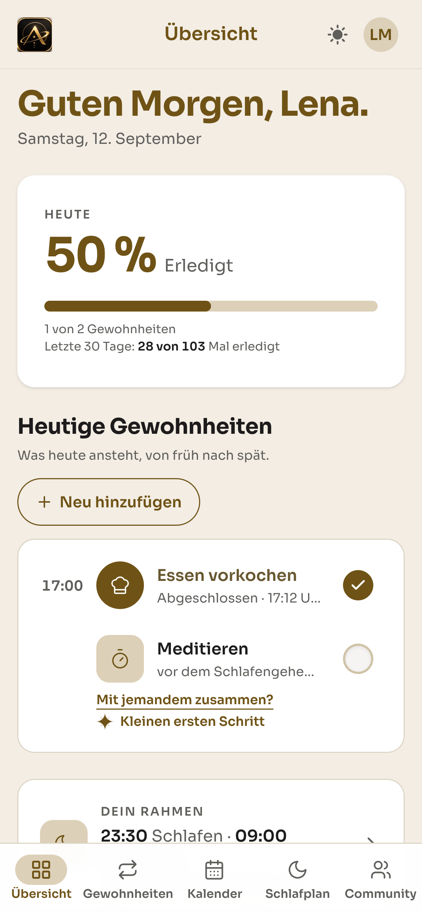
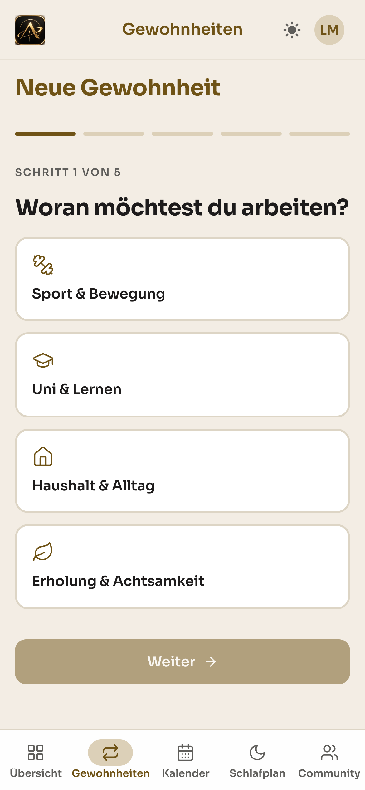
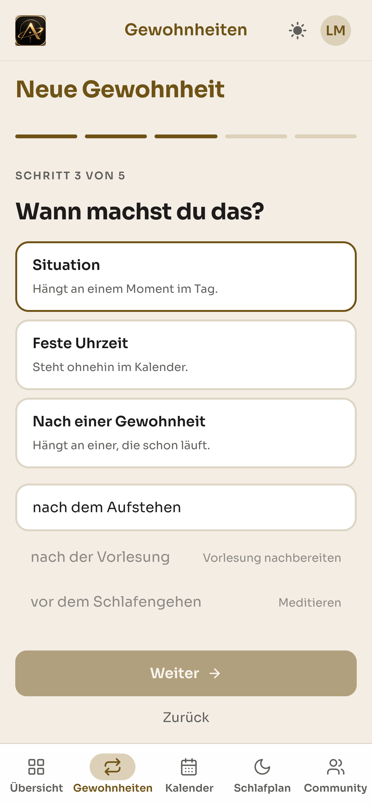
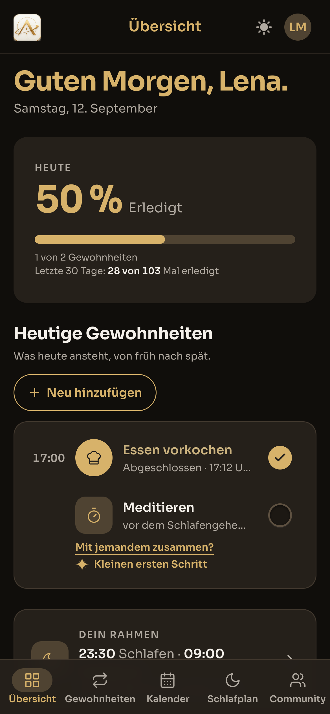

# 8. Die fertige App

Dieses Kapitel führt durch die lauffähige Anwendung. Die Bildschirmaufnahmen stammen aus dem
Stand vom 12. September 2026, aufgenommen in einer Mobilansicht mit 390 Pixeln Breite, also
in der Ansicht, für die wir Align gestaltet haben.

Die Anwendung gliedert sich über eine Navigationsleiste am unteren Rand in fünf Bereiche,
**Übersicht**, **Gewohnheiten**, **Kalender**, **Schlafplan** und **Community**.

---

## 8.1 Übersicht

*Abb. 1: Die Übersicht zeigt nur, was heute ansteht.*

Die Startseite beantwortet eine einzige Frage, nämlich was heute ansteht. Sie zeigt oben den
Tagesfortschritt, darunter die heutigen Gewohnheiten von früh nach spät und unten den
Tagesrahmen.

Drei Entscheidungen aus der Nutzerforschung sind hier unmittelbar sichtbar.

**Die Fortschrittskarte nennt zwei Zahlen.** „1 von 2 Gewohnheiten" für heute und „28 von 103
Mal erledigt" für die letzten 30 Tage. Die zweite Zahl ist die Konsistenzrate. Sie ordnet
einen schwachen Tag in einen Verlauf ein, statt ihn isoliert zu bewerten (Abschnitt 5.10).

**Erledigte und offene Gewohnheiten unterscheiden sich nur durch den Haken.** „Essen
vorkochen" ist abgeschlossen und trägt einen gefüllten Haken, „Meditieren" steht offen und
trägt einen hohlen Kreis. Es gibt kein rotes Kreuz und keine Mahnung, das ist der bewusste
Verzicht auf Bestrafung (Schuldwert ø 3,92 in der Umfrage).

**Zwei Angebote pro Gewohnheit.** „Mit jemandem zusammen?" führt in den
Verabredungsmechanismus, „Kleinen ersten Schritt" ruft die KI-Assistenz auf. Beide erscheinen
dort, wo sie gebraucht werden, statt in einem eigenen Menü.

## 8.2 Gewohnheiten

*Abb. 2: Alle Gewohnheiten mit den letzten sieben Tagen.*

Die Gewohnheiten-Seite legt alle aktiven Gewohnheiten auf ein Blatt und zeigt für jede die
letzten sieben Tage. Das Raster kennt drei Zustände, die unten erklärt werden: **erledigt**
(gefüllt), **offen** (hohl) und **nicht vorgesehen** (gestrichelt). Ein Tag lässt sich
antippen und damit nachtragen.

Die Zahl unter jedem Titel ist die entscheidende Gestaltungsentscheidung. „8 von 13 Tagen"
steht bei einer Gewohnheit, die nur montags, mittwochs und freitags läuft, denn gezählt
werden ausschließlich Tage, an denen die Gewohnheit tatsächlich anstand. Eine Gewohnheit wird
nicht dafür abgewertet, dass sie dienstags nicht vorgesehen war.

## 8.3 Eine neue Gewohnheit anlegen

Der Einrichtungsflow führt in fünf Schritten durch das Anlegen. Zwei davon zeigen die
grundlegenden Konzepte der Anwendung.

 

*Abb. 3 und 4: Schritt 1 zeigt die vier Bereiche des Katalogs, Schritt 2 die Einträge mit ihrer Dauer.*

**Schritt 1 zeigt die vier Bereiche des Gewohnheitskatalogs**, also Sport & Bewegung, Uni &
Lernen, Haushalt & Alltag sowie Erholung & Achtsamkeit. Es gibt kein freies Eingabefeld.

**Schritt 2 macht sichtbar, warum das so ist.** Jeder Eintrag trägt eine Dauer, etwa
Krafttraining 45 Minuten, Spazieren gehen 20, Dehnen & Mobility 10 und Fahrrad fahren 30.
Genau diese Angabe fehlt einer frei formulierten Gewohnheit, und ohne sie lässt sich nichts
zuverlässig in einen Tag einplanen (Abschnitt 7.9). Bereits laufende Gewohnheiten sind
ausgegraut und mit „läuft schon" gekennzeichnet, damit dieselbe Gewohnheit nicht zweimal
entsteht.

*Abb. 5: Schritt 3 mit den drei Wegen, eine Gewohnheit im Tag zu verankern.*

**Schritt 3 ist der Kern des Time-Blocking-Konzepts.** Er bietet drei Wege an, eine
Gewohnheit im Tag zu verankern:

| Anker | Beschreibung in der App |
|---|---|
| **Situation** | „Hängt an einem Moment im Tag." |
| **Feste Uhrzeit** | „Steht ohnehin im Kalender." |
| **Nach einer Gewohnheit** | „Hängt an einer, die schon läuft." |

Die Reihenfolge ist nicht zufällig. Die Situation steht oben, weil situative Anker laut Lally
et al. (2010) zuverlässiger auslösen als Uhrzeiten. Der dritte Weg bildet das Domino-Prinzip
ab, eine Gewohnheit wird zum Auslöser der nächsten.

Darunter werden bereits vergebene Situationen ausgegraut dargestellt. „nach der Vorlesung"
ist durch „Vorlesung nachbereiten" belegt, „vor dem Schlafengehen" durch „Meditieren". Jeder
Moment im Tag trägt genau eine Gewohnheit.

## 8.4 Kalender

*Abb. 6: Die Monatsansicht mit Hinweis auf einen kommenden Stundenplan-Konflikt.*

Der Kalender hat zwei Ebenen. Die **Monatsansicht** zeigt für jeden Tag Punkte, einen je
vorgesehener Gewohnheit, und markiert die laufende Woche.

Oben steht ein Hinweis, der die Semesterlogik sichtbar macht:

> „Eine Gewohnheit verliert ab dem 12. Oktober durch deinen Stundenplan ihren Platz. Bis
> dahin läuft alles wie bisher. Ein neuer Platz lässt sich schon jetzt finden."

Die Anwendung weiß, dass zum Semesterbeginn eine Vorlesung in einen bereits belegten Slot
fällt, und sagt es, bevor der Konflikt eintritt. Der Weg aus dem Konflikt wird direkt
angeboten. Man springt zum betroffenen Tag oder lässt sich neue Zeiten von der KI vorschlagen.

*Abb. 7: Die Tagesansicht am Semesterbeginn mit Vorlesung und daran hängender Gewohnheit.*

Die **Tagesansicht** zeigt denselben Tag als Zeitraster, das am Aufstehen beginnt und am
Schlafengehen endet. Abbildung 7 zeigt Montag, den 12. Oktober, den ersten Tag des
Wintersemesters, und darin das Zusammenspiel, das Align von einem reinen Gewohnheitstracker
unterscheidet:

- **„Analysis I, 07:00–08:30"** ist ein Block aus dem Stundenplan. Er ist gefüllt
  dargestellt, weil er nicht verschiebbar ist.
- **„Nach der Vorlesung · Vorlesung nachbereiten"** hängt unmittelbar daran. Der gestrichelte
  Rand kennzeichnet einen situativen Anker, die Gewohnheit hat also keine feste Uhrzeit,
  sondern folgt einem Ereignis.
- Die Gewohnheit, die zuvor um 07:30 lag, erscheint an diesem Tag nicht mehr, sie wurde von
  der Vorlesung verdrängt. Genau darauf hatte die Monatsansicht hingewiesen.

## 8.5 Schlafplan

*Abb. 8: Der Tagesrahmen, für jeden Wochentag einzeln einstellbar.*

Der Schlafplan spannt den Rahmen auf, in dem geplant werden kann. Er ist bewusst **keine
Gewohnheit**, er wird nicht abgehakt und hat weder Serie noch Quote.

Die Wochenansicht zeigt für jeden Tag einen Balken. Werktags liegen acht Stunden Schlaf von
23:00 bis 07:00, am Wochenende verschiebt sich das Fenster nach hinten, in der App steht dazu
„8 Stunden bis 9,5 Stunden Schlaf, je nach Tag". Darunter lässt sich jeder Tag einzeln
anpassen. Der Wecker ist werktags aktiv, am Wochenende nicht.

Bewegt sich dieser Rahmen, bewegen sich die Gewohnheiten an seinen Rändern mit.

## 8.6 Community

*Abb. 9: Der Community-Bereich beginnt mit der Zusage, was nicht geteilt wird.*

Der Community-Bereich setzt die Entscheidung aus Abschnitt 6.4 um, also Verabredung statt
Rangliste. Wichtig ist der erste Satz der Seite:

> „Was ihr tut, sieht niemand. Nur, dass ihr euch kennt."

Die Seite beginnt mit dem, was **nicht** geteilt wird. Das ist die direkte Antwort auf den
Interviewbefund, dass Vergleich als Kontrolle empfunden wird, und auf die Umfrage, in der
eine Rangliste explizit nicht gewünscht war.

Verbindungen entstehen nur über einen exakt eingegebenen Namen, die Anwendung schlägt keine
Personen vor und sucht nicht nach Ähnlichem. Verabredungen lassen sich vollständig
abschalten, ohne den bestehenden Kreis zu verlieren.

## 8.7 Dark Mode

*Abb. 10: Dieselbe Übersicht im Dark Mode.*

Alle Bereiche liegen in einem hellen und einem dunklen Modus vor, die derselben Designsprache
folgen. Gold bleibt in beiden Modi die Akzentfarbe, im Dark Mode trägt es zusätzlich die
Überschriften, weil ein reines Weiß auf dunklem Grund zu hart wirkt.

## 8.8 Funktionsumfang im Überblick

| Bereich | Umgesetzt |
|---|---|
| **Gewohnheiten** | Anlegen aus dem Katalog (vier Bereiche) · Anker über Situation, feste Uhrzeit oder Kette · Wochentage und Uhrzeiten je Tag · Bearbeiten und Beenden · Grenze von fünf aktiven Gewohnheiten |
| **Tracking** | Abhaken per Tippen oder Wischen · Sieben-Tage-Raster mit Nachtragen · Konsistenzrate über 30 Tage, die nur vorgesehene Tage zählt · Serien ohne Bestrafung bei Unterbrechung |
| **Kalender** | Monatsansicht mit Tagespunkten · Tagesansicht als Zeitraster · Verschieben von Blöcken · Semesterplan mit Kursen, Kollisionsprüfung und Parken verdrängter Gewohnheiten |
| **Tagesrahmen** | Schlaf- und Aufstehzeit je Wochentag · tageweise Ausnahmen · Wecker innerhalb der Anwendung |
| **KI-Assistenz** | kleinster nächster Schritt · neue Zeiten vorschlagen · Tag neu ordnen · Kontextwissen über Gewohnheiten, Rahmen und Stundenplan |
| **Community** | Kontakte über exakten Namen · Verabredungen zu einzelnen Gewohnheiten · Absagen mit Weiterführung · Übernehmen fremder Gewohnheiten |
| **Sonstiges** | Onboarding mit einleitendem Auftakt · Light und Dark Mode · Registrierung mit Passkeys und Zwei-Faktor-Authentifizierung |

Was bewusst nicht umgesetzt wurde, ist in Abschnitt 7.13 aufgeführt und wird im Ausblick
(Kapitel 10) wieder aufgenommen.
