# Align — Projektbericht

> **Gemeinsames Dokument.** Das ist die Datei, an der wir alle am Bericht arbeiten. Jede
> Änderung am Berichtstext kommt hier hinein, nicht in die einzelnen Kapiteldateien, nicht in
> Google Docs und nicht in Notion. Wer was geändert hat, zeigt die Git-Historie dieser Datei.
>
> **Ablauf:** vor dem Schreiben `git pull` · Änderung in dieser Datei · kurzer Commit, der sagt,
> was geändert wurde · sofort `git push`. Vorher im Gruppenchat sagen, an welchem Kapitel man
> sitzt. Bilder liegen in `screenshots/` neben dieser Datei.
>
> **Schreibregeln:** Wir-Perspektive · keine Namen im Fließtext, die Schwerpunkte stehen in 3.1 ·
> auf Projektebene bleiben, keine Werkzeugpannen oder Terminfragen · KI nur bei der
> Implementierung und als Funktion der App erwähnen · Abbildungen kapitelweise nummeriert
> („Abb. 8.3") mit kursiver Bildunterschrift · Querverweise als „Abschnitt 7.8".

# 1. Einleitung

## 1.1 Was entwickelt wurde

**Align** ist eine Anwendung, die Studierende dabei unterstützt, gute Gewohnheiten in ihren
Alltag einzubauen und so mehr Struktur, Fokus und Balance in den Studienalltag zu bringen, der
oft weniger feste Abläufe vorgibt als zum Beispiel die Schulzeit.

Gewohnheiten werden bei Align nicht nur festgelegt, sondern direkt als konkrete Zeitblöcke in
den Tag eingeplant. Dabei berücksichtigt die Anwendung den eigenen Schlafrhythmus und den
Stundenplan. Eine KI-Unterstützung hilft, wenn der Einstieg schwerfällt, und schlägt einen neuen
Platz im Tag vor, wenn sich der Alltag verändert, etwa weil ein neuer Stundenplan eine
Gewohnheit verdrängt.

Umgesetzt haben wir Align als funktionsfähige **MVP-Version** in Form einer
Mobile-First-Web-App. Warum wir uns für diese Form entschieden haben, erklären wir in
Kapitel 7.

## 1.2 Ausgangssituation und Motivation

Die Idee zu Align entstand aus unseren eigenen Erfahrungen im Studium. Im Studienalltag ist man
für die Planung seiner Zeit größtenteils selbst verantwortlich. Dadurch startet man schnell ohne
richtigen Plan in den Tag oder verschiebt Vorhaben auf einen anderen Tag. Das betrifft nicht nur
Aufgaben für das Studium, sondern auch Sport, Schlaf und Pausen. Meistens weiß man, was einem
guttut, und schafft es trotzdem nicht, dauerhaft dranzubleiben. Bei anderen Studierenden in
unserem Umfeld haben wir dasselbe beobachtet.

Bestehende Anwendungen haben uns dabei nicht überzeugt. Einige bieten so viele Funktionen, dass
sie unübersichtlich wirken, andere setzen stark auf Erinnerungen und werden nach einiger Zeit
selbst zu einer weiteren Aufgabe. Mit Align wollten wir deshalb eine Anwendung entwickeln, die
sich einfach in den Alltag einfügt, keinen zusätzlichen Druck erzeugt und trotzdem genug Struktur
gibt, um dranzubleiben.

## 1.3 Problemstellung

Aus dieser Ausgangssituation haben wir drei Probleme abgeleitet, die wir später in unserer
Nutzerforschung untersucht und bestätigt gefunden haben (Kapitel 5).

### 1.3.1 Fehlende Alltagsstruktur im Studium

Im Studium gibt es oft keine feste Tagesstruktur, wie man sie aus der Schule kennt.
Vorlesungszeiten ändern sich von Semester zu Semester, es gibt Freistunden, und für das
Selbststudium ist man selbst verantwortlich. Dadurch werden Aufgaben schnell aufgeschoben,
besonders in vorlesungs- und prüfungsfreien Phasen.

### 1.3.2 Gute Vorsätze werden selten zu Routinen

Das Problem liegt oft nicht darin, sich etwas vorzunehmen, sondern darin, daraus eine feste
Routine zu machen. Bestehende Habit-Tracker sind teilweise sehr komplex, stark spielerisch oder
zu allgemein. Außerdem gehen sie kaum auf den tatsächlichen Alltag ein. Ändert sich der Tag, etwa
durch einen neuen Stundenplan, bleibt der Plan derselbe, und je weiter Plan und Alltag
auseinandergehen, desto eher legt man die Anwendung beiseite.

### 1.3.3 Keine Anwendung, die sich dem eigenen Alltag anpasst

Bei bestehenden Lösungen fehlt uns vor allem eine Planung, die sich nach dem Alltag der Person
richtet, also danach, wie viel Zeit an einem Tag zur Verfügung steht, in welcher Phase des
Semesters man sich befindet und welche Termine ohnehin feststehen. Genau hier sehen wir den
sinnvollen Einsatz von KI. Sie soll die Planung an die jeweilige Situation anpassen und
unterstützen, wenn es einmal nicht nach Plan läuft.

## 1.4 Zielsetzung und Leitfrage

Aus den beschriebenen Problemen ergibt sich die Leitfrage unseres Projekts:

> **„Wie kann eine mobile Applikation Studierende durch minimalistisches Design,
> kontextsensitive KI und verhaltenspsychologisch fundierte Mechanismen dabei unterstützen,
> nachhaltige Alltagsgewohnheiten zu etablieren?"**

Um diese Frage zu beantworten, haben wir auf Grundlage unserer Nutzerforschung eine
funktionsfähige MVP-Version entwickelt und Schritt für Schritt verbessert. Die drei Bereiche der
Leitfrage dienten uns dabei als Auftrag für Gestaltung und Entwicklung.

| Begriff | Was daraus folgte |
|---|---|
| **Minimalistisches Design** | wenige, klar getrennte Bereiche · eine durchgängige Designsprache in Light und Dark Mode · keine visuelle Überladung (Kapitel 6) |
| **Kontextsensitive KI** | Vorschläge, die den tatsächlichen Tag kennen, also Schlafrhythmus, Stundenplan und bestehende Gewohnheiten (Kapitel 7) |
| **Verhaltenspsychologisch fundierte Mechanismen** | Wenn-Dann-Pläne, Trigger- und Kontextbindung, Konsistenz statt Serie; jede Funktion auf eine Quelle zurückführbar (Kapitel 4 und 6) |

Der dritte Bereich hat unser Vorgehen am stärksten geprägt. Nutzer sollten ihre Gewohnheiten
nicht wegen Punkten oder Belohnungen einhalten. Wir wollten verstehen, **warum** Gewohnheiten
entstehen und **woran** sie scheitern. Deshalb haben wir uns zu Beginn mit Verhaltens- und
Motivationspsychologie beschäftigt, unter anderem mit Implementation Intentions, also der
Verbindung eines Verhaltens mit einer konkreten Situation, mit der Wirkung von Auslösern, dem
Domino-Prinzip und Befunden dazu, wie lange der Aufbau einer Gewohnheit dauert.

Aus diesen Grundlagen sind die wichtigsten Funktionen von Align entstanden: Situations-Anker als
Alternative zu festen Uhrzeiten, Gewohnheitsketten, eine Konsistenzrate statt einer reinen Serie
und der bewusste Verzicht auf Bestrafung. Die Quellen beschreibt Kapitel 4.

## 1.5 Zielgruppe

Die Zielgruppe von Align sind Studierende im deutschsprachigen Raum, unabhängig vom Semester. In
unsere Nutzerforschung haben wir deshalb Studierende vom ersten bis über das siebte Semester
einbezogen. Daraus sind zwei Personas entstanden (Abschnitt 5.5):

- **„Die Selbstregulierten"** aus höheren Semestern organisieren ihren Alltag bereits
  selbstständig. Belastend sind für sie vor allem Streak-Druck und der Vergleich mit anderen.
- **„Die Einsteiger"** aus mittleren Semestern haben noch keine festen Routinen. Ihre größte
  Schwierigkeit ist, einen Einstieg zu finden, ohne sich zu überfordern.

## 1.6 Anspruch an das Endprodukt

Zu Beginn haben wir sechs Ansprüche festgelegt, an denen sich alle späteren Entscheidungen messen
lassen mussten. Über allen stand, dass jede Funktion ohne Erklärung verständlich ist. Eine
Anwendung, deren Bedienung selbst Überwindung kostet, verstärkt genau das Problem, das sie lösen
soll. Deshalb haben wir bei jeder Entscheidung geprüft, ob ein zusätzlicher Schritt, eine weitere
Frage oder eine Erklärung wirklich nötig ist.

- einfache und verständliche Bedienung, damit die Anwendung nicht selbst zum Hindernis wird
- langfristige Motivation statt Druck, ohne Bestrafung
- klare Struktur und wenig visuelle Ablenkung
- einheitlicher Aufbau aller Bereiche, in Light und Dark Mode
- Anpassung an den eigenen Alltag, mit Situations-Ankern als Alternative zu festen Uhrzeiten
- Gestaltung auf Grundlage der Verhaltens- und Motivationspsychologie

## 1.7 Aufbau dieses Berichts

Der Bericht folgt dem Ablauf unseres Projekts. **Teil I** beschreibt Problemraum und Marktumfeld
(Kapitel 2) sowie unser Vorgehen im Team (Kapitel 3). **Teil II** folgt den vier
Entwicklungsphasen mit ihren sechs Iterationen: Analyse und Grundlagen (Kapitel 4),
Nutzerforschung (Kapitel 5), Konzeption und Design (Kapitel 6) und technische Umsetzung
(Kapitel 7), jeweils mit dem Feedback aus den Betreuungsgesprächen. **Teil III** stellt die
fertige Anwendung vor (Kapitel 8) und schließt mit Reflexion und Ausblick (Kapitel 9).

---

# 2. Problemraum und Markt

Bevor wir einzelne Funktionen geplant haben, mussten wir klären, für wen wir die Anwendung
entwickeln, was wir über diese Zielgruppe wissen müssen und welche ähnlichen Anwendungen es
bereits gibt. Dieses Kapitel fasst die Anforderungsanalyse und die Competitor-Analyse aus Phase 1
zusammen (Kapitel 4).

## 2.1 Stakeholder und Informationsbedarf

Primäre Stakeholder von Align sind **Studierende zwischen 18 und 35 Jahren**, denen es
schwerfällt, Routinen aufzubauen, oder die sich in ihrem Alltag überfordert fühlen. Als sekundäre
Gruppe haben wir Fachleute aus Psychologie und Verhaltensforschung betrachtet. Ihre fachliche
Sicht ist über die wissenschaftliche Literatur in unser Projekt eingeflossen (Kapitel 4).

Für die Nutzerforschung haben wir fünf Bereiche festgelegt, die geklärt werden sollten:

| Bereich | Leitfragen |
|---|---|
| **Alltag und Routinen** | Wie sieht ein typischer Tag aus? Welche Routinen bestehen bereits, welche funktionieren und welche nicht? In welchem Bereich ist die Überforderung am größten? |
| **Gewohnheiten** | Welche Gewohnheiten wurden bereits versucht? Warum sind diese Versuche gescheitert? Was hat bei den erfolgreichen geholfen? |
| **Motivation** | Was motiviert grundsätzlich? Wie wird mit Rückschlägen umgegangen? |
| **Technologie** | Welche Anwendungen wurden ausprobiert? Was funktionierte, was hat gestört? Wie lange darf ein Check-in höchstens dauern? |
| **Zeit** | Wie viele neue Gewohnheiten sind gleichzeitig realistisch? |

Diese Fragen haben wir in Phase 2 mit Leitfadeninterviews und einer Online-Umfrage untersucht
(Kapitel 5). Aus dem letzten Punkt entstand später eine konkrete Regel für unser Produkt
(Abschnitt 6.3).

## 2.2 Competitor-Analyse

### Ziel und Methodik

Mit der Competitor-Analyse wollten wir herausfinden, welche ähnlichen Anwendungen es gibt, wo noch
Platz für Align ist und welche Ansätze gut funktionieren oder besser vermieden werden. Zum Stand
vom 19. Mai 2026 haben wir **acht Anwendungen** untersucht, und zwar nach Zielgruppe und
Positionierung, Funktionen, Gamification und UX sowie dem Einsatz von KI. Grundlage waren
App-Store-Einträge, Rezensionen und Marktanalysen, dazu unsere eigenen Erfahrungen. Neben direkten
Konkurrenten haben wir bewusst auch Anwendungen aus angrenzenden Bereichen betrachtet, die
Studierende ohnehin nutzen:

| Kategorie | Anwendungen | Warum ausgewählt |
|---|---|---|
| **Direkte Wettbewerber** | Habitica · Fabulous · Finch · Streaks | die zwei dominanten Habit-Apps mit gegensätzlichen Philosophien (Spiel vs. Coaching), die derzeit populärste App bei jüngeren Zielgruppen sowie der minimalistische Gegenpol |
| **Indirekte Wettbewerber** | Forest · Headspace · Notion · Athenify | Marktführer im Fokus-Segment · Wellness-Anbieter mit ernsthafter KI-Integration · das Werkzeug, mit dem Studierende ihre Routinen tatsächlich strukturieren · die einzige Lösung im deutschsprachigen Raum mit Studierendenfokus |

### Die untersuchten Anwendungen

**Habitica** verbindet den Aufbau von Gewohnheiten mit einer Rollenspiel-Mechanik aus Avatar und
Erfahrungspunkten. Das kann motivieren, lenkt aber von der eigentlichen Gewohnheit ab. Für Align
haben wir mitgenommen, spielerische Elemente nur dezent einzusetzen.

**Fabulous** kombiniert Habit Stacking mit Audio-Coaching und beruht auf wissenschaftlichen
Ansätzen, wirkt aber eher wie eine Bibliothek als wie eine persönliche Begleitung. Wir haben
mitgenommen, dass sich Unterstützung am tatsächlichen Alltag orientieren sollte.

**Finch** arbeitet mit einem virtuellen Begleiter und verzichtet bewusst auf Druck durch Serien.
Die warme Ansprache trifft die Zielgruppe gut, der wissenschaftliche Anspruch bleibt aber gering.

**Streaks** ist minimalistisch und übersichtlich, bietet aber kaum persönliche Unterstützung. Ein
einfacher Aufbau ist sinnvoll, ein reiner Tracker reicht für unser Konzept aber nicht aus.

**Forest** verbindet Fokuszeiten mit einer virtuellen Pflanze, die beim konzentrierten Arbeiten
wächst. Das Prinzip kommt bei Studierenden gut an, beschränkt sich aber auf Fokuszeiten.

**Headspace** hat mit dem Begleiter „Ebb" die ausgereifteste KI-Integration der untersuchten
Anwendungen, plant aber keine Gewohnheiten. Für unsere KI-Assistenz war Headspace die wichtigste
Referenz dafür, dass KI persönlich und einfühlsam wirken muss und nicht klinisch.

**Notion** ist kein direkter Konkurrent, wird aber von vielen Studierenden zur Organisation des
Alltags genutzt. Eigene Tracker brauchen dort viel Einrichtung und scheitern oft daran, dass man
sie nicht regelmäßig pflegt. Align soll diesen Aufwand verringern.

**Athenify** richtet sich gezielt an Studierende im deutschsprachigen Raum, konzentriert sich aber
auf die Organisation von Lernzeiten. Align bezieht zusätzlich Schlaf, Bewegung und Balance ein.

### Vergleichsmatrix

| Anwendung | Zielgruppe | Habit-Logik | Gamification | KI | DACH-Fit |
|---|---|---|---|---|---|
| Habitica | Gamer | ★★★★ | ★★★★★ (Rollenspiel) | – | ★★ |
| Fabulous | Wellness-Interessierte | ★★★★ | ★★ (mild) | ★★ (Content) | ★★ |
| Finch | Gen Z, neurodivergent | ★★★ | ★★★ (Begleiter) | ★ | ★★ |
| Streaks | Apple-Nutzer | ★★★ | ★ (Serien) | – | ★ |
| Forest | Studierende | ★ (nur Fokus) | ★★★ | – | ★★★ |
| Headspace | breite Wellness | ★★ | ★ | ★★★★ | ★★★ |
| Notion | Studierende, Power-User | ★★ (Eigenbau) | ★ | ★★ | ★★★★ |
| Athenify | DACH-Studierende | ★★ (nur Lernen) | ★★ | ★★ (analytisch) | ★★★★★ |
| **Align (Ziel)** | **DACH-Studierende** | **★★★★** | **★★★ (subtil)** | **★★★★** | **★★★★★** |

## 2.3 Vier Marktlücken

Aus der Analyse haben sich vier Bereiche ergeben, die keine der untersuchten Anwendungen
vollständig abdeckt:

**1 · Die Lebensrealität Studierender als Produktlogik.** Keine der acht Anwendungen
berücksichtigt Semester, Prüfungsphasen und wechselnde Vorlesungszeiten. Athenify kommt diesem
Ansatz am nächsten, konzentriert sich aber auf das Lernen. → *Align kann den Stundenplan und den
Ablauf eines Semesters zur Grundlage der Planung machen.*

**2 · Planen findet am Laptop statt.** Fast alle spezialisierten Anwendungen sind vor allem für
das Smartphone gebaut, Studierende planen und lernen aber viel am Laptop. Notion zeigt, dass das
Tracken von Gewohnheiten auch im Browser funktioniert.

**3 · KI als echter Begleiter statt als Content-Bibliothek.** Wo Habit-Tracker KI einsetzen,
liefert sie meist vorgefertigte Inhalte, statt auf die Situation der Person einzugehen. → *Align
kann Vorschläge machen, die den tatsächlichen Tag kennen.*

**4 · Subtile statt aggressiver Gamifizierung.** Starke Gamifizierung wie bei Habitica wird schnell
zu viel, und reine Serien erzeugen Druck, weil schon ein ausgelassener Tag den Fortschritt
unterbricht. → *Align setzt auf einfache Fortschrittsanzeigen ohne Verlustdruck.*

## 2.4 Positionierung

Daraus haben wir folgende Positionierung abgeleitet:

> Für Studierende, die Struktur und Balance im Studienalltag suchen, ist Align die einzige
> Anwendung zum Gewohnheitsaufbau, die ihre Lebensrealität versteht, mit einem
> kontextsensitiven KI-Begleiter und verhaltenspsychologisch fundierten Mechanismen, die
> ohne Druck zur Konsistenz führen.

Habitica ist stark auf Spielelemente ausgerichtet, Fabulous eher allgemein gehalten, Notion
verlangt viel eigene Einrichtung, und Athenify konzentriert sich auf das Lernen. Align soll diese
Bereiche in einer einfachen, übersichtlichen Anwendung auf wissenschaftlicher Grundlage verbinden.

## 2.5 Was daraus für das MVP folgte

Am Ende der Analyse haben wir festgelegt, was für Align gesetzt ist, was später dazukommen kann und
worauf wir bewusst verzichten:

| | |
|---|---|
| **Gesetzt** | Stundenplan-Integration als Alleinstellungsmerkmal · kurzer täglicher Check-in · KI an wenigen, gezielten Berührungspunkten · Fortschrittsanzeige mit Schutz vor Abbruchdruck |
| **Später** | soziale Funktionen, erst wenn der Einzelnutzen klar ist · wenige, gezielte Erfolgsmarken · ein einfacher Fokusmodus |
| **Bewusst nicht** | eigene Meditationen oder Workouts produzieren · komplexe Rollenspielmechanik · verlustaversive Mechanismen, die dem eigenen Tonalitätsziel widersprechen |

Zwei dieser frühen Entscheidungen haben das Projekt besonders geprägt. Die
**Stundenplan-Integration** war zunächst nur eine Annahme aus der Marktanalyse, die unsere
Nutzerforschung später gestützt hat (Abschnitt 5.9). Als Semesterplan umgesetzt (Abschnitt 7.11),
hat dieser Gedanke das Projekt bis in die fertige Anwendung begleitet. Auf **verlustaversive
Mechanismen** wollten wir von Anfang an verzichten. Interviews und Umfrage haben das bestätigt, und
in der Anwendung zeigt es sich an neutral dargestellten Fehltagen und an einer Konsistenzrate, die
nur die Tage zählt, an denen eine Gewohnheit tatsächlich geplant war.

---

# 3. Vorgehen und Zusammenarbeit

## 3.1 Das Team

Align haben wir zu dritt entwickelt, **Berkay**, **Silas** und **Ngoc Ha**. Wir studieren alle
E-Commerce an der Technischen Hochschule Würzburg-Schweinfurt. Eine Kommilitonin, Prabjot Kaur,
war zu Projektbeginn eingeplant, konnte wegen eines parallel beginnenden Praktikums aber nicht
mitarbeiten. Betreut wurde das Projekt von **Frau Heß**.

Die Recherche, die Interviews und alle wichtigen Konzeptentscheidungen haben wir gemeinsam
erarbeitet. Nach Interessen und Vorkenntnissen haben sich Schwerpunkte entwickelt, eine strikte
Aufgabenverteilung gab es aber nicht.

| | Schwerpunkt |
|---|---|
| **Berkay** | Competitor-Analyse, Personas, Interview-Leitfaden, technische Umsetzung |
| **Silas** | Literaturrecherche/-analyse, Endfassung der Online-Umfrage, Feature-Ableitung, technische Umsetzung |
| **Ngoc Ha** | Wireframes und Design, Erstfassung der Umfrage, Zwischenpräsentationen, Dokumentation |

## 3.2 Phasen und Iterationen

An Align haben wir vom 17. Mai bis zum 7. September 2026 gearbeitet, gegliedert in vier
Entwicklungsphasen und **sechs Iterationen**. Jede Iteration endete mit einem
Betreuungsgespräch, in dem wir unseren Stand vorgestellt und Feedback bekommen haben. Danach haben
wir gemeinsam entschieden, was wir anpassen und worauf wir uns als Nächstes konzentrieren.
Zwischen zwei Gesprächen lagen meist etwa drei Wochen.

| Phase | Iterationen | Gespräche | Schwerpunkt |
|---|---|---|---|
| **1 · Analyse und Grundlagen** | Iteration 1 | 20.05. | Literatur, Competitor-Analyse, erste Wireframes |
| **2 · Nutzerforschung** | Iterationen 2 und 3 | 08.06. · 29.06. | Interviews, Personas, Online-Umfrage, Feature-Priorisierung |
| **3 · Konzeption und Design** | Iteration 4 | 20.07. | Feature-Ausarbeitung, Designsprache, Prototypen |
| **4 · Technische Umsetzung** | Iterationen 5 und 6 | 10.08. · 07.09. | Aufbau der Anwendung, Ausbau, zuverlässigere Abläufe |

Statt den gesamten Projektverlauf von Anfang an festzulegen, haben wir nach jeder Iteration
geschaut, was als Nächstes sinnvoll ist. Deshalb brauchten manche Phasen zwei Iterationen, etwa
die Nutzerforschung mit Interviews und anschließender Umfrage. Durch die festen Termine haben wir
Ideen nicht lange nur diskutiert, sondern umgesetzt und überprüft und so einige Entscheidungen
früh angepasst, zum Beispiel die Fortschrittsanzeige und die Farbwelt.

## 3.3 Zusammenarbeit und Dokumentation

Für die Abstimmung im Team haben wir einen Gruppenchat und regelmäßige Videocalls genutzt, die
Betreuungsgespräche fanden über Zoom statt. Ein zusätzliches Projektmanagement-Werkzeug brauchten
wir nicht.

In **Notion** haben wir für jede Iteration das Feedback, die nächsten Aufgaben und wichtige
Zwischenergebnisse festgehalten. Uns war wichtig, die Dokumentation während des Projekts zu
führen, statt am Ende alles nachträglich zusammenzutragen. Mit Beginn der technischen Umsetzung
haben wir sie in Markdown-Dateien im Projektverzeichnis weitergeführt, gemeinsam mit dem Code
versioniert. Zu jedem Betreuungsgespräch haben wir außerdem eine kurze Präsentation vorbereitet.

## 3.4 Eingesetzte Werkzeuge

| Zweck | Werkzeug |
|---|---|
| Abstimmung und Betreuungsgespräche | Gruppenchat, Videocalls, Zoom |
| Projektdokumentation | Notion, später Markdown im Projektverzeichnis |
| Zwischenpräsentationen | Canva |
| Design und Prototyping | Figma |
| Online-Umfrage | LimeSurvey |
| Literaturrecherche | THWS-Bibliothek, Springer, ResearchRabbit |
| Entwicklung | Laravel Herd, VS Code, GitHub, KI-gestützte Entwicklungswerkzeuge |

Drei Entscheidungen zu Werkzeugen waren für unsere Arbeit besonders wichtig.

**LimeSurvey statt Google Forms.** Frau Heß wies uns im ersten Betreuungsgespräch darauf hin, bei
der Umfrage besonders auf Datenschutz und Anonymität zu achten. Deshalb haben wir LimeSurvey statt
Google Forms verwendet (Kapitel 5).

**Figma als verbindliche Designquelle.** Ab Iteration 2 haben wir Farben, Typografie und
Komponenten in einer gemeinsamen Figma-Datei festgelegt. Sie blieb bis zum Projektende die
Grundlage für alle Gestaltungsfragen.

**KI-gestützte Entwicklungswerkzeuge.** In Phase 4 haben wir beim Programmieren mit einem
KI-gestützten Entwicklungswerkzeug gearbeitet. Es hat uns geholfen, den Funktionsumfang in der
verfügbaren Zeit umzusetzen (Abschnitte 7.1 und 9.4).

---

# 4. Phase 1 — Analyse und Grundlagen

**Zeitraum:** 17. bis 20. Mai 2026 · **Iteration 1**, Betreuungsgespräch am 20. Mai

Zwischen der Bildung unserer Arbeitsgruppe und dem ersten Betreuungsgespräch lagen nur drei Tage.
Unser Ziel war deshalb noch kein fertiges Konzept, sondern die Projektidee einzuordnen und eine
erste Richtung für Align festzulegen.

## 4.1 Literaturrecherche

Für die inhaltliche Grundlage haben wir gezielt nach wissenschaftlichen Quellen aus der
Verhaltens- und Motivationspsychologie gesucht und populärwissenschaftliche Literatur bewusst
ausgeschlossen. Drei Quellen waren für Align besonders wichtig:

| Quelle | Kernbefund | Wirkung im Produkt |
|---|---|---|
| **Lally et al. (2010)**<br>*How are habits formed: Modelling habit formation in the real world*<br>Artikel im European Journal of Social Psychology | Median 66 Tage bis zur stabilen Gewohnheit (Spanne 18 bis 254). Konsistenz ist der wichtigste Prädiktor, nicht die absolute Anzahl der Ausführungen; einzelne Aussetzer haben keine messbaren Langzeitkosten. | Konsistenzrate statt Streak · kein Bestrafungsmechanismus · realistische Erwartungen |
| **Faude-Koivisto & Gollwitzer (2009)**<br>*Coachingwissen. Denn sie wissen nicht, was sie tun?* (Hrsg. B. Birgmeier)<br>Kapitel „Wenn-Dann Pläne: eine effektive Planungsstrategie aus der Motivationspsychologie" | Wenn-Dann-Pläne (*Implementation Intentions*) verlagern die Verhaltenskontrolle von der Selbstdisziplin auf die Situation. Ein einziger bewusster Willensakt kann automatische Auslösung anstoßen. | Time Blocking · Situations-Anker als Alternative zu festen Uhrzeiten |
| **Becker (2024)**<br>*Positive Psychologie – Wege zu Erfolg, Resilienz und Glück*<br>Kapitel 14 „Gewohnheiten ändern und aufbauen" | Trigger- und Kontextbindung, Domino-Prinzip (eine Gewohnheit wird zum Auslöser der nächsten), Wirkung sozialer Unterstützung, Effekt sichtbaren Fortschritts | Habit Chains · Community · Progress Tracking |

Diese Erkenntnisse haben schon während der Konzeption mitentschieden, welche Ansätze wir
übernehmen. Auf Grundlage von Lally et al. haben wir uns zum Beispiel gegen Streaks als wichtigste
Kennzahl entschieden, und Faude-Koivisto und Gollwitzer waren die Grundlage für unsere
Situations-Anker.

## 4.2 Competitor-Analyse

Parallel haben wir acht Anwendungen untersucht, vier direkte Wettbewerber aus dem Habit Tracking
und vier aus angrenzenden Bereichen, die Studierende ohnehin nutzen. Zusätzlich sind unsere eigenen
Erfahrungen mit Finch, Habit Tracker und HabitShare eingeflossen. Die ausführliche Analyse steht
in Kapitel 2. Für die weitere Entwicklung von Align waren vor allem drei Erkenntnisse wichtig:

1. **Keine der untersuchten Anwendungen berücksichtigt den Ablauf eines Studiums.** Semester,
   Prüfungsphasen und wechselnde Vorlesungszeiten spielen kaum eine Rolle.
2. **KI wird im Habit Tracking kaum als persönliche Unterstützung eingesetzt.** Eine Ausnahme ist
   Headspace mit dem KI-Begleiter „Ebb".
3. **Zu starke Gamification erzeugt Druck statt Motivation**, etwa bei Habitica oder bei reinen
   Streaks. Für Align wollten wir deshalb einen zurückhaltenden Ansatz.

Besonders der erste Punkt wurde im Projektverlauf immer wichtiger. Daraus entstand später der
Semesterplan, das wichtigste Alleinstellungsmerkmal von Align (Kapitel 7).

## 4.3 Erste Visualisierungen und Arbeitsorganisation

Parallel zur Analyse entstanden erste Wireframes und ein klickbarer Entwurf. Sie sollten uns eine
gemeinsame Vorstellung davon geben, wie Align aussehen und aufgebaut sein könnte. Dabei entstand
schon die Farbrichtung aus Beige, Schwarz und Gold, die uns bis zum Ende begleitet hat, und auch
Light und Dark Mode waren von Anfang an vorgesehen. Für die Zusammenarbeit haben wir festgelegt,
Aufgaben vor jeder Iteration gemeinsam zu verteilen und zu jedem Betreuungsgespräch eine kurze
Präsentation zu erstellen.

## 4.4 Feedback von Frau Heß

Das erste Betreuungsgespräch hat unser weiteres Vorgehen stark beeinflusst:

- **Reihenfolge der Nutzerforschung.** Zuerst Interviews führen und die Umfrage danach auf
  Grundlage der Ergebnisse erstellen.
- **Datenschutz und Anonymität** bei der Umfrage beachten.
- **Bias vermeiden.** In der Umfrage zuerst allgemeine Funktionen abfragen und unsere eigenen Ideen
  erst am Schluss.
- **Persona erarbeiten** und daran einen Vorher-Nachher-Vergleich durchspielen.
- **Sozialer Aspekt.** Nutzern das Gefühl geben, nicht allein zu sein, und gegenseitige Motivation
  ermöglichen.
- **Dokumentation.** Nicht nur Ergebnisse festhalten, sondern auch das Vorgehen.
- **Nicht zu früh einschränken.** Gute Ideen nicht verwerfen, nur weil die technische Umsetzung
  zunächst schwierig erscheint.

## 4.5 Was daraus folgte

Der Hinweis zur Reihenfolge der Nutzerforschung war die folgenreichste Rückmeldung unseres
gesamten Projekts. Wir haben die nächste Phase deshalb in qualitative Interviews und eine darauf
aufbauende Umfrage aufgeteilt, deren Ergebnisse zur Grundlage unserer Funktionsauswahl wurden. Den
sozialen Aspekt haben wir direkt als eigene Funktion vorgesehen, daraus entstand das
Community-Feature (Kapitel 6). Das Feedback und die nächsten Schritte haben wir, wie von Beginn
an, in unserer projektbegleitenden Dokumentation in Notion festgehalten (Abschnitt 3.3).

---

# 5. Phase 2 — Nutzerforschung

**Zeitraum:** 21. Mai bis 29. Juni 2026 · **Iterationen 2 und 3**, Betreuungsgespräche am
8. und 29. Juni

## 5.1 Der zweistufige Forschungsansatz

Auf den Hinweis von Frau Heß haben wir unsere Nutzerforschung in zwei Schritte aufgeteilt.
Qualitative Leitfadeninterviews sollten zeigen, welche Probleme und Erfahrungen Studierende
tatsächlich haben, und erste Annahmen liefern. Eine darauf aufbauende Online-Umfrage sollte prüfen,
ob sich diese Erkenntnisse in einer größeren Gruppe zeigen, und die Funktionen priorisieren.

| Stufe | Methode | Umfang | Ziel |
|---|---|---|---|
| **1** | Leitfadeninterviews | n = 6 Studierende | Hypothesen zu Problemen und Bedürfnissen bilden, Grundlage für den Fragebogen |
| **2** | Online-Umfrage (LimeSurvey) | n = 25 abgeschlossene Antworten | Validierung der Hypothesen, Feature-Priorisierung |

Hätten wir die Umfrage zuerst erstellt, wären ihre Fragen vor allem aus unseren eigenen Annahmen
entstanden. So prüfte jede Frage etwas, das vorher jemand wirklich gesagt hatte.

---

# Iteration 2 — Interviews und Personas

## 5.2 Der Interview-Leitfaden

Unser Leitfaden umfasste dreizehn Fragen für Gespräche von etwa 20 bis 30 Minuten, aufgeteilt in
fünf Phasen:

1. **Intro und Warm-up.** Einstieg mit einer konkreten Frage: „Wie sieht aktuell ein ganz normaler
   Dienstag bei dir im Semester aus?"
2. **Status quo und bisherige Lösungsversuche.** Welche Gewohnheiten verfolgt die Person gerade,
   und wie ist ihr letzter Versuch verlaufen?
3. **Schmerzpunkte.** In welchen Situationen scheitert eine Gewohnheit, und wie geht es nach einer
   Unterbrechung weiter?
4. **Community und soziale Verbindlichkeit.** Helfen gemeinsame Gewohnheiten, und wie wirken Apps,
   die den Fortschritt von Freunden zeigen?
5. **Cool-down.** Was wünscht sich die Person von einer Habit-App für den Studienalltag?

Wir sind bewusst vom Konkreten zum Allgemeinen gegangen. Wer zuerst seinen tatsächlichen Dienstag
beschreibt, antwortet auf die späteren Fragen weniger idealisiert.

## 5.3 Durchführung und Auswertung

Zwischen dem 1. und 7. Juni haben wir sechs Interviews mit Studierenden aus verschiedenen
Studiengängen und Semestern geführt, jede und jeder von uns zwei. Gesprochen haben wir mit
**Alissa, Hannah, Aylin, Danial, Felix und Ngoc Anh**. Die Gespräche haben wir aufgezeichnet,
transkribiert und nach demselben Raster ausgewertet: Finden sich unsere bisherigen Ideen wieder,
tauchen neue Themen auf, und welche Zitate belegen das? Die einzelnen Auswertungen haben wir
anschließend in einem gemeinsamen Dokument nach Themen zusammengeführt.

## 5.4 Zentrale Erkenntnisse aus den Interviews

**Kontext beeinflusst Gewohnheiten stärker als feste Uhrzeiten.**

> „Wenn ich dann im Bett bin, kann ich es direkt machen." *(Alissa)*

Alissa verbindet das Lesen mit dem Moment, in dem sie ins Bett geht, und Felix bewegt sich an
Uni-Tagen automatisch mehr, würde für ein Schrittziel aber nicht extra spazieren gehen. Auch in den
anderen Interviews hingen Gewohnheiten eher an Situationen als an einer genauen Uhrzeit.

**Gewohnheiten hängen oft miteinander zusammen.**

> „Ich konnte alle anderen Sachen, diesen Domino-Effekt nicht beibehalten, weil einfach schon
> der Schlaf, das erste, schon schlecht angefangen hat." *(Danial)*

Aylin beschrieb eine ganze Kette rund um ihr Meal Prep: abends vorbereiten → morgens mitnehmen →
Bibliothek → arbeiten. Fällt der erste Teil weg, wirkt sich das auf den ganzen restlichen Ablauf
aus. Daraus haben wir abgeleitet, Gewohnheiten an Situationen und aneinander zu knüpfen und bei
einer unterbrochenen Kette einen Ausweg anzubieten.

**Der Einstieg fällt oft schwer.**

> „Ich weiß oft nicht, wo ich anfangen soll, dann werde ich überfordert und fange erst gar
> nicht an." *(Ngoc Anh)*

> „Du brauchst so ein bisschen diesen leichten Dopaminschub von: ey, ich habe eine Sache
> abgehakt." *(Danial)*

Oft fehlt nicht die Motivation, sondern ein klarer erster Schritt, und kleine Erfolge helfen dabei,
überhaupt anzufangen und weiterzumachen.

**Kein Druck, aber der Wunsch nach Selbstanalyse.**

> „Dann war das halt ein Ausrutscher. Und morgen machst du es halt dann wieder besser."
> *(Aylin)*

Ein verpasster Tag wurde nicht als Scheitern gesehen. Gleichzeitig wünschte sich Aylin, die eigenen
Gewohnheiten „mal so vor Augen gehalten" zu bekommen. Align soll ausgelassene Gewohnheiten deshalb
nicht bestrafen, den eigenen Verlauf aber sichtbar machen.

**Community ja, direkter Vergleich nein.**

> „Wenn du eine Verabredung hast, dann gehst du da natürlich auch mit einem anderen
> Pflichtbewusstsein ran, als wenn du das einfach nur für dich selber machen würdest."
> *(Aylin)*

Gemeinsame Gewohnheiten mit vertrauten Personen wurden positiv gesehen, ein direkter Vergleich mit
anderen dagegen kritisch:

> „Das löst dann kein positives Gefühl aus, dass ich mich für die Person freue, sondern eher so
> 'ne Kontrolle, bin ich auch soweit, muss ich noch was mehr tun." *(Hannah)*

Über alle sechs Interviews haben sich drei Muster wiederholt: Rankings und Vergleiche motivieren
nicht langfristig, Community funktioniert vor allem mit Personen, die man kennt, und Prüfungsphasen
verändern bestehende Routinen stark.

## 5.5 Personas

Aus den Interviews haben wir zwei Verhaltenstypen abgeleitet und als Persona-Sheets ausgearbeitet,
die uns im weiteren Projekt als Orientierung dienten.

### „Die Selbstregulierten", intrinsisch und selbstreguliert


*Abb. 5.1: Das Persona-Sheet „Die Selbstregulierten", verdichtet aus vier Interviews.*

*Verdichtet aus Alissa, Hannah, Aylin und Felix. Höhere Semester, flexible Tage, bereits
funktionierende Routinen, die an Situationen hängen.*

> „Dann war das halt ein Ausrutscher. Morgen machst du es halt wieder besser." *(Aylin)*

Die Selbstregulierten haben keinen festen Tagesablauf, kommen mit dieser Flexibilität aber gut
zurecht. Ihre Motivation kommt von ihnen selbst und nicht aus dem Vergleich mit anderen, und Apps
mit Streaks haben sie nicht dauerhaft genutzt.

| | |
|---|---|
| **Ziele** | Gewohnheiten an Anker knüpfen statt an Uhrzeiten · Verbindlichkeit über echte Verabredungen · Fortschritt ohne Konkurrenz · das Warum sichtbar halten |
| **Frustrationen** | Streaks verdrängen das eigentliche Ziel · zeitbasierte Trigger gehen am Alltag vorbei · Apps werten Nicht-Nutzung als Versagen · lose soziale Absichten halten nicht |
| **Align-Hebel** | Wenn-Dann-Ketten an Kontexte · Habit-Buddies über konkrete Termine · Konsistenzrate statt Streak · Fehltage neutral |

### „Die Einsteiger", überfordert und inkonsistent

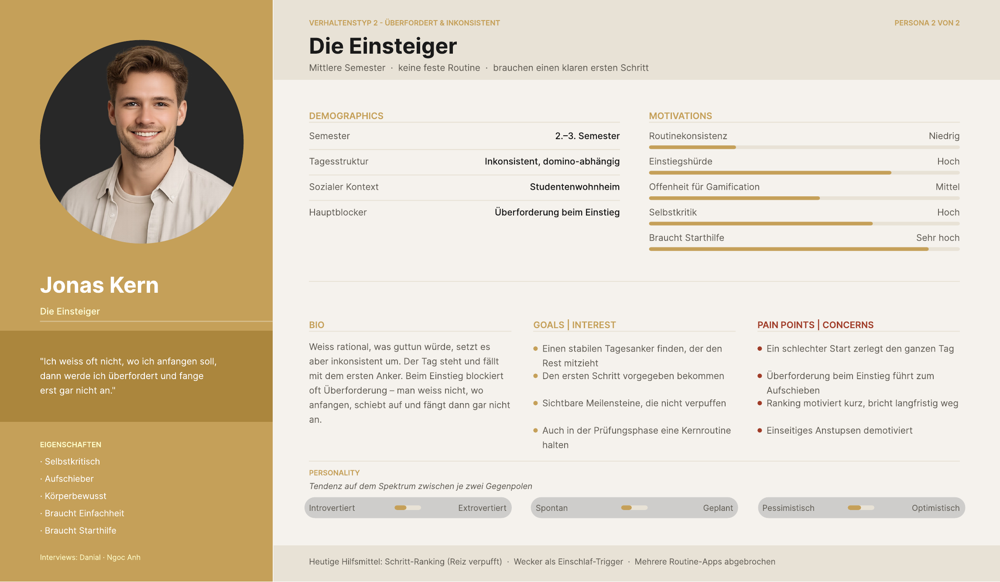

*Abb. 5.2: Das Persona-Sheet „Die Einsteiger", verdichtet aus zwei Interviews.*

*Verdichtet aus Danial und Ngoc Anh. Mittlere Semester, keine feste Routine, brauchen einen
klaren ersten Schritt.*

> „Ich weiß oft nicht, wo ich anfangen soll, dann werde ich überfordert und fange erst gar
> nicht an." *(Ngoc Anh)*

Den Einsteigern fehlt weniger das Wissen darüber, was ihnen guttun würde, als der Anfang. Besonders
der Start in den Tag ist entscheidend. Läuft er nicht wie geplant, werden auch die nächsten
Vorhaben aufgeschoben, und der ganze Domino kippt.

| | |
|---|---|
| **Ziele** | einen stabilen Tagesanker finden, der den Rest mitzieht · den ersten Schritt vorgegeben bekommen · sichtbare Meilensteine · auch in der Prüfungsphase eine Kernroutine halten |
| **Frustrationen** | ein schlechter Start zerlegt den Tag · Überforderung führt zum Aufschieben · Ranking motiviert kurz, bricht langfristig weg |
| **Align-Hebel** | KI-Assistent formuliert den nächsten Mikroschritt · Gewohnheitsketten, die am ersten Anker des Tages hängen · Meilensteine statt Ranking |

Die Zeile „Align-Hebel" ist unsere Antwort auf den Vorschlag von Frau Heß, anhand der Personas einen
Vorher-Nachher-Vergleich zu erstellen. Sie stellt jeder Frustration die Funktion gegenüber, die sie
auffangen soll.

## 5.6 Feedback von Frau Heß

Frau Heß war von unserem Stand überzeugt und gab uns vier Punkte mit:

- **Eine offene Fachfrage.** Gibt es eine Höchstzahl an Gewohnheiten, die man gleichzeitig verfolgen
  kann, ohne überfordert zu sein? Das sollten wir in unseren Quellen prüfen.
- **Persona-Fokus.** Für welche der beiden Personas entwickeln wir Align eigentlich?
- **Nicht zu früh einschränken.** Bei Ideen und Mockups zunächst größer denken und erst bei der
  Umsetzung entscheiden, was wir tatsächlich bauen. „Es muss nicht alles perfekt sein."
- **Design-System.** Farben, Typografie und Formen in einer gemeinsamen Figma-Datei festlegen,
  damit alle in dieselbe Richtung gestalten.

Aus der Frage nach der Höchstzahl entstand die **Grenze von fünf aktiven Gewohnheiten**
(Abschnitt 6.3). Beim Persona-Fokus wollten wir uns nicht auf eine Gruppe festlegen und haben die
Frage über die Funktionen beantwortet. Die Einsteiger brauchen vor allem Hilfe beim Anfangen, also
die KI-gestützte Starthilfe. Für die Selbstregulierten stehen Situations-Anker und eine
Fortschrittsanzeige ohne Druck im Vordergrund.

---

# Iteration 3 — Online-Umfrage und Priorisierung

## 5.7 Konzeption des Fragebogens

Zuerst haben wir zwei Versionen der Umfrage entworfen, eine längere mit zwanzig Fragen und eine
kürzere mit zwölf, die sich auf die offenen Punkte aus den Interviews konzentrierte. In einem
gemeinsamen Call haben wir schwache Fragen gestrichen oder neu formuliert. Jede Frage sollte eine
konkrete Entscheidung für Align prüfen, zum Beispiel ob Streaks oder eine Konsistenzrate besser
ankommen und ob soziale Funktionen gewünscht sind. Den Hinweis von Frau Heß, zuerst allgemeine
Funktionen und erst danach unsere eigenen Ideen abzufragen, haben wir in der Reihenfolge der Fragen
umgesetzt.

## 5.8 Werkzeugwahl und Durchführung

Erstellt haben wir die Umfrage in **LimeSurvey** (Abschnitt 3.4). Zu Beginn wurde abgefragt, ob
man studiert, außerdem Alter und Geschlecht. Am 14. Juni haben wir die Umfrage in unserer
E-Commerce-Kohorte, bei den Erstsemestern, in weiteren Hochschulgruppen und in Gruppen von
Studentenwohnheimen geteilt. Nach rund zwei Stunden hatten bereits **25 Personen** den Fragebogen
vollständig ausgefüllt. Damit war die Kapazität des Umfragewerkzeugs erreicht, und die Erhebung
endete (Abschnitt 5.11).

## 5.9 Ergebnisse

**Stichprobe.** An der Umfrage haben 25 Personen vollständig teilgenommen, davon 24 Studierende.
16 waren weiblich und 9 männlich, 19 zwischen 21 und 25 Jahre alt. Bei den Semestern lag der
Schwerpunkt im 5. bis 6. Semester (12), gefolgt vom 1. bis 2. Semester (5).

**Wie organisieren sich Studierende heute?**

| Methode | Nennungen |
|---|---|
| Kalender oder Planer | 20 |
| Erinnerungen am Handy | 14 |
| Freunde / Lernpartner | 7 |
| Nichts Bestimmtes | 7 |
| **Habit-App** | **2** |

Nur 2 von 25 nutzen aktuell eine Habit-App, aber 20 von 25 planen ohnehin mit einem Kalender oder
Planer, und 14 lassen sich vom Handy erinnern. Eine Planung mit Zeitblöcken knüpft also an etwas
an, das Studierende bereits tun. Dieser Befund ist der Ausgangspunkt für unser Time Blocking
(Abschnitt 6.2) und später für den Kalender von Align (Abschnitt 7.10).

Bei den Gewohnheiten selbst standen **Lernen und Uni** (20), **Bewegung und Sport** (18) sowie
**Schlaf und Erholung** (16) im Vordergrund.

**Was macht es schwierig, Gewohnheiten beizubehalten?** Stress und Prüfungsphasen waren mit 17 von
25 Nennungen der häufigste Grund aufzugeben. 15 von 25 **reduzieren** ihre Gewohnheiten in solchen
Phasen aber nur, statt sie ganz aufzugeben. Daraus haben wir mitgenommen, dass Gewohnheiten klein
genug sein sollten, um auch in vollen Wochen Platz zu haben. Eine eigene Funktion für
Prüfungsphasen haben wir nicht umgesetzt (Abschnitt 9.9). Der dritthäufigste Grund war mit 10
Nennungen schlicht „Ich vergesse es". Auch das spricht dafür, Gewohnheiten fest im Tag einzuplanen
und vorher an sie zu erinnern.

| Aussage (1 bis 5) | Ø |
|---|---|
| „Wenn ich eine Gewohnheit nicht einhalten konnte, fühle ich mich schuldig/enttäuscht." | **3,92** |
| „Ich weiß, was ich ändern will, aber es wird selten zur Routine." | 3,80 |
| „Wenn ich aus einer Routine rausgefallen bin, fällt mir der Wiedereinstieg schwer." | 3,68 |

Der hohe Wert beim Schuldgefühl hat uns zusammen mit dem schwierigen Wiedereinstieg darin
bestätigt, auf jede Form von Bestrafung zu verzichten.

**Welche Funktionen werden gewünscht?**

| Funktion | Ø Nützlichkeit |
|---|---|
| Starthilfe, kleinster nächster Schritt | **4,16** |
| Erinnerung vor der Gewohnheit | 4,04 |
| Dynamische Anpassung bei Nichteinhaltung | 4,04 |
| Wenn-Dann / Situationsanker | 3,88 |
| Warum-Satz (Motivationsanker) | 3,56 |
| Sehen, ob Freund:in es gemacht hat | 3,55 |
| Feste Uhrzeit (Time-Block) | 3,50 |
| Gemeinsamer Kalender mit Freunden | 3,04 |
| Bilder/Nachrichten *während* der Gewohnheit | **2,83** |

Die Starthilfe wurde am besten bewertet. Für das Time Blocking war das Mittelfeld aufschlussreich.
Die Erinnerung vor der Gewohnheit gehört zu den bestbewerteten Funktionen, und Situations-Anker
fanden die Befragten nützlicher als eine feste Uhrzeit. Genau so haben wir das Anlegen einer
Gewohnheit später aufgebaut, mit der Situation zuerst und der festen Uhrzeit als zweitem Weg
(Abschnitt 8.3). Bei der Frage nach der wichtigsten einzelnen Funktion lag dagegen das
Fortschrittstracking vorn (9 von 25), vor der dynamischen Anpassung (7) und der Starthilfe (6).

**Soziales, genauer betrachtet.** Nur 3 von 25 nannten soziale Funktionen als wichtigste Funktion,
aber 21 von 25 würden ihre Gewohnheiten mit **engen Freunden** teilen, mit anonymen Personen nur 2.
Soziale Funktionen sind also gefragt, aber im kleinen, vertrauten Kreis.

## 5.10 Ein Befund, der die Interviews korrigierte

Aus den Interviews stammte die Annahme, dass Streaks demotivieren. In der Umfrage hat sich das so
nicht bestätigt.

| Präferenz | Stimmen |
|---|---|
| Streak | 9 |
| Konsistenzrate | 5 |
| offen für beides | 11 |

Nur 5 von 25 bevorzugten eindeutig die Konsistenzrate, 9 den Streak, und 11 waren für beides
offen. Wir haben uns deshalb nicht für eine Seite entschieden. Der Streak kann motivieren, aber sein
**Bruch** darf nicht bestrafen. In der fertigen Anwendung gibt es beides: die Konsistenzrate als
ruhige Kennzahl, Serien an einer eigenen Stelle und verpasste Tage, die neutral dargestellt werden.

## 5.11 Methodische Einordnung

Die Ergebnisse unserer Umfrage geben eine **Richtung vor, sind aber nicht repräsentativ**. Mit 25
statt der angestrebten 50 Antworten ist die Stichprobe klein, viele Teilnehmende kamen aus dem
Studiengang E-Commerce und dem 5. bis 6. Semester, und das Verhältnis von 16 Frauen zu 9 Männern war
nicht ausgeglichen. Als Hilfe zur Priorisierung ist die Umfrage gut geeignet. Zwei ursprünglich
geplante Skalen, zur Habit Journey und zur Konsistenzrate, fehlen im finalen Fragebogen, und für
eine getrennte Auswertung nach Personas wären die Gruppen zu klein gewesen. Was wir daraus gelernt
haben, beschreibt Abschnitt 9.5.

## 5.12 Abgeleitete Produktentscheidungen

| Erkenntnis | Entscheidung |
|---|---|
| Nur 2/25 nutzen eine Habit-App, 20/25 planen mit Kalender | Time Blocking statt eigener Tracker-Welt; Gewohnheiten liegen später als Blöcke im Kalender (Abschnitt 7.10) |
| Erinnerung vor der Gewohnheit ø 4,04, Situationsanker ø 3,88 vor fester Uhrzeit ø 3,50, „Ich vergesse es" 10/25 | Gewohnheiten an einen Moment im Tag knüpfen, feste Uhrzeit als zweiter Weg, Erinnerung vor dem Termin |
| Stress/Prüfungsphase ist Hauptgrund fürs Aufgeben (17/25), 15/25 reduzieren statt aufzugeben | Gewohnheiten klein halten und den Einstieg erleichtern; eine eigene Funktion für Prüfungsphasen ist nicht umgesetzt (Abschnitt 9.9) |
| Schuldgefühl nach Scheitern ø 3,92 | kein Straf- oder Bestrafungsmechanismus, Fehltage neutral |
| Starthilfe bei Überforderung ist die bestbewertete Funktion (ø 4,16) | KI-gestützter Erster-Schritt-Assistent als Kern-Anwendungsfall der Claude API |
| Fortschrittstracking meistgewählte wichtigste Funktion (9/25) | Progress Tracking als Kernfeature, nicht bestrafend gestaltet |
| Streak-Präferenz uneinheitlich (9 : 5 : 11) | beide Ansichten anbieten, Bruch vergebend gestalten |
| 21/25 teilen mit engen Freunden, nur 3/25 nennen Soziales als wichtigste Funktion | Habit-Buddies als dezente Opt-in-Ebene, keine öffentliche Rangliste |
| Gemeinsamer Kalender (3,04) und Live-Bilder (2,83) schwach bewertet | beide verworfen |

## 5.13 Eine Entscheidung gegen ein eigenes Feature

Ein Ergebnis der Auswertung war, dass wir die geplante **Habit Journey** nicht weiterverfolgt
haben, also die Darstellung des langfristigen Gewohnheitsaufbaus als Fortschrittskurve. Nach der
Umfrage waren uns andere Funktionen wichtiger. Wir haben die Idee trotzdem bewusst in unserer
Präsentation gezeigt und anhand der Umfragedaten erklärt, warum wir uns dagegen entschieden haben.

## 5.14 Feedback von Frau Heß

Das Feedback war dieses Mal kurz und bestätigend. Wir hätten die wichtigsten Funktionen aus der
Umfrage herausgearbeitet und sollten sie jetzt umsetzen und auch visuell zeigen. Vor allem sollten
wir **dem roten Faden folgen** und das Design auf den Ergebnissen der Umfrage aufbauen. Für die
Screens, die ab Juli entstanden sind, haben wir deshalb in einem eigenen Begründungsdokument
festgehalten, auf welcher Erkenntnis die jeweilige Entscheidung beruht.

---

# 6. Phase 3 — Konzeption und Design

**Zeitraum:** 30. Juni bis 20. Juli 2026 · **Iteration 4**, Betreuungsgespräch am 20. Juli

In dieser Phase sollten aus den Ergebnissen der Nutzerforschung konkrete Funktionen und
ausgearbeitete Screens entstehen, und jede Entscheidung sollte sich auf einen Befund aus
Interviews, Umfrage oder Recherche zurückführen lassen. Gleichzeitig haben wir eine gemeinsame
Designsprache festgelegt, damit die Screens zusammenpassen.

## 6.1 Von der Priorisierung zu drei Kernfeatures

Auf Grundlage der Umfrage haben wir drei Kernfeatures festgelegt, ergänzt durch eine KI-Assistenz,
die an mehreren Stellen unterstützt:

| Feature | Empirischer Anker |
|---|---|
| **Time Blocking** | Wenn-Dann-Anker ø 3,88 · 20/25 planen ohnehin mit Kalender · in allen sechs Interviews bestätigt |
| **Progress Tracking** | meistgewählte wichtigste Funktion (9/25) · Schuldwert 3,92 macht „vergebend" zur Pflicht |
| **Community** | 21/25 teilen mit engen Freunden, aber nur 3/25 nennen Soziales als wichtigste Funktion |
| **KI-Assistenz** | Starthilfe bei Überforderung ø 4,16, der Bestwert aller abgefragten Funktionen |

Die ursprünglich geplante **Habit Journey** haben wir nicht weiterverfolgt (Abschnitt 5.13). Für
alle Features galt derselbe Maßstab: Eine Gewohnheit anzulegen, abzuhaken oder zu verschieben
durfte nicht selbst zu einer Aufgabe werden, die man aufschiebt. Deshalb haben wir bei jedem Screen
geprüft, welche Angabe wirklich nötig ist, und alles andere weggelassen oder sinnvoll vorbelegt.

## 6.2 Time Blocking

Time Blocking ist die Grundlage für die Planung in Align. Statt nur ein allgemeines Ziel wie „Ich
möchte regelmäßig laufen gehen" festzulegen, wird eine Gewohnheit nach dem Prinzip der
Wenn-Dann-Planung mit einer konkreten Situation und einem Zeitfenster verbunden. Zuerst wählt man
die Gewohnheit, danach einen passenden Auslöser, zum Beispiel „Wenn ich von der Uni nach Hause
komme, dann gehe ich laufen". Dieses Format ist Grundlage für die Planung im Tag und für
Erinnerungen. Dazu gehören drei Mechanismen:

- **Situations-Picker statt Zeitpicker.** Eine Situation wie „nach dem Aufstehen" kommt ohnehin im
  Alltag vor und löst das Verhalten aus, während man sich eine Uhrzeit aktiv merken muss.
- **Domino-Prinzip und Habit Chains.** Eine Gewohnheit wird zum Auslöser der nächsten. Verschiebt
  sich die erste, rückt die zweite mit.
- **Erinnerung vor dem Auslöser.** Die Erinnerung kommt vor der Situation und nicht erst dann, wenn
  die Gewohnheit eigentlich schon erledigt sein sollte.

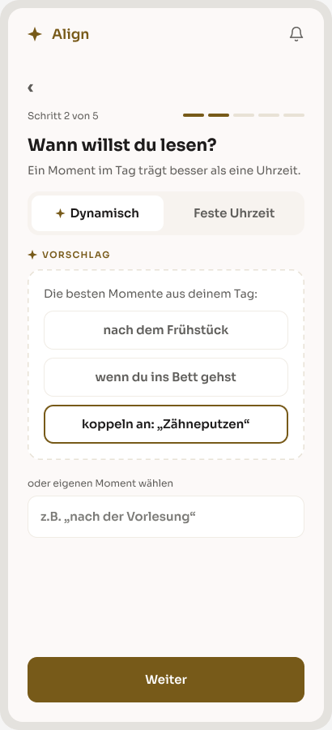 

*Abb. 6.1 und 6.2: Der Einrichtungsflow im Entwurf. Links die Wahl des Ankers, rechts der
Warum-Satz in eigenen Worten.*

**Wissenschaftliche Grundlage.** Faude-Koivisto und Gollwitzer (2009) zeigen, dass das Format
„Wenn X, dann Y" die Kontrolle über ein Verhalten von der Selbstdisziplin auf die Situation
verlagert, vor allem bei einem genau festgelegten Wenn-Teil. Becker (2024) nennt einen konkreten
Auslöser als Voraussetzung jeder Gewohnheit und beschreibt das Domino-Prinzip. Lally et al. (2010)
halten fest, dass situative Auslöser wirksamer sind als Uhrzeiten.

## 6.3 Progress Tracking

Sichtbarer Fortschritt motiviert, ist in unserer Zielgruppe aber auch eine empfindliche Stelle,
weil sich viele nach einem verpassten Tag schuldig fühlen. Unser Grundsatz war deshalb, Fortschritt
ehrlich zu zeigen, ohne Druck aufzubauen. Daraus ergaben sich folgende Regeln:

- Es können höchstens fünf Gewohnheiten gleichzeitig aktiv sein.
- Der Verlauf erscheint als Kalenderansicht, und Tage ohne Eintrag bleiben neutral statt rot.
- Ein verpasster Tag löst weder eine negative Nachricht noch ein Kreuz oder einen Reset aus.
- Ist eine Gewohnheit gefestigt, kann sie durch eine neue ersetzt werden.

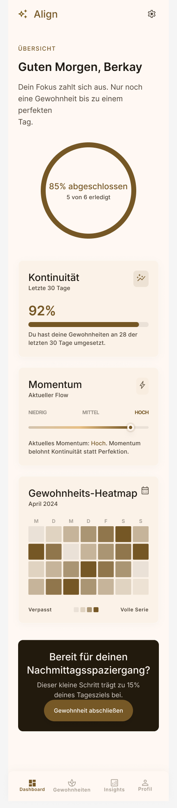 

*Abb. 6.3 und 6.4: Progress Tracking im Entwurf. Die Übersicht zeigt den Stand des Tages, die
Insights-Ansicht den Verlauf über mehrere Wochen.*

**Wissenschaftliche Grundlage.** Becker (2024) beschreibt, dass sichtbarer Fortschritt die
zukünftige Leistung um bis zu 20 % erhöhen kann. Lally et al. (2010) zeigen, dass für den Aufbau
einer Gewohnheit vor allem die Regelmäßigkeit zählt und einzelne ausgelassene Tage keinen messbaren
langfristigen Einfluss haben. Rund die Hälfte der motivierten Teilnehmenden dieser Studie hat keine
feste Gewohnheit aufgebaut, weil sie zu unregelmäßig war. Sanfte Hinweise auf die Regelmäßigkeit
sind deshalb wichtiger als das reine Zählen von Serien.

### Die Frage von Frau Heß nach der Höchstzahl

Die Frage von Frau Heß, ob es eine Grenze für gleichzeitig verfolgte Gewohnheiten gibt, haben wir
bei **Becker (2024, Kap. 14.7.2)** beantwortet. Dort werden täglich bis zu fünf Gewohnheiten
bewertet, und sobald sich eine gefestigt hat, kann sie durch eine neue ersetzt werden. Daraus wurde
eine belegte Regel für unser Produkt, die **Grenze von fünf aktiven Gewohnheiten**, die wir in
Phase 4 umgesetzt haben (Kapitel 7).

## 6.4 Community

Mit der Community wollten wir Gewohnheiten eine soziale Seite geben, ohne daraus einen Vergleich
zwischen Nutzern zu machen. 21 von 25 Befragten würden ihre Gewohnheiten mit engen Freunden
teilen, aber nur 3 von 25 nannten den sozialen Bereich als wichtigste Funktion, und aufdringliche
Mechaniken wie ein gemeinsamer Kalender wurden deutlich schwächer bewertet. Deshalb haben wir die
Community als **freiwillige, ergänzende Ebene** für Personen geplant, die man bereits kennt.


*Abb. 6.5: Eine Verabredung vorschlagen. Der Entwurf zeigt eine einzelne Gewohnheit und eine
einzelne Person, keine Gruppe und keine Liste.*

### Eine explizite Entscheidungsvorlage

Zwei mögliche Mechanismen haben wir auf einer eigenen Vergleichsfolie gegenübergestellt:

| | „Community Dashboard" | „Die Verabredung" |
|---|---|---|
| Prinzip | Rangliste, Gruppenstatistiken, Feed | konkrete, terminbasierte Verbindlichkeit zwischen 1 bis 3 Personen |
| Empirie | Rangliste explizit nicht gewünscht; Rankings verlieren laut Interviews langfristig ihre Wirkung | „Wenn du eine Verabredung hast, gehst du mit einem anderen Pflichtbewusstsein ran" |


*Abb. 6.6: Die Vergleichsfolie, mit der wir die Entscheidung begründet haben.*

Auf Grundlage der Daten haben wir uns für den **Verabredungsmechanismus** entschieden. Damit haben
wir auch die Anregung von Frau Heß aus Iteration 1 aufgegriffen, den sozialen Aspekt im Sinne von
„ich bin nicht allein" umzusetzen, ohne dass daraus ein Vergleich wird.

**Wissenschaftliche Grundlage.** Becker (2024) beschreibt, dass das soziale Umfeld über den Erfolg
einer Gewohnheit mitentscheidet und dass soziale Verbindlichkeit („ich verabrede mich mit jemandem
zum Sport") zu den wirksamsten Starthilfen für neue Gewohnheiten gehört.

## 6.5 KI-Assistenz

Ergänzend zu den drei Kernfeatures haben wir die KI als übergreifende Ebene geplant, im Konzept
noch über die Claude API angebunden (zur Umsetzung Abschnitt 7.4). Weiß jemand nicht, wie er
anfangen soll, schlägt sie einen möglichst kleinen nächsten Schritt vor. Fällt eine Gewohnheit mit
einem anderen Termin zusammen, schlägt sie einen neuen Platz im Tag vor.


*Abb. 6.7: Der kleinste nächste Schritt im Entwurf.*

Diese Rolle ist durch die Umfrage am besten abgesichert, denn die **Starthilfe bei Überforderung**
war die bestbewertete Funktion. Für die acht Screens, in denen die KI eine Rolle spielt, haben wir im
Begründungsdokument festgehalten, was dort passiert, warum wir uns dafür entschieden haben und auf
welche Erkenntnisse wir uns beziehen.

## 6.6 Die Designsprache

Aus der Arbeit an den Prototypen entstand ein Dokument, das Farben, Typografie, Abstände, Formen und
wiederkehrende Komponenten festhält und später als Vorlage für die technische Umsetzung diente.
Verbindlich blieb die Figma-Datei, von der das aus Screenshots abgeleitete Dokument an einzelnen
Stellen abweicht.

### Die Farbentscheidung

Unsere ersten Entwürfe mit dunkler Farbwelt und blauen Akzenten wirkten im Vergleich zu dominant.
Deshalb haben wir uns für eine ruhigere, wärmere Farbwelt mit **Gold als durchgängiger
Akzentfarbe** entschieden, kombiniert mit Schwarz im Dark Mode und Weiß im Light Mode. An dieser
Farbwelt haben wir bis zum Projektende festgehalten.

 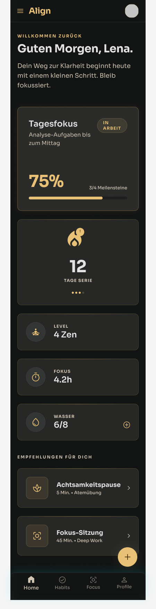 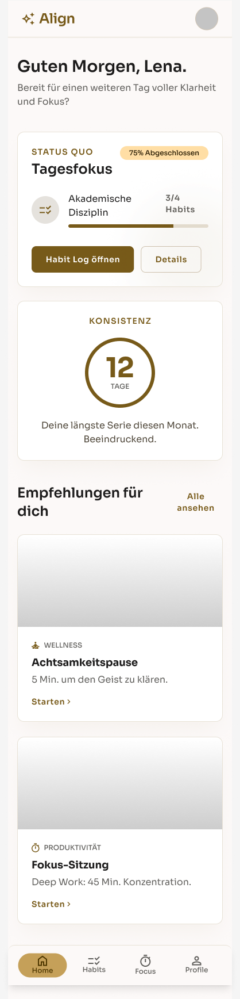

*Abb. 6.8 bis 6.10: Dieselbe Startseite über drei Iterationen. Links die erste, dunkelblaue
Fassung mit Cyan-Akzent, in der Mitte der Zwischenstand, rechts die warme Fassung mit Gold
und Sora, die bis zum Projektende hielt.*

Als Schrift haben wir **Sora** festgelegt. Im Entwurf gliedert die Navigation die Anwendung in vier
Hauptbereiche, in der gebauten Anwendung sind daraus fünf geworden (Kapitel 8).

## 6.7 Von statischen Entwürfen zu interaktiven Prototypen

Neben statischen Entwürfen haben wir in dieser Phase interaktive Prototypen in HTML gebaut, weil
sich Abläufe mit mehreren Schritten, wie das Einrichten einer Gewohnheit, darin besser ausprobieren
lassen als in einzelnen Screens. Farben, Typografie und Abstände kamen aus Figma, und bei
Abweichungen galt Figma. Rückblickend war das unser erster Schritt in Richtung Umsetzung, denn viele
dieser Abläufe sind direkt in die spätere Entwicklung eingeflossen.

## 6.8 Prototypen

Bis zum Betreuungsgespräch lagen Entwürfe für alle drei Kernfeatures vor, die wir untereinander
aufgeteilt hatten:

- **Time Blocking und KI-Assistenz** als Abfolge von neun Screens, vom Ziel über den
  Situations-Anker und den Warum-Satz bis zur Meldung bei einem Terminkonflikt
- **Progress Tracking** von einfachen Wireframes bis zu ausgearbeiteten Screens mit Übersicht,
  Konsistenz, Insights, Hindernissen und Meilensteinen
- **Community** mit dem Anlegen gemeinsamer Gewohnheiten, den Community-Screens und der
  Vergleichsfolie zur Entscheidung für die Verabredung

## 6.9 Feedback von Frau Heß

Das Feedback zu den drei ausgearbeiteten Features und ihren Designs fiel kurz und bestätigend aus.
Nach dem Gespräch haben wir Frau Heß in unsere Figma-Datei eingeladen, damit sie sich die Entwürfe
dort direkt ansehen konnte.

## 6.10 Was daraus folgte

Nach dem Betreuungsgespräch haben wir mit der technischen Umsetzung begonnen. Mit einer durch
Interviews und Umfrage abgesicherten Funktionsauswahl, zwei Personas, einer gemeinsamen
Designsprache und ausgearbeiteten Entwürfen mussten wir nichts neu denken. Prototypen und
Designsprache sind direkt in die Implementierung eingegangen.

---

# 7. Phase 4 — Technische Umsetzung

**Zeitraum:** 21. Juli bis 7. September 2026 · **Iterationen 5 und 6**, Betreuungsgespräche
am 10. August und 7. September

Nach der Konzeptphase stand fest, welche Features wir bauen wollten. In dieser Phase haben wir
zuerst die technische Grundlage gebaut und daraus dann eine Anwendung gemacht, die sich im Alltag
benutzen lässt.

## 7.1 Die Entscheidung für den Tech-Stack

Wir haben Align als Mobile-First-Web-App mit Laravel gebaut. Warum wir diese
Entwicklungsentscheidung getroffen haben, erklären wir im Folgenden.

**Web-App statt nativer App.** In der Konzeptphase sind wir von einer nativen App ausgegangen. Eine
Web-App läuft dagegen im Browser, muss nicht getrennt für iOS und Android gebaut und nicht über
einen App-Store veröffentlicht werden. Dadurch war jede Änderung sofort sichtbar, und wir konnten
jeden Zwischenstand direkt ausprobieren.

**Mobile First.** Align ist für das Smartphone gedacht. Deshalb haben wir jede Ansicht zuerst für
die Breite eines Smartphones gestaltet und die Mobilansicht beim Entwickeln am Laptop laufend im
Browser geprüft, ohne Simulator und ohne eigenes Testgerät.

**Laravel.** Laravel ist ein PHP-Framework, in dem viele Grundfunktionen einer Webanwendung schon
enthalten sind, zum Beispiel die Anmeldung, der Zugriff auf die Datenbank und die Prüfung von
Eingaben. So kamen wir schneller zu einer lauffähigen Anwendung und konnten uns auf die
eigentlichen Funktionen von Align konzentrieren. Die Oberfläche haben wir mit React aus
wiederverwendbaren Bausteinen gebaut (Abschnitt 7.2).

Die Web-App ist eine Entscheidung für die Entwicklung und keine für das spätere Produkt. Unsere
langfristige Produktidee bleibt eine native App (Abschnitt 9.10). Beim Programmieren haben wir
KI-gestützte Werkzeuge eingesetzt. Was die App können soll, welche Daten sie speichert und wie sie
sich in welcher Situation verhält, haben wir selbst entschieden.

## 7.2 Der Stack im Überblick

| Schicht | Technologie | Begründung |
|---|---|---|
| Sprache / Runtime | PHP 8.4, Node 25 | kommen beide von Herd, keine separate Einrichtung |
| Backend | **Laravel 13** | Routing, Validierung, Anmeldung und Datenbankzugriff sind bereits enthalten |
| Bridge | **Inertia.js 3** | verbindet Controller direkt mit React-Seiten, SPA-Gefühl ohne eigene API-Schicht |
| Frontend | **React 19** + TypeScript 5.7 | Komponenten mit Typprüfung über die gesamte Oberfläche |
| UI | **shadcn/ui** (Radix), **Tailwind CSS 4** | Komponenten liegen als Quelltext im Projekt und sind frei an die Designsprache anpassbar |
| Build | Vite 8 | Hot Reload im Betrieb, gebündelte Assets für die Auslieferung |
| Routen im Frontend | `laravel/wayfinder` | erzeugt TypeScript-Funktionen aus den Laravel-Routen, Tippfehler fallen beim Kompilieren auf |
| Auth | `laravel/fortify` mit Passkeys und 2FA | geprüfter Baustein statt Eigenbau |
| Datenbank | **SQLite** | eine Datei, kein Server; Cache, Queue und Session laufen ebenfalls darüber |
| KI | `laravel/ai` über die **OpenRouter-API** | siehe 7.4 |
| Qualität | Pest 5, Larastan, Pint, ESLint, Prettier | siehe 7.5 |
| Umgebung | Laravel Herd, `https://align.test` | HTTPS lokal, ohne eigene Serverkonfiguration |

## 7.3 Architektur

Ein Aufruf nimmt immer denselben Weg:

```
Browser → Route (routes/web.php) → Controller → Inertia::render() → React-Seite
```

Der Controller lädt die Daten und übergibt sie über Inertia direkt an die React-Seite, eine eigene
REST-API ist dafür nicht nötig. Die Oberfläche baut auf shadcn/ui-Komponenten, die die
Design-Tokens aus einer zentralen Stylesheet-Datei tragen. Dort liegen Sora und die Farben aus Figma
als CSS-Variablen, darunter `primary` mit `#775A19`. Unsere Designsprache aus Phase 3 ist damit
direkt im Code verankert.

## 7.4 Die KI-Anbindung

Die KI-Funktionen sprechen über das Laravel-AI-SDK mit der OpenRouter-API. Anbieter und Modell
lassen sich ohne Codeänderung austauschen. Jede Funktion ist eine eigene Agent-Klasse mit festem
Prompt, Zeitlimit und einem Schema für die Antwort. Die Agenten kennen dabei den Kontext, in dem sie
gefragt werden, also die Gewohnheiten der Person, ihren Schlafrahmen und ihren Stundenplan. Ein
Vorschlag für einen neuen Platz im Tag entsteht damit für genau diesen Tag.

Eine Entscheidung war uns dabei wichtig. Fällt ein Aufruf aus, antwortet die Anwendung mit einer
**ehrlichen Absage** und nicht mit einem regelbasierten Ersatzvorschlag. Ein Vorschlag soll nur dann
als KI-Vorschlag erscheinen, wenn er auch von der KI stammt.

## 7.5 Qualitätssicherung

Feature-Tests mit **Pest** decken die zentralen Abläufe ab: Onboarding, Gewohnheiten,
Erinnerungen, KI-Vorschläge, Verabredungen. **Larastan** prüft die Typen im Backend, der
TypeScript-Compiler die im Frontend, **Pint** und **ESLint/Prettier** den Stil. Ein einzelner
Befehl führt alles in einem Durchlauf aus.

---

# Iteration 5 — Aufbau der Anwendung

Unser Ziel war ein lauffähiger Stand, der die drei Kernfeatures erkennbar abbildet. Er musste
nicht vollständig sein, aber weit genug, um ihn vorführen zu können.

## 7.6 Was entstand

**Grundgerüst und Designsprache.** Aus einem ersten Dashboard mit Beispieldaten wurde eine
Anwendung mit echten Gewohnheitsdaten in unserer Designsprache aus Phase 3. Danach kamen Onboarding,
das Abhaken von Gewohnheiten und die drei Feature-Bereiche dazu.

**Kernfunktionen.** Darauf aufbauend entstanden feste Uhrzeiten mit Erinnerungen zehn Minuten vor
dem Termin, die KI-Anbindung mit dem kleinsten nächsten Schritt und ein Tageskalender, in dem die KI
einen Block verschieben kann. Dazu kamen der Freundschafts-Layer mit Verabredungen und Absagen,
Light und Dark Mode und eine Serienzählung, die ein Wochenende und einen verpassten Tag übersteht.

**Die Fünf-Gewohnheiten-Grenze.** Aus der belegten Regel wurde eine Funktion. Gewohnheiten lassen
sich beenden, und die Grenze wird dort erklärt, wo sie tatsächlich greift, nicht als abstrakte
Regel im Onboarding. Parallel ist ein eigenes Logo in einer hellen und einer dunklen Variante
entstanden.

Für diesen Bericht haben wir den Code-Stand vom 10. August noch einmal gestartet und zwei
Bildschirme nachträglich aufgenommen. Datum und Beispieldaten stammen deshalb aus der Aufnahme,
Aufbau und Funktionen aus dem damaligen Stand.

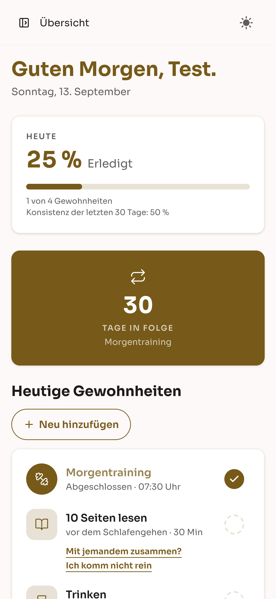 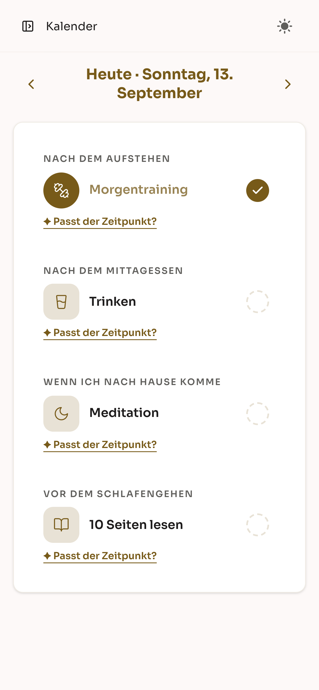

*Abb. 7.1 und 7.2: Die Anwendung im Code-Stand vom 10. August. Links die Übersicht mit
Prozentwert und großer Serien-Karte, „Ich komm nicht rein" war der damalige Name der
Starthilfe. Rechts der Kalender, der den Tag noch als Liste nach Situationen ordnete, darunter
„nach dem Mittagessen" und „wenn ich nach Hause komme".*

## 7.7 Feedback von Frau Heß

Frau Heß nannte drei Punkte. Die Dokumentation parallel weiterführen, das Design fertigstellen
und dabei priorisieren, die technische Umsetzung weitertreiben.

---

# Iteration 6 — Ausbau und Zuverlässigkeit

Für diese Iteration hatten wir uns zwei Ziele gesetzt: Die App sollte intuitiver werden, damit sie
nicht selbst zum Hindernis wird, und das Bestehende sollte in unterschiedlichen Kontexten
zuverlässig funktionieren. Beides zu vereinbaren fiel uns schwer. Damit sich die App intuitiv
bedienen lässt, muss sie in jeder Situation verlässlich reagieren. Jede Gewohnheit muss dabei aber
anders behandelt werden, je nachdem, ob sie am Aufstehen, an einer Vorlesung oder an einer festen
Uhrzeit hängt, und auch der Kontext ist oft ein anderer, etwa an einem Tag mit Vorlesungen oder am
Wochenende.

Der Stand aus Iteration 5 hatte viele Funktionen, die aber noch nicht ineinandergriffen. Der
Kalender ordnete den Tag nach Situationen, weil die Gewohnheiten keine Dauer hatten (Abb. 7.2), und
er wusste weder, wann der Tag beginnt und endet, noch etwas von Vorlesungen. Die folgenden
Abschnitte schließen diese Lücken nacheinander, jeweils mit dem Stand vorher, dem, was beim
Benutzen auffiel, und der Änderung.

| Abschnitt | Vorher | Nachher |
|---|---|---|
| **7.8 Katalog** | freie Eingabe, Gewohnheiten ohne Dauer | fester Katalog, jede Gewohnheit mit Dauer |
| **7.9 Schlafplan** | der Tag hatte keinen Anfang und kein Ende | Aufstehen und Schlafengehen spannen den Tag auf |
| **7.10 Zeitraster** | der Tag als Liste nach Situationen | der Tag als Zeitraster mit verschiebbaren Blöcken, nur noch Situationen mit berechenbarer Uhrzeit |
| **7.11 Stundenplan** | Semesterplan als eigener Bereich | Kurse liegen direkt im Kalender und haben Vorrang vor Gewohnheiten |
| **7.12 Navigation** | Seitenleiste mit sechs Einträgen | fünf Tabs am unteren Rand |
| **7.13 Gewohnheiten** | Karten mit Schaltern, Fortschritt in Prozent | Wochenblatt, Tage statt Prozent |

## 7.8 Gewohnheiten bekommen eine Dauer: der Katalog

**Vorher.** Im zweiten Schritt des Assistenten wählte man aus Vorschlägen oder tippte über „Etwas
anderes" eine eigene Gewohnheit in ein Textfeld. Unter den Vorschlägen standen auch Gewohnheiten wie
„Treppe statt Aufzug" oder „Eine Station früher aussteigen", die keine Dauer haben und keinen Platz
im Tag belegen (Abb. 7.3).

**Was beim Benutzen auffiel.** Eine Gewohnheit ohne Dauer lässt sich nicht in einen Tag einplanen,
und eine angehängte Gewohnheit weiß nicht, wann die vorige fertig ist. Solange der Kalender eine
Liste war, fiel das kaum auf. Im Zeitraster wurde es zum Hindernis.

**Nachher.** Wir haben uns entschieden, zunächst nur mit fest vorgegebenen Gewohnheiten zu arbeiten,
damit die Anwendung jede Gewohnheit zuverlässig planen kann. Gewohnheiten kommen aus einem Katalog,
in den nur aufgenommen wird, was planbar ist, eine Dauer hat und am Stück stattfindet. Der Katalog
ist in vier Bereiche des Studienalltags sortiert, und jede Dauer lässt sich beim Anlegen anpassen
(Abb. 7.4).

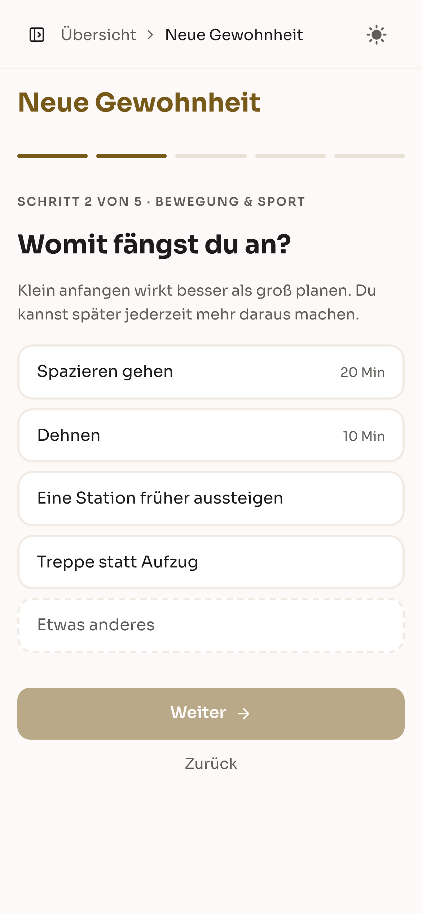 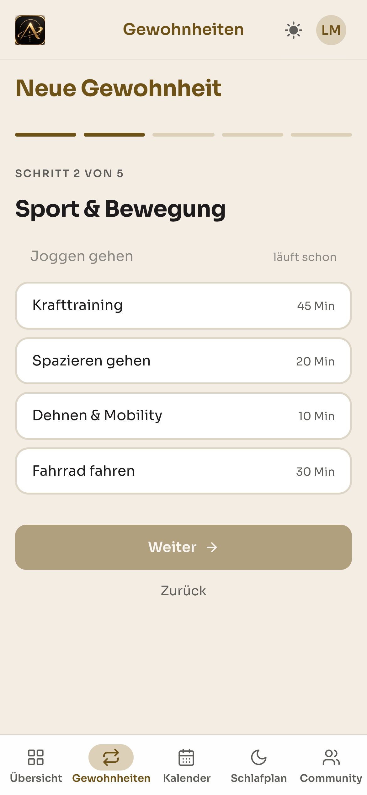

*Abb. 7.3 und 7.4: Derselbe Schritt im selben Bereich vorher und nachher. Links der Code-Stand
vom 31. August mit Vorschlägen, von denen zwei keine Dauer haben, und dem Feld
„Etwas anderes" für eine eigene Gewohnheit. Rechts der Katalog, in dem jeder Eintrag seine
Dauer trägt.*

**Warum das die wichtigste Änderung war.** Erst die Dauer macht aus einer Gewohnheit einen Block,
der eine echte Spanne im Tag belegt, und darauf bauen alle folgenden Abschnitte auf. Aus einem
Tracker wurde so ein Planungswerkzeug. Zugleich ist der Katalog unsere größte bewusste
Einschränkung, die sich aber erweitern lässt (Abschnitt 9.7).

## 7.9 Der Tag bekommt einen Rahmen: der Schlafplan

**Vorher.** Der Tag hatte keinen Anfang und kein Ende. Gewohnheiten „nach dem Aufstehen" oder „vor
dem Schlafengehen" hingen an Momenten, deren Uhrzeit die Anwendung nicht kannte.

**Was beim Benutzen auffiel.** Ohne Rahmen wusste die Anwendung nicht, wie viel Platz ein Tag
überhaupt bietet, und ein Vorschlag für einen neuen Platz hätte in der Nacht landen können.

**Nachher.** Aufsteh- und Schlafenszeit spannen den Tag auf, in dem alles andere stattfindet. Beide
legt man im Schlafplan für jeden Wochentag einzeln fest, weil ein Samstag anders aussieht als ein
Dienstag (Abb. 7.5). Damit kennt die Anwendung die Uhrzeit von „nach dem Aufstehen" und „vor dem
Schlafengehen", und verschiebt sich der Rahmen, rücken die Gewohnheiten an seinen Rändern mit.


*Abb. 7.5: Der Schlafplan mit einem Balken je Wochentag. Darunter lassen sich Schlafens- und
Aufstehzeit des gewählten Tages einstellen, dazu der Wecker und die Erinnerung vor der
Schlafenszeit.*

**Zwei Aufgaben auf einmal.** Der Rahmen ist bewusst **keine Gewohnheit**. Er wird nicht abgehakt,
hat weder Serie noch Quote und belegt keinen der fünf Plätze. Ein regelmäßiger Schlafrhythmus ist
aber selbst eine gute Gewohnheit, und wer im Schlafplan feste Zeiten einträgt, nimmt sie sich damit
schon vor. Dabei helfen eine Erinnerung 20 Minuten vor der Schlafenszeit und ein Wecker zur
Aufstehzeit, beides, solange die Anwendung geöffnet ist.

## 7.10 Aus der Liste wird ein Zeitraster

**Vorher.** Der Kalender zeigte den Tag als Liste nach Situationen (Abb. 7.2). Man sah, was ansteht,
aber nicht, wann genau, wie lange es dauert und ob zwei Dinge zeitlich zusammenpassen.

**Nachher.** Mit Dauer und Rahmen wurde der Tag zu einem Zeitraster, das beim Aufstehen beginnt und
beim Schlafengehen endet (Abb. 7.6 und 7.7). Jede Gewohnheit ist ein Block, den man per Langdruck
greifen und verschieben kann. Hängt eine Gewohnheit an einer anderen, rückt sie mit, und bevor die
Änderung gilt, fragt die Anwendung, ob sie nur an diesem Tag oder immer gelten soll
(Abschnitt 8.4).

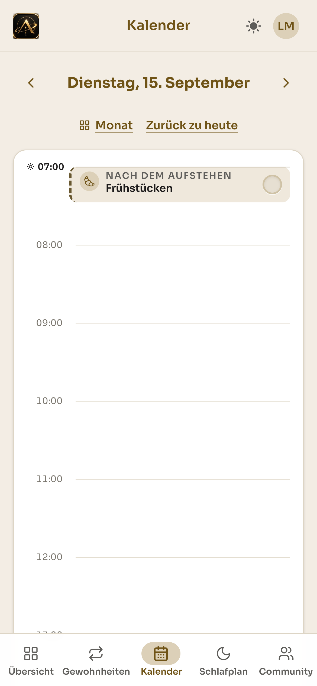 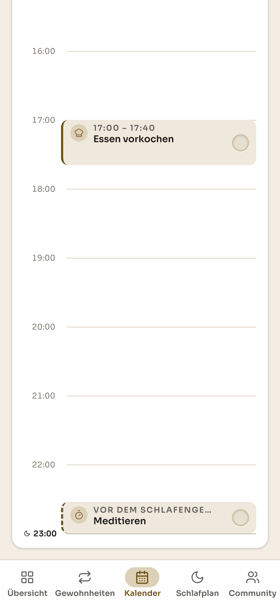

*Abb. 7.6 und 7.7: Derselbe Tag am Anfang und am Ende. Er beginnt mit der Aufstehzeit um 07:00
und endet mit der Schlafenszeit um 23:00. „Frühstücken" hängt an „nach dem Aufstehen" und liegt
deshalb am Anfang des Tages, „Meditieren" hängt an „vor dem Schlafengehen" und liegt an seinem
Ende.*

**Nur Situationen, deren Uhrzeit sich berechnen lässt.** Im Zeitraster braucht jede Gewohnheit eine
Uhrzeit. Anfangs gab es noch Situationen wie „nach dem Frühstück", „nach dem Mittagessen" und „wenn
ich nach Hause komme" (Abb. 7.2), deren Uhrzeit die Anwendung schätzen musste, zum Beispiel das
Mittagessen um 13 Uhr. Das passt für kaum jemanden, weil jede Person zu anderen Zeiten isst oder
nach Hause kommt, und eine selbst eingetippte Situation wie „Wenn ich aus der Bib komme" landete
sogar bei allen mittags. Wir haben diese Situationen und das Feld für eigene Situationen deshalb
herausgenommen. Angeboten werden nur noch die drei Situationen, deren Uhrzeit die Anwendung und die
KI aus den eigenen Angaben berechnen können: „nach dem Aufstehen" und „vor dem Schlafengehen" aus
dem Schlafplan und „nach der Vorlesung" aus dem Stundenplan. Wer eine Gewohnheit nach dem Frühstück
machen möchte, hängt sie an die Gewohnheit „Frühstücken".

**Luft zwischen zwei Blöcken.** Zwischen zwei Gewohnheiten und vor und nach einer Vorlesung hält
Align eine Viertelstunde Luft, zum Hinkommen und Umschalten, innerhalb einer Kette fünf Minuten.
Ohne diese Regel hätte das Raster Tage erlaubt, die auf dem Bildschirm aufgehen, im Alltag aber
nicht.

**„Immer" nur, wenn an allen Tagen Platz ist.** „Immer" legt eine Gewohnheit an jedem Wochentag, an
dem sie vorgesehen ist, auf die neue Uhrzeit. Deshalb prüft die Anwendung vorher den nächsten
Termin jedes dieser Wochentage und, falls ein Semester bevorsteht, auch den ersten Termin im
Semester. Liegt dort schon eine andere Gewohnheit, lehnt sie „Immer" ab, nennt die freien Zeiten und
bietet an, die Gewohnheit als „danach" anzuhängen oder zum betroffenen Tag zu springen (Abb. 7.8).
Nur für den gewählten Tag lässt sie sich trotzdem verschieben, wenn dort Platz ist.


*Abb. 7.8: „Frühstücken" soll an einem Dienstag auf 07:30 rücken. An diesem Tag ist dort Platz,
für „Immer" aber nicht, weil montags um 07:30 schon „Joggen gehen" liegt.*

## 7.11 Der Stundenplan zieht in den Kalender

**Vorher.** Aus der Competitor-Analyse stammte der Befund, dass keine der untersuchten Anwendungen
in Semestern und Vorlesungsrhythmus denkt (Abschnitt 4.2). Unser Semesterplan bekam zunächst einen
eigenen Bereich in der Navigation, in dem sich Kurse je Wochentag eintragen ließen (Abb. 7.9).

**Was beim Benutzen auffiel.** Ein Stundenplan ist keine eigene Aufgabe, sondern gibt vor, wo im Tag
überhaupt Platz für Gewohnheiten ist. Wer seinen Tag plant, will die Vorlesung dort sehen, wo auch
die Gewohnheiten liegen.

**Nachher.** Kurse liegen als Blöcke direkt im Kalender, damit weder man selbst noch die KI eine
Gewohnheit in eine Vorlesung legt (Abb. 8.15). Ein Kurs in einem kommenden Semester beansprucht
seinen Platz erst ab Semesterbeginn, und die Monatsansicht kündigt Konflikte an, bevor sie
eintreten (Abb. 8.14).

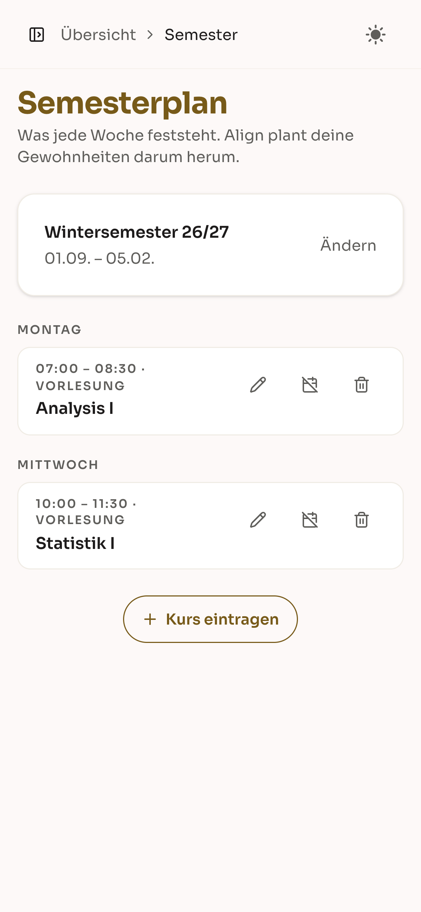

*Abb. 7.9: Der Semesterplan im Code-Stand vom 3. September, noch als eigener Bereich mit einer
Liste von Kursen.*

**Vorlesungen haben Vorrang.** Eine Vorlesung gibt die Hochschule vor, sie lässt sich nicht
verschieben, eine Gewohnheit dagegen schon. Zieht man eine Gewohnheit in eine Vorlesung, lässt die
Anwendung das nicht zu, erklärt den Grund und nennt die freien Zeiten davor und danach
(Abb. 7.10). Hängt eine Gewohnheit an einer Situation, weicht sie innerhalb eines Zeitfensters von
selbst auf die nächste freie Stelle aus.


*Abb. 7.10: „Frühstücken" soll an einem Mittwoch im Semester auf 10:30 rücken, mitten in
„Statistik I". Die Anwendung lässt das nicht zu, weil der Kurs nicht rückt, und nennt die
freien Zeiten bis 09:45 und ab 11:45.*

**Eine Verfeinerung.** Zunächst wurde ein Kurs abgewiesen, wenn an seiner Stelle schon eine
Gewohnheit lag. Wer zu Semesterbeginn seinen Stundenplan einträgt, hätte also erst jede Gewohnheit,
die im Weg liegt, von Hand wegräumen müssen. Jetzt wird der Kurs eingetragen, und die Gewohnheit
wird geparkt. Sie wird nicht gelöscht, steht ab Semesterbeginn aber im Bereich „Ohne festen Platz",
zusammen mit der Uhrzeit, zu der sie bisher lief (Abb. 7.11). Von dort lässt sie sich ins Raster
ziehen, oder man lässt sich über „Anderer Zeitpunkt?" von der KI einen neuen Platz vorschlagen
(Abb. 7.12).

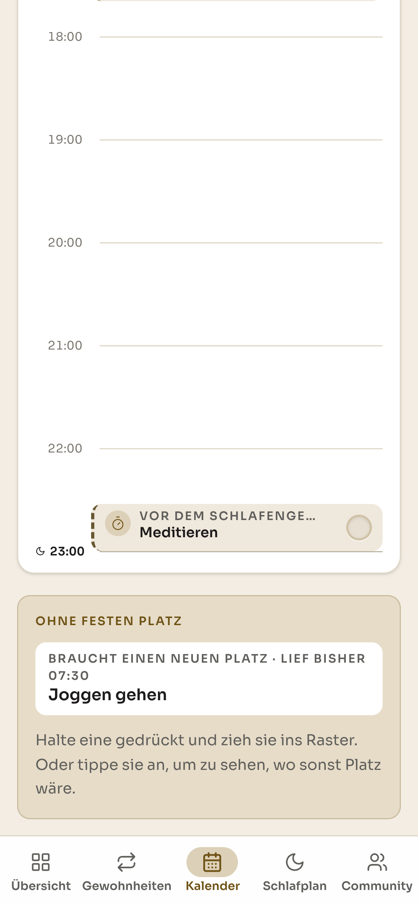 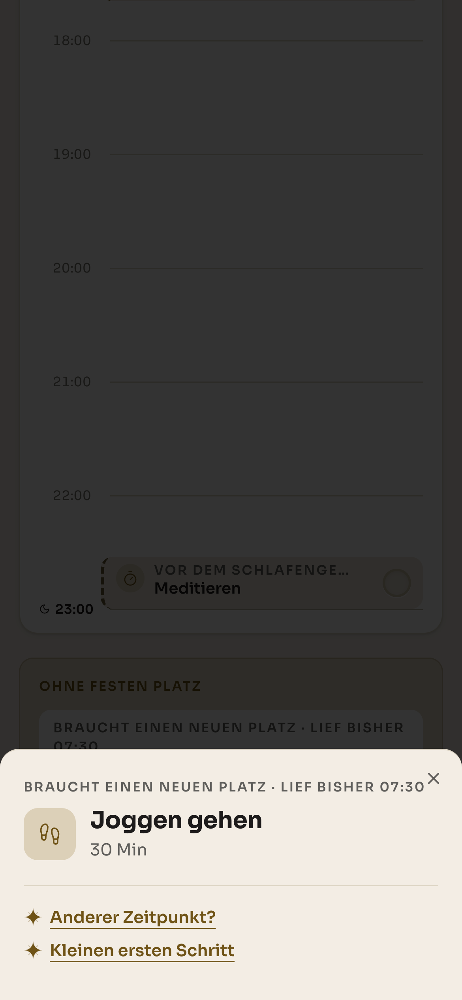

*Abb. 7.11 und 7.12: Ab Semesterbeginn liegt montags „Analysis I" auf der Zeit von
„Joggen gehen". Die Gewohnheit steht deshalb unter dem Tag im Bereich „Ohne festen Platz".
Tippt man sie an, kann die KI einen anderen Zeitpunkt vorschlagen.*

## 7.12 Die Navigation wandert nach unten

**Vorher.** Auf dem Handy lag die Navigation in einer Seitenleiste mit sechs Einträgen, darunter
Semester und Schlaf als eigene Bereiche, und man musste sie erst öffnen (Abb. 7.13).

**Nachher.** Die Navigation steht als Leiste mit fünf Tabs am unteren Bildschirmrand, in Reichweite
des Daumens und auf jeder Seite sichtbar: Übersicht, Gewohnheiten, Kalender, Schlafplan und
Community. Der Semesterplan braucht keinen eigenen Tab mehr, weil er im Kalender liegt.


*Abb. 7.13: Die Navigation im Code-Stand vom 3. September als Seitenleiste mit sechs Einträgen.
In der fertigen Anwendung steht sie als Tab-Leiste am unteren Rand, zu sehen etwa in Abb. 8.2.*

## 7.13 Gewohnheiten im Wochenblick: Tage statt Prozent

**Vorher.** Zuerst bestand die Gewohnheiten-Seite aus Karten mit Schaltern, deren Titel auf dem Handy
abgeschnitten wurden (Abb. 7.14), danach aus Karten, geteilt in „Steht heute an" und „Steht später
an" (Abb. 7.15). Der Fortschritt stand als Prozentwert auf der Übersicht (Abb. 7.1).

**Was beim Benutzen auffiel.** Die Seite zeigte, welche Gewohnheiten es gibt, aber nicht, wie es mit
ihnen läuft. Und ein Prozentwert, der alle Tage mitzählt, lässt eine Gewohnheit, die nur montags,
mittwochs und freitags läuft, schwächer erscheinen, als sie ist.

**Nachher.** Die Seite zeigt für jede Gewohnheit die letzten sieben Tage und zählt **Tage statt
Prozente**, und zwar nur die Tage, an denen die Gewohnheit tatsächlich anstand (Abschnitt 8.6). Damit
ist auch der Streak-Befund aus der Umfrage umgesetzt (Abschnitt 5.10). Die Konsistenz steht als
ruhige Kennzahl im Vordergrund, und ein verpasster Tag ist kein rotes Kreuz.

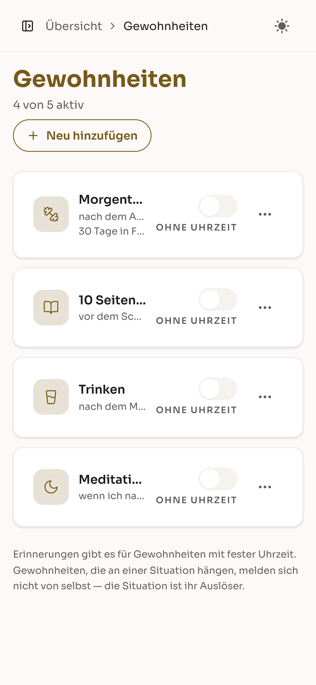 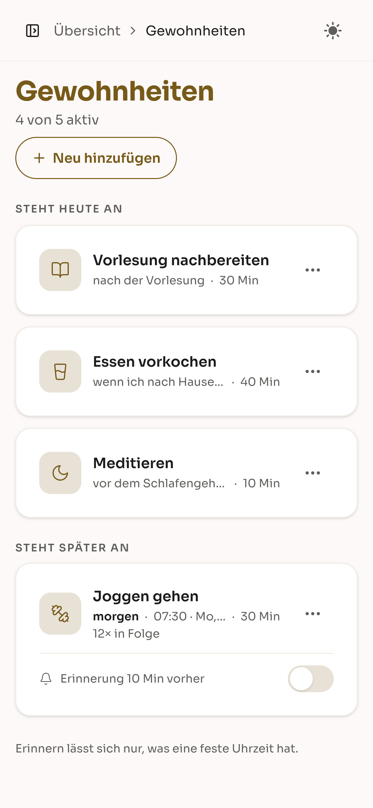

*Abb. 7.14 und 7.15: Die Gewohnheiten-Seite im Code-Stand vom 10. August mit Schaltern und
abgeschnittenen Titeln und im Code-Stand vom 3. September mit der Einteilung nach heute und
später. Den heutigen Stand zeigt Abb. 8.16.*

## 7.14 Verabredungen zu Ende gedacht

Parallel haben wir die Verabredungen vervollständigt. Nach einer Absage macht, wer die Gewohnheit
führt, allein weiter, und wer eingeladen war, kann sie als eigene übernehmen. Auch fremde
Gewohnheiten lassen sich direkt übernehmen. Sie zählen dann gegen die eigenen fünf Plätze, aber ohne
den Warum-Satz und den ersten Schritt, weil diese zu einer Person gehören und nicht zu einer
Gewohnheit.

## 7.15 Wie sich das Datenmodell entwickelte

Die Reihenfolge unserer Datenbank-Migrationen zeigt, dass wir nicht nach einem fertigen Modell
gebaut, sondern schrittweise erweitert haben. Jede Tabelle entstand, als die zugehörige Frage
auftrat.

| Schritt | Was hinzukam | Wofür |
|---|---|---|
| 1 | `habits`, `habit_completions`, Onboarding-Marker, Motivation | Grundgerüst für Gewohnheiten und ihr Abhaken |
| 2 | feste Zeitpläne, Erinnerungen, kleinster Schritt | Time Blocking und KI-Assistenz |
| 3 | `friendships`, `appointments`, `appointment_notices` | Community und Verabredungen |
| 4 | `ai_suggestions`, Zielgröße, Ketten | KI-Gedächtnis und Habit Chains |
| 5 | `template_key`, Entfernung punktueller Gewohnheiten, `sleep_schedules` | Katalog und Tagesrahmen |
| 6 | `semesters`, `courses`, `course_exceptions` | Semesterplan |
| 7 | `sleep_day_overrides`, Zeitpläne je Wochentag | tageweise Anpassung des Rahmens |

Auffällig sind die Migrationen, die etwas **entfernen**, etwa punktuelle Gewohnheiten und geratene
Situationen. Sie zeigen, dass wir Konzepte auch zurückgenommen haben, wenn der tatsächliche Gebrauch
dagegen sprach.

## 7.16 Das Abschlussgespräch

Im Abschlussgespräch haben wir Frau Heß die fertige Anwendung vorgeführt. Dabei sind wir beim
Verschieben von Gewohnheiten noch auf kleinere Fehler gestoßen, die wir anschließend behoben
haben.

---

# 8. Die fertige App

Dieses Kapitel führt durch die fertige Anwendung, in der Reihenfolge, in der man sie beim ersten
Benutzen kennenlernt. Die Bildschirmaufnahmen zeigen den Stand vom 12. und 13. September 2026 in
einer Mobilansicht mit 390 Pixeln Breite, also in der Ansicht, für die wir Align gestaltet haben.
Als Beispiel dient ein Demokonto, das nach unserer ersten Persona Lena heißt. Die Anwendung
gliedert sich über eine Navigationsleiste am unteren Rand in fünf Bereiche, **Übersicht**,
**Gewohnheiten**, **Kalender**, **Schlafplan** und **Community**.

---

## 8.1 Der Auftakt

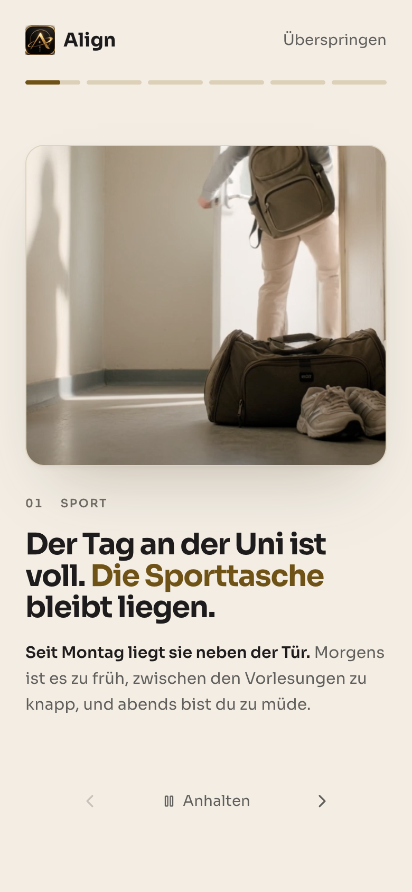

*Abb. 8.1: Der Auftakt erklärt die Anwendung, bevor die erste Frage gestellt wird.*

Vor dem Onboarding steht ein kurzer Auftakt über sechs Bildschirme. Er benennt eine typische
Situation aus dem Studienalltag, statt Funktionen aufzuzählen, und stellt erst danach die erste
Frage.

## 8.2 Die Übersicht


*Abb. 8.2: Die Übersicht zeigt nur, was heute ansteht.*

Die Startseite beantwortet eine einzige Frage, nämlich was heute ansteht. Drei Entscheidungen aus
der Nutzerforschung sind hier unmittelbar sichtbar.

**Die Fortschrittskarte nennt zwei Zahlen**, „0 von 2 Gewohnheiten" für heute und „25 von 102 Mal
erledigt" für die letzten 30 Tage. So wird ein Tag, an dem noch nichts erledigt ist, in einen
Verlauf eingeordnet, statt für sich bewertet zu werden (Abschnitt 5.10).

**Offene und erledigte Gewohnheiten unterscheiden sich nur durch den Haken.** Ein rotes Kreuz oder
eine Mahnung gibt es nicht, das ist der bewusste Verzicht auf Bestrafung.

**Zwei Angebote unter jeder offenen Gewohnheit.** „Zu zweit?" führt zur Verabredung, „Kleinen
ersten Schritt" zur KI-Assistenz, beide direkt dort, wo man sie braucht, und nicht in einem
eigenen Menü.

## 8.3 Eine Gewohnheit anlegen

Am Anlegen einer Gewohnheit zeigt sich unser Anspruch an eine einfache Bedienung am deutlichsten.
Der Assistent stellt fünf Fragen, jede auf einem eigenen Bildschirm und mit einer Auswahl statt
eines leeren Feldes. Im Beispiel legt Lena „Aufräumen" direkt im Anschluss an „Essen vorkochen"
an.

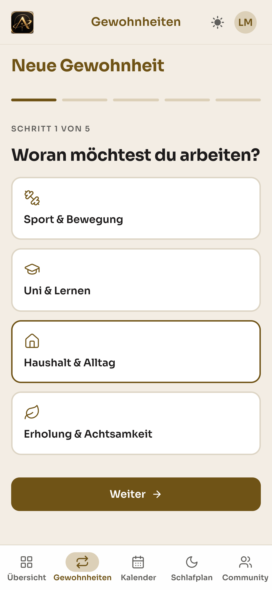 

*Abb. 8.3 und 8.4: Schritt 1 fragt nach dem Bereich, Schritt 2 zeigt die Einträge des Katalogs
mit ihrer Dauer.*

**Schritt 1 und 2 fragen, was man sich vornimmt.** Zuerst wählt man einen der vier Bereiche des
Studienalltags, danach einen Eintrag aus dem Katalog, dessen Dauer sich anpassen lässt. „Essen
vorkochen" ist als „läuft schon" markiert, damit dieselbe Gewohnheit nicht zweimal entsteht.

 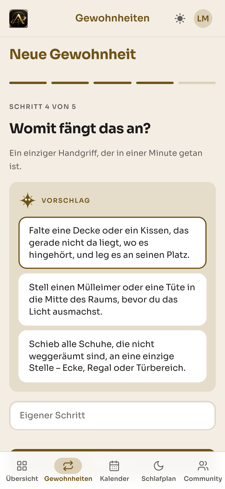

*Abb. 8.5 und 8.6: Schritt 3 verankert die Gewohnheit im Tag, Schritt 4 schlägt einen ersten
Handgriff vor.*

**Schritt 3 fragt, wann.** Hier liegt der Kern des Time-Blocking-Konzepts. Der Assistent bietet drei
Wege an, eine Gewohnheit im Tag zu verankern:

| Anker | Beschreibung in der App |
|---|---|
| **Situation** | „Hängt an einem Moment im Tag." |
| **Feste Uhrzeit** | „Steht ohnehin im Kalender." |
| **Nach einer Gewohnheit** | „Hängt an einer, die schon läuft." |

Die Situation steht oben, weil situative Anker laut Lally et al. (2010) zuverlässiger auslösen als
Uhrzeiten. Der dritte Weg bildet das Domino-Prinzip ab. Bei jeder Gewohnheit, an die sich die neue
hängen lässt, steht gleich dabei, ab wann sie liefe, bei „Essen vorkochen" etwa „danach ab 17:45".

**Schritt 4 fragt, womit es anfängt.** Die KI schlägt drei Handgriffe vor, die in einer Minute
getan sind und zur Gewohnheit passen, für „Aufräumen" etwa „Falte eine Decke oder ein Kissen, das
gerade nicht da liegt, wo es hingehört, und leg es an seinen Platz". Man übernimmt einen Vorschlag,
formuliert einen eigenen oder geht ohne weiter.

 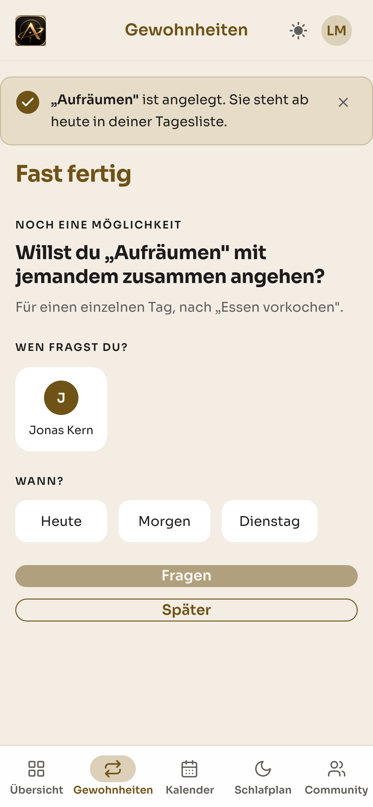

*Abb. 8.7 und 8.8: Schritt 5 fasst den Vorsatz zusammen, danach bietet die Anwendung an, die
Gewohnheit zu zweit anzugehen.*

**Schritt 5 fasst den Vorsatz zusammen.** Auslöser, Gewohnheit und erster Schritt stehen
untereinander, darunter die einzige offene Frage des Ablaufs, „Warum ist dir das wichtig?", und sie
ist optional. Der Knopf heißt nicht „Speichern", sondern „Ich nehme mir das vor". Er ist die bewusste
Zusage, die Faude-Koivisto und Gollwitzer (2009) als Voraussetzung wirksamer Wenn-Dann-Pläne
beschreiben. Danach fragt die Anwendung einmal, ob man die Gewohnheit zu zweit angehen möchte, und
„Später" steht gleichwertig daneben.

## 8.4 Verschieben, und die Kette rückt mit

Im Kalender ist jede Gewohnheit ein Block, den man kurz gedrückt hält und an eine andere Stelle
zieht. Was dabei passiert, zeigt sich am besten an zwei Gewohnheiten, die aneinander hängen.

 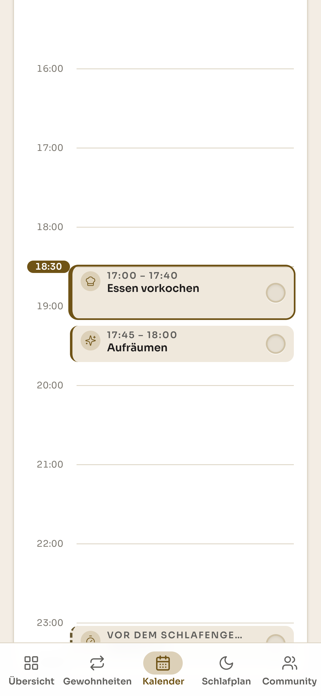 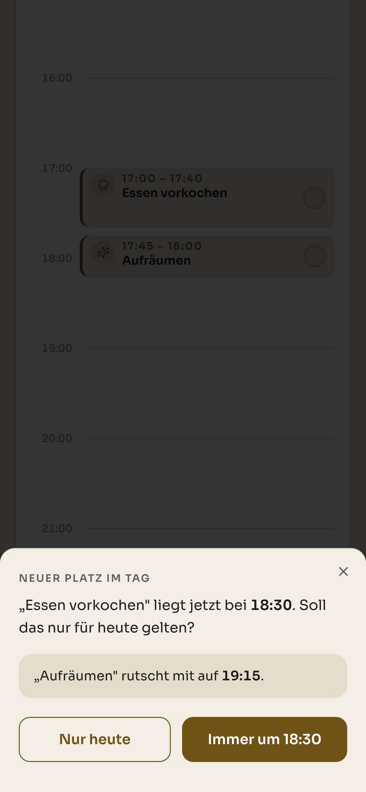

*Abb. 8.9 bis 8.11: Vor dem Ziehen, beim Ziehen und nach dem Loslassen.*

Vorher liegt „Essen vorkochen" von 17:00 bis 17:40 und „Aufräumen" direkt dahinter (Abb. 8.9). Beim
Ziehen zeigt eine Marke die Uhrzeit, an der der Block landen würde, und „Aufräumen" wandert schon
während der Bewegung mit (Abb. 8.10). Nach dem Loslassen nennt die Anwendung, was sich außerdem
ändert, und fragt, ob die Änderung **nur heute** oder **immer** gelten soll (Abb. 8.11).

 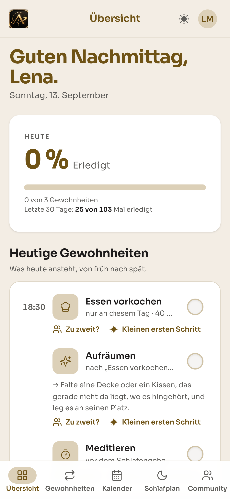

*Abb. 8.12 und 8.13: Nach der Entscheidung „Nur heute", im Kalender und auf der Übersicht.*

Nach „Nur heute" liegen beide Blöcke an ihrer neuen Stelle, und auch die Übersicht ordnet sich neu
(Abb. 8.12 und 8.13). Morgen gilt wieder der gewohnte Plan. In diesem kleinen Ablauf steckt, was
Align von einem Gewohnheitstracker unterscheidet: Ändert sich der Tag, ändert sich der Plan mit,
und die Anwendung sagt vorher, was dabei passiert.

## 8.5 Der Stundenplan im Kalender

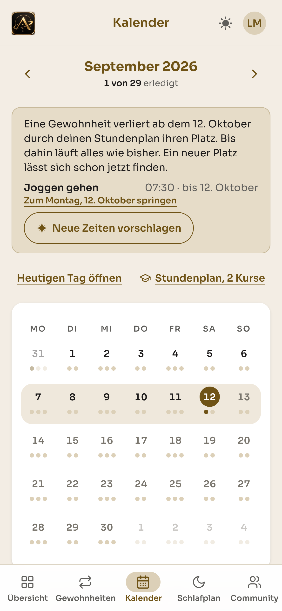 

*Abb. 8.14 und 8.15: Die Monatsansicht kündigt einen Konflikt mit dem Stundenplan an, die
Tagesansicht zeigt den ersten Vorlesungstag.*

Die **Monatsansicht** zeigt für jeden Tag einen Punkt je vorgesehener Gewohnheit. Oben kündigt ein
Hinweis einen Konflikt mit dem Stundenplan an, bevor er eintritt:

> „Eine Gewohnheit verliert ab dem 12. Oktober durch deinen Stundenplan ihren Platz. Bis
> dahin läuft alles wie bisher. Ein neuer Platz lässt sich schon jetzt finden."

Man kann direkt zum betroffenen Tag springen oder sich neue Zeiten von der KI vorschlagen lassen.

Die **Tagesansicht** zeigt den ersten Tag des Wintersemesters. „Analysis I" ist ein fester Block aus
dem Stundenplan, „Vorlesung nachbereiten" hängt als situativer Anker direkt daran, und die
Gewohnheit, die zuvor um 07:30 lag, steht jetzt im Bereich „Ohne festen Platz" (Abb. 7.11).

## 8.6 Gewohnheiten im Wochenblick


*Abb. 8.16: Alle Gewohnheiten mit den letzten sieben Tagen.*

Die Gewohnheiten-Seite zeigt für jede aktive Gewohnheit die letzten sieben Tage als **erledigt**
(gefüllt), **offen** (hohl) oder **nicht vorgesehen** (gestrichelt), und ein Tag lässt sich
nachtragen. Entscheidend ist die Zahl unter jedem Titel. „8 von 13 Tagen" zählt nur die Tage, an
denen die Gewohnheit tatsächlich anstand. Eine Gewohnheit für Montag, Mittwoch und Freitag wird also
nicht dafür abgewertet, dass sie dienstags nicht vorgesehen war.

## 8.7 Schlafplan

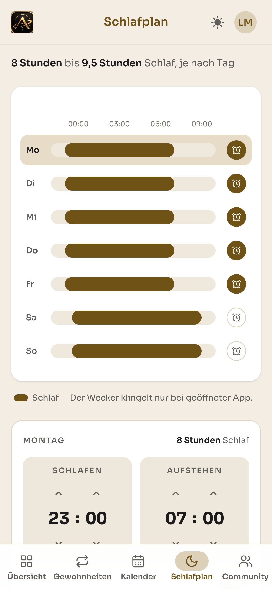

*Abb. 8.17: Der Tagesrahmen, für jeden Wochentag einzeln einstellbar.*

Der Schlafplan zeigt für jeden Wochentag einen Balken und lässt sich tageweise anpassen, im Beispiel
mit acht Stunden Schlaf von 23:00 bis 07:00 unter der Woche und einem späteren Fenster am Wochenende.
Wecker und Erinnerung vor der Schlafenszeit ergänzen ihn (Abschnitt 7.9). Bewegt sich der Rahmen,
bewegen sich die Gewohnheiten an seinen Rändern mit.

## 8.8 Community

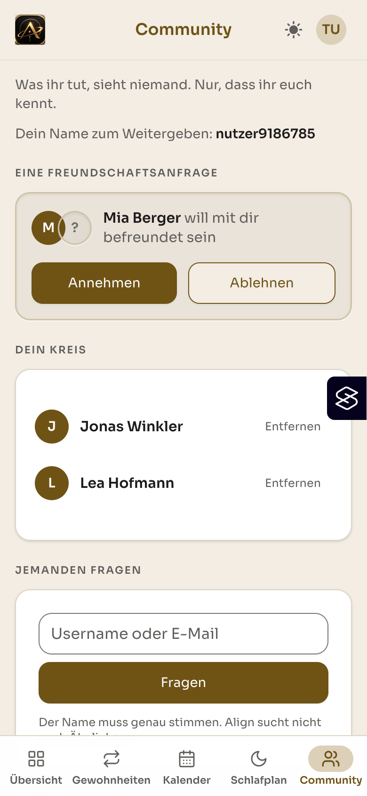

*Abb. 8.18: Der Community-Bereich beginnt mit der Zusage, was nicht geteilt wird.*

Der Community-Bereich setzt die Entscheidung für die Verabredung um (Abschnitt 6.4) und beginnt mit
dem, was **nicht** geteilt wird:

> „Was ihr tut, sieht niemand. Nur, dass ihr euch kennt."

Das ist die direkte Antwort auf den Interviewbefund, dass Vergleich als Kontrolle empfunden wird.
Verbindungen entstehen nur über einen exakt eingegebenen Namen, und wer keine Anfragen mehr möchte,
schaltet Verabredungen ab und behält seinen Kreis trotzdem.

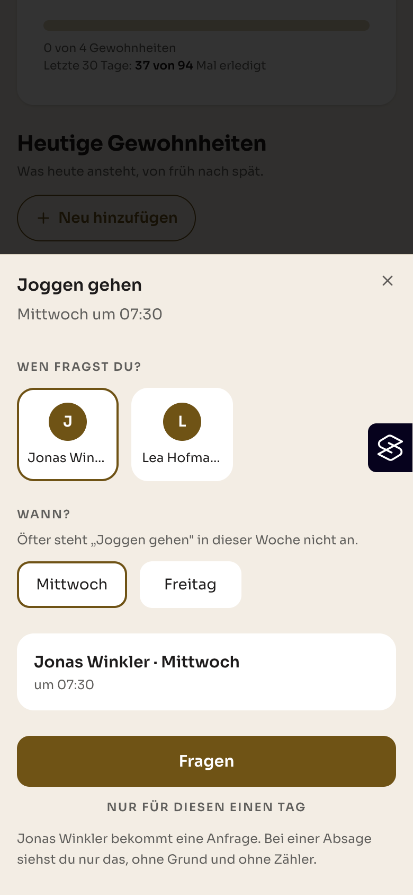

*Abb. 8.19: Eine Gewohnheit zu zweit angehen. Person und Tag stehen fest, bevor gefragt wird.*

Eine Verabredung beginnt auf der Übersicht mit „Zu zweit?". Das Blatt fragt nur, wen und wann, und
bietet nur Tage an, an denen die Gewohnheit ohnehin ansteht. Der Satz unter dem Knopf nimmt die
Sorge vorweg, die aus den Interviews stammt:

> „Jonas Winkler bekommt eine Anfrage. Bei einer Absage siehst du nur das, ohne Grund und
> ohne Zähler."

Eine Verabredung gilt für einen einzigen Tag und taucht in keiner Statistik auf.

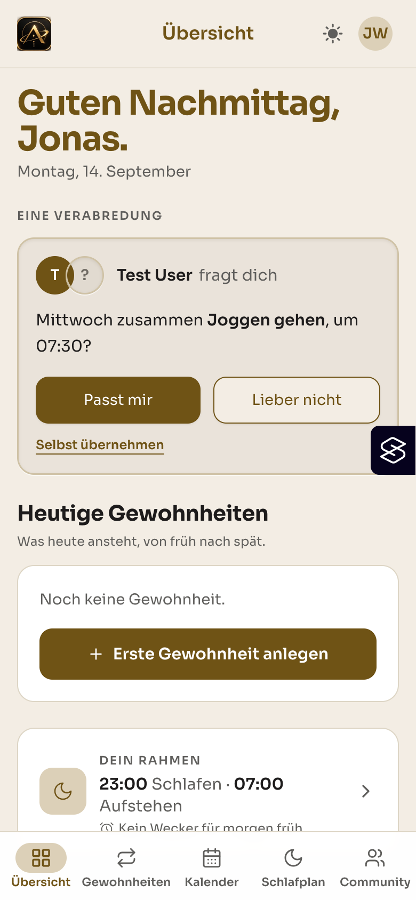 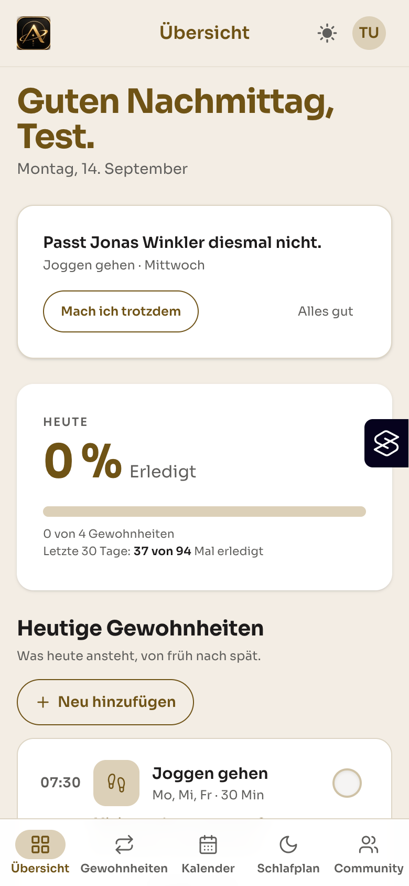

*Abb. 8.20 und 8.21: Dieselbe Verabredung von beiden Seiten. Links, was Jonas bekommt. Rechts,
was zurückkommt, wenn er ablehnt.*

Jonas kann mit „Passt mir", „Lieber nicht" oder „Selbst übernehmen" antworten. So wird aus einer
Absage eine Übernahme, wenn er die Gewohnheit gut findet, aber nicht mitkommen kann. Die Absage
selbst nennt keinen Grund. Sie sagt „Passt Jonas Winkler diesmal nicht" und fragt nur, ob man es
trotzdem macht. Ein rotes Kreuz gibt es auch hier nicht.

## 8.9 Dark Mode


*Abb. 8.22: Die Übersicht im Dark Mode.*

Alle Bereiche gibt es in einem hellen und einem dunklen Modus, die derselben Designsprache folgen.
Gold bleibt in beiden Modi die Akzentfarbe und trägt im Dark Mode zusätzlich die Überschriften,
weil ein reines Weiß auf dunklem Grund zu hart wirkt.

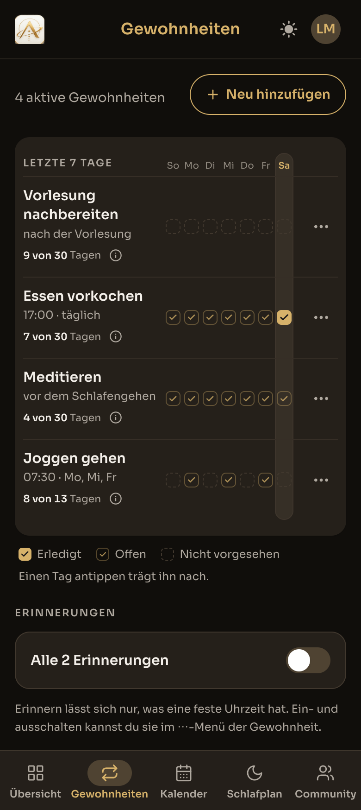 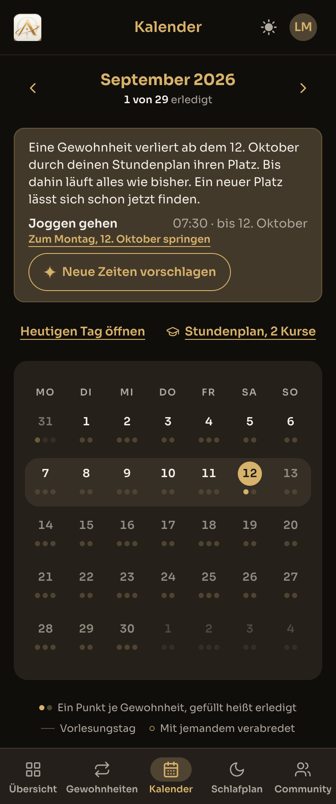

*Abb. 8.23 und 8.24: Gewohnheiten und Kalender im Dark Mode. Das Sieben-Tage-Raster und die
Monatsansicht behalten ihre Struktur, nur die Flächen kehren sich um.*

## 8.10 Funktionsumfang im Überblick

| Bereich | Umgesetzt |
|---|---|
| **Gewohnheiten** | Anlegen in fünf Schritten aus dem Katalog (vier Bereiche) · Anker über Situation, feste Uhrzeit oder Kette · Wochentage und Uhrzeiten je Tag · Bearbeiten und Beenden · Grenze von fünf aktiven Gewohnheiten |
| **Tracking** | Abhaken per Tippen oder Wischen · Sieben-Tage-Raster mit Nachtragen · Konsistenz über 30 Tage, die nur vorgesehene Tage zählt · Serien ohne Bestrafung bei Unterbrechung |
| **Kalender** | Monatsansicht mit Tagespunkten · Tagesansicht als Zeitraster · Verschieben per Ziehen, nur heute oder immer · verkettete Gewohnheiten rücken mit · Semesterplan mit Kursen, Kollisionsprüfung und Parken verdrängter Gewohnheiten |
| **Tagesrahmen** | Schlaf- und Aufstehzeit je Wochentag · tageweise Ausnahmen · Wecker und Erinnerung vor der Schlafenszeit innerhalb der Anwendung |
| **KI-Assistenz** | kleinster erster Schritt · neue Zeiten vorschlagen · Tag neu ordnen · Kontextwissen über Gewohnheiten, Rahmen und Stundenplan |
| **Community** | Kontakte über exakten Namen · Verabredungen zu zweit für einen einzelnen Tag · Absagen mit Weiterführung · Übernehmen fremder Gewohnheiten |
| **Sonstiges** | Auftakt vor dem Onboarding · Light und Dark Mode · Registrierung mit Passkeys und Zwei-Faktor-Authentifizierung |

Was wir bewusst nicht umgesetzt haben und wie sich Align weiterentwickeln ließe, beschreiben die
Abschnitte 9.7 bis 9.10.

---

# 9. Reflexion und Ausblick

Dieses Kapitel blickt zurück auf die Entscheidungen, die getragen haben, auf die Stellen, an denen
wir umgekehrt sind, auf die Rolle von KI und auf das, was wir für künftige Projekte gelernt haben.
Der zweite Teil blickt nach vorn, auf das, was wir bewusst weggelassen haben, und darauf, wie sich
Align weiterentwickeln ließe.

---

## 9.1 Was getragen hat

**Die Reihenfolge der Nutzerforschung war die wichtigste Weichenstellung.** Weil wir auf Rat von
Frau Heß zuerst Interviews geführt und erst daraus den Fragebogen entwickelt haben, prüfte jede
Umfragefrage etwas, das vorher jemand tatsächlich gesagt hatte. Jede spätere Feature-Entscheidung
ruht auf dieser Grundlage.

**Das Iterationsformat hat abstrakte Diskussionen verhindert.** Weil wir alle drei Wochen ein
vorzeigbares Ergebnis brauchten, blieben Konzeptfragen nie lange theoretisch. Korrekturen wie an der
Fortschrittsanzeige oder an der Farbwelt kamen dadurch früh und haben wenig gekostet.

**Die Dokumentation lief mit, statt am Ende rekonstruiert zu werden.** Iterationsnotizen, Feedback
und Entscheidungen haben wir laufend festgehalten, zuerst in Notion, später als Markdown. Ohne diese
Gewohnheit ließe sich kaum nachzeichnen, warum eine Entscheidung zu einem bestimmten Zeitpunkt fiel.

**Zwischen Konzeption und Umsetzung gab es keinen Bruch.** Nichts aus Phase 3 haben wir verworfen.
Die Designsprache ist als Quelle im Code verankert und gilt für die gesamte Anwendung. Dass ein
Studienprojekt den Weg vom Prototyp zur lauffähigen Anwendung ohne Konzeptverlust schafft, hat uns
in der letzten Phase selbst überrascht.

## 9.2 Wo wir umgekehrt sind

Drei Stellen im Projekt haben wir revidiert, nachdem wir sie bereits entschieden hatten.

**Die Umfrage hat eine unserer Interviewhypothesen widerlegt.** Nach den Interviews galten Streaks
als demotivierend, in der Umfrage bevorzugten aber nur 5 von 25 Befragten klar die Konsistenzrate.
Statt uns für eine Seite zu entscheiden, bietet Align beides an, und der Bruch einer Serie bestraft
nicht (Abschnitt 5.10).

**Die freie Eingabe haben wir zurückgenommen.** Anfangs ließen sich Gewohnheiten und auch die
Situation, an der sie hängen, frei eintragen. Wir haben uns dann bewusst auf vordefinierte
Gewohnheiten beschränkt, die für den Studienalltag wirklich sinnvoll sind und mit denen wir besser
planen und die Anwendung gezielter entwickeln konnten. Zu unseren Ideen gehörten zum Beispiel auch
punktuelle Gewohnheiten wie „Treppe statt Aufzug", die keine Dauer haben und im Kalender ganz anders
behandelt werden müssten. Die freie Eingabe der Situation haben wir herausgenommen, weil die
Anwendung bei einer frei gewählten Situation oft nicht weiß, wann sie im Tag eintritt
(Abschnitt 7.10). Beide Entscheidungen haben wir getroffen, um eine stabil lauffähige Anwendung zu
bekommen, und auf ihnen lässt sich aufbauen (Abschnitte 7.8 und 9.7).

**Auch das Datenmodell ist gewachsen, nicht entworfen worden.** Punktuelle Gewohnheiten, geratene
Situationen und eine überflüssige Kursart sind nach dem tatsächlichen Gebrauch wieder verschwunden
(Abschnitt 7.15).

Die letzte Iteration hat uns außerdem gezeigt, dass Funktionen, die in kurzen Zyklen ergänzt
werden, Verbindungsarbeit erzeugen. Nach Iteration 5 griffen sie noch nicht ineinander, und sie
zuverlässig zusammenzubringen, hat selbst Zeit gekostet.

## 9.3 Der Wechsel der Plattform

Geplant hatten wir eine native App, gebaut haben wir eine Mobile-First-Web-App mit Laravel
(Abschnitt 7.1). Für ein Projekt mit sechs dreiwöchigen Iterationen war das die richtige
Entscheidung, weil wir jeden Zwischenstand sofort ausprobieren konnten. Sie betrifft aber nur die
Entwicklung. Als Produkt soll Align langfristig eine native App für das Smartphone werden. Deshalb
spricht unsere Leitfrage weiterhin von „einer mobilen Applikation", und deshalb haben wir jede
Ansicht zuerst für das Smartphone gestaltet (Abschnitt 9.10). Eine Folge der Web-App ist, dass
Erinnerungen nur erscheinen, solange die Anwendung geöffnet ist (Abschnitt 9.9).

## 9.4 KI als Werkzeug, und wo sie aufhört

KI kommt in diesem Projekt zweimal vor, und die beiden Fälle sind auseinanderzuhalten.

**In der Anwendung** formuliert sie den kleinsten nächsten Schritt, schlägt neue Zeiten vor und
ordnet den Tag neu. Diese Rolle ist durch die Umfrage am besten abgesichert. Die wichtigste
Entscheidung dabei war eine Verzichtsentscheidung: Fällt ein Aufruf aus, antwortet Align mit einer
ehrlichen Absage, denn was wie ein KI-Vorschlag aussieht, muss auch einer sein (Abschnitt 7.4). Unser
Konzept ging noch von der Claude API aus, umgesetzt ist die Anbindung über `laravel/ai` und die
OpenRouter-API.

**Bei der Entwicklung** haben uns KI-gestützte Werkzeuge geholfen, den Funktionsumfang in der
verfügbaren Zeit umzusetzen. Die Entscheidungen darüber, was die Anwendung tun soll und wie, lagen
aber bei uns, und das lässt sich im Projektverlauf belegen. Die Umstellung auf den Katalog kam aus
dem eigenen Benutzen, die Grenze von fünf Gewohnheiten aus der Frage von Frau Heß und den
Umfragedaten, und der Verzicht auf einen simulierten KI-Fallback ist eine Haltung gegenüber dem
Nutzer. Ein Werkzeug kann eine Regel umsetzen, aber nicht bestimmen, welche Regel richtig ist.

## 9.5 Was wir für die Nutzerforschung gelernt haben

Unsere Interviews und die Umfrage haben uns eine klare Richtung für die Funktionen von Align
gegeben. Für eine nächste Befragung nehmen wir trotzdem einiges mit.

**Das Umfragewerkzeug früh auf Kapazität prüfen.** Die 25 Antworten kamen in rund zwei Stunden
zusammen. Die Zielgruppe war also sehr bereit mitzumachen, begrenzt hat nur die Kapazität des
Werkzeugs (Abschnitt 5.11).

**Den Fragebogen gegen den Leitfaden abgleichen.** Beim Überarbeiten sind die geplanten Skalen zur
Habit Journey und zur Konsistenzrate aus dem Fragebogen gefallen. Die fertige Fassung würden wir vor
dem Versand noch einmal Punkt für Punkt mit dem Leitfaden vergleichen.

**Auswertungen nach Personas einplanen.** Eine getrennte Auswertung nach Einsteigern und
Selbstregulierten braucht von vornherein genügend Antworten je Gruppe.

**Die fertige Anwendung mit Nutzern erproben.** Technisch haben wir die Anwendung laufend mit Tests
und statischer Analyse geprüft, Feedback von außen kam aus den Betreuungsgesprächen. Der nächste
sinnvolle Schritt ist, sie von Studierenden ausprobieren zu lassen, die das Projekt nicht kennen
(Abschnitt 9.9).

## 9.6 Was wir mitnehmen

**Eine begründete Entscheidung ist mehr wert als eine gute Idee.** Seit dem Hinweis, dem roten Faden
zu folgen, haben wir jeden Screen mit einem Befund aus Interviews, Umfrage oder Literatur begründet.
Das hat sich vor allem beim Streichen gezeigt, etwa bei der Habit Journey, die sich mit Daten aus der
Diskussion nehmen ließ.

**Feedback wirkt nur, wenn es eine Adresse bekommt.** Jedes Betreuungsgespräch lässt sich bis zu
einer konkreten Umsetzung verfolgen. Aus dem sozialen Aspekt wurde die Community, aus der Frage nach
einer Höchstzahl die Grenze von fünf Gewohnheiten und aus dem Hinweis auf Datenschutz die
Entscheidung für LimeSurvey. Das gelang, weil wir die Folgerungen aus jedem Gespräch festgehalten
haben, solange sie noch frisch waren.

**Für eine Dreiergruppe genügt wenig Organisation, solange die Termine stehen.** Ein Gruppenchat,
feste Termine für inhaltliche Abstimmungen, Aufgaben vor jeder Iteration und eine kurze Präsentation
zu jedem Gespräch haben dem Projekt eine nachvollziehbare Form gegeben.

**Umsetzbarkeit darf nicht am Anfang stehen.** Frau Heß hat uns zweimal geraten, gute Konzepte nicht
aufzugeben, nur weil ihre Umsetzung aufwendig erscheint. Die Stundenplan-Integration wirkte im Mai
technisch am teuersten und ist heute das Merkmal, das Align von einem Gewohnheitstracker
unterscheidet.

---

# Ausblick

Unsere Migrationen zeigen, dass wir Konzepte nicht nur ergänzt, sondern nach dem tatsächlichen
Gebrauch auch zurückgenommen haben (Abschnitt 7.15). Jede dieser Rücknahmen hat einen Grund, und
jeder Grund beschreibt zugleich, was nötig wäre, um sie aufzuheben. Darauf baut dieser Ausblick auf.

---

## 9.7 Was wir bewusst weggelassen haben

Vier Funktionen fehlen in der fertigen Anwendung bewusst, damit der Umfang beherrschbar bleibt und
die übrigen Funktionen zuverlässig laufen:

| Weggelassen | Warum | Was es bräuchte |
|---|---|---|
| **Punktuelle Gewohnheiten** wie „Treppe statt Aufzug" | haben keine Dauer und belegen kein Zeitfenster | ein zweiter Gewohnheitstyp, der ohne Platz im Tag auskommt und nur gezählt wird |
| **Situative Anker ohne planbare Uhrzeit** wie „nach dem Frühstück" | jede Person frühstückt oder isst zu einer anderen Zeit, die Anwendung müsste die Uhrzeit raten (Abschnitt 7.10) | eine Möglichkeit, die Uhrzeit eines solchen Moments je Wochentag einmal selbst festzulegen |
| **Eigene Gewohnheiten eintragen** | wir haben uns zunächst auf vordefinierte, sinnvolle Gewohnheiten beschränkt, mit denen sich besser planen und entwickeln ließ (Abschnitte 7.8 und 9.2) | ein eigener Eintrag, den die KI auswertet und dem sie Dauer, Bereich und eine passende Tageszeit zuordnet |
| **Blocker** als eigene Kategorie für feste Termine | im Rahmen dieser Umsetzung nicht mehr erreicht | ein dritter Blocktyp neben Kurs und Gewohnheit, der den Tag belegt, ohne abgehakt zu werden |

Am spürbarsten ist, dass sich eigene Gewohnheiten derzeit nicht anlegen lassen. Mit dem festen
Katalog haben wir bewusst begonnen, damit die Planung zuverlässig funktioniert. Darauf lässt sich
aufbauen: Nutzer könnten wieder eigene Gewohnheiten eintragen, und die KI könnte ihnen eine Dauer,
einen Bereich und eine passende Tageszeit zuordnen, sodass die Anwendung sie genauso plant wie einen
Eintrag aus dem Katalog.

## 9.8 Verworfenes, das wiederkommen könnte

**Die Habit Journey.** Die nach der Umfrage gestrichene Habit Journey (Abschnitt 5.13) liegt als
Konzept vollständig ausgearbeitet vor und beruht auf Lally et al. (2010). Vorgesehen waren eine
Automatisierungskurve pro Gewohnheit, eine Phasenanzeige von Aufbau über Festigung bis Gewohnheit
und Erfolgsmarken nach 30, 66 und 100 Tagen, wobei 66 Tage der in der Studie gemessene Durchschnitt
sind. Sie würde zeigen, was unsere Fortschrittsanzeige heute nicht zeigt, nämlich den Weg über die
letzten 30 Tage hinaus.

**Das Freiwerden eines Platzes.** Läuft eine Gewohnheit über Wochen zuverlässig, könnte die
Anwendung anbieten, sie als gefestigt zu markieren und damit einen der fünf aktiven Plätze
freizugeben. Heute gibt es nur „Beenden", und das liest sich wie ein Abbruch.

**Eine KI, die über längere Zeit mitlernt.** Als Idee hatten wir auch eine KI, die das Verhalten
über Wochen beobachtet und daraus Muster erkennt. Sie könnte zum Beispiel bemerken, dass eine
Gewohnheit zu einer bestimmten Uhrzeit immer wieder liegen bleibt, und eine besser passende Uhrzeit
vorschlagen. Wir haben diese Idee für die Umsetzung verworfen, weil sie eine stabile Grundlage
voraussetzt: Gewohnheiten mit festem Platz im Tag, einen verlässlichen Tagesrahmen und eine Planung,
die auch bei Verschiebungen zuverlässig funktioniert. Steht der Rest zuverlässig, ließe sich die KI
um ein solches Gedächtnis erweitern.

**Zurückhaltende Erweiterungen der Community.** Ausgearbeitet, aber nicht umgesetzt sind drei
kleinere Bausteine: ein Signal, dass jemand heute aktiv ist, ohne zu zeigen, woran, eine einzelne
Reaktion auf eine erledigte Gewohnheit und eine gemeinsame Gewohnheit für eine kleine Gruppe, etwa
eine WG oder eine Lerngruppe. Aussetzer blieben auch dabei für andere unsichtbar.

**Was verworfen bleibt.** Die Rangliste und das Community Dashboard nehmen wir nicht wieder auf, und
ebenso bleiben der gemeinsame Kalender und Live-Bilder während einer Gewohnheit gestrichen. Vergleich
wurde in den Interviews als Kontrolle beschrieben, und diese Funktionen waren die schwächsten der
gesamten Umfrage.

## 9.9 Was als Nächstes käme

**Ein Modus für die Prüfungsphase.** Stress und Prüfungsphase sind der häufigste Grund, Gewohnheiten
aufzugeben, und 15 von 25 Befragten reduzieren in dieser Zeit, statt ganz aufzuhören
(Abschnitt 5.9). Align kann heute einen Tag umsortieren, aber nicht kleiner machen. Ein solcher
Modus würde den Tag auf eine Kernroutine zusammenziehen und die übrigen Gewohnheiten beiseitestellen,
statt sie zu löschen. Von allen offenen Punkten hat dieser die beste Datengrundlage.

**Erinnerungen, die auch bei geschlossener App ankommen.** Unser Konzept sah eine Erinnerung vor dem
Auslöser vor. Umgesetzt sind Erinnerungen und ein Wecker, die nur erscheinen, solange die Anwendung
geöffnet ist. Der Grund ist, dass wir Align als Web-App entwickelt haben, die den Nutzer bei
geschlossener App nicht zuverlässig erreichen kann (Abschnitt 7.1). Als native App, die über den App
Store veröffentlicht wird, könnte Align dagegen Push-Benachrichtigungen schicken, und Erinnerungen
und Wecker würden auch bei geschlossener App funktionieren (Abschnitt 9.10).

**Eine KI, die noch mehr weiß.** Beim Bau der KI-Funktionen haben wir vor allem gelernt, dass die KI
immer den richtigen Kontext bekommen muss, damit sie wirklich hilft (Abschnitt 7.4). Dieser Kontext
lässt sich weiter ausbauen. Die KI könnte auch die verhaltenspsychologischen Grundlagen kennen, auf
denen Align beruht, etwa Wenn-Dann-Pläne, das Domino-Prinzip oder die Befunde zur Konsistenz, und
ihre Vorschläge danach ausrichten, was Gewohnheiten nachweislich stabil macht. Zusammen mit einer
KI, die über längere Zeit mitlernt (Abschnitt 9.8), würde daraus ein Begleiter, der den Nutzer noch
gezielter unterstützt.

**Eine Erprobung mit Nutzern.** Ein Usability-Test des Einrichtungsflows und der Tagesansicht mit
Studierenden, die das Projekt nicht kennen, würde zeigen, ob die Anwendung ihren ersten Anspruch
einlöst. Eine Folgebefragung mit mindestens 50 Teilnehmenden könnte die Befunde, die uns schon eine
klare Richtung gegeben haben, breiter absichern und die fehlenden Skalen nachholen. Ob der Aufwand
einer Verabredung im Alltag tragbar ist, lässt sich dabei nur mit echten Paaren prüfen.

## 9.10 Die langfristige Richtung

Am Anfang dieses Projekts stand eine Beobachtung aus unserem eigenen Studium: Man weiß meistens,
was einem guttut, und trotzdem bleibt die Sporttasche neben der Tür liegen. Daraus wurde unsere
Leitfrage, wie eine mobile Applikation Studierende durch minimalistisches Design, kontextsensitive
KI und verhaltenspsychologisch fundierte Mechanismen dabei unterstützen kann, nachhaltige
Alltagsgewohnheiten zu etablieren. Nach vier Monaten können wir darauf eine konkrete Antwort
geben, und sie läuft.

**Was wir erreicht haben.** Die Ansprüche aus Abschnitt 1.6 und die Bausteine unserer Leitfrage
haben uns durch das ganze Projekt begleitet, und sie sind in der fertigen Anwendung sichtbar:

- **Einfache Bedienung.** Eine Gewohnheit entsteht in fünf kurzen Fragen, jede mit einer
  Auswahl statt eines leeren Feldes. Verschieben geht mit einem langen Fingerdruck, und die Anwendung
  sagt vorher, was sich dabei ändert.
- **Motivation statt Druck.** Es gibt kein rotes Kreuz, keine Mahnung und keine Serie, die bei
  einem verpassten Tag zusammenbricht. Gezählt werden nur die Tage, an denen eine Gewohnheit
  wirklich anstand.
- **Klare Struktur.** Die Übersicht beantwortet eine einzige Frage, nämlich was heute ansteht.
- **Einheitliche Gestaltung.** Alle Bereiche folgen derselben Designsprache, in Light und Dark
  Mode.
- **Anpassung an den eigenen Alltag.** Schlafrhythmus und Stundenplan geben den Rahmen vor, und
  Gewohnheiten hängen an Momenten wie „nach dem Aufstehen" oder an einer festen Uhrzeit.
- **KI als Begleiter.** Die KI hilft dort, wo Gewohnheiten oft scheitern. Fällt der Anfang
  schwer, schlägt sie einen kleinen ersten Schritt vor, und verändert sich der Tag, sucht sie
  einen neuen Platz für die Gewohnheit. Dabei kennt sie Gewohnheiten, Schlafrhythmus und
  Stundenplan der Person.
- **Wissenschaftliche Grundlage.** Jede zentrale Funktion lässt sich auf Interviews, Umfrage oder
  Literatur zurückführen, vom Wenn-Dann-Plan bis zur Grenze von fünf Gewohnheiten.

Align ist damit mehr als ein Habit-Tracker. Eine Gewohnheit ist bei uns kein Eintrag in einer
Liste, sondern ein Platz in einem echten Tag, der sich mitbewegt, wenn sich der Tag verändert.
In dieser Form haben wir das bei keiner der Anwendungen gefunden, die wir zu Beginn untersucht
haben.

**Wohin es geht.** Align ist heute ein MVP aus einem Studienprojekt und bewusst noch kein
marktfähiges Produkt. Die Web-App war der schnellste Weg, unser Konzept vollständig und
lauffähig umzusetzen. Langfristig soll Align eine native App für das Smartphone werden. Dann
erreichen Erinnerungen die Nutzer auch bei geschlossener App, und Align ist dort, wo der Alltag
stattfindet. Auf der stabilen Grundlage, die jetzt steht, lassen sich die nächsten Schritte
aufbauen: eigene Gewohnheiten, die die KI auswertet, ein Modus für Prüfungsphasen und eine KI,
die über Wochen mitlernt. Vorher steht die Erprobung mit Studierenden, die Align noch nicht
kennen.

Die Positionierung aus Abschnitt 2.4 bleibt dabei unser Ziel, eine Anwendung zum
Gewohnheitsaufbau, die die Lebensrealität Studierender versteht und ohne Druck zur Konsistenz
führt. Mit diesem Projekt haben wir gezeigt, dass sich eine solche Anwendung aus echten
Gesprächen, einer Umfrage und wissenschaftlichen Quellen Schritt für Schritt begründen und bauen
lässt. Die Sporttasche liegt vielleicht noch neben der Tür. Aber jetzt hat sie einen festen
Platz im Tag.
