# Align — Projektbericht

> **Gemeinsames Dokument.** Das ist die Datei, an der wir alle am Bericht arbeiten. Jede
> Änderung am Berichtstext kommt hier hinein, nicht in die einzelnen Kapiteldateien, nicht in
> Google Docs und nicht in Notion. Wer was geändert hat, zeigt die Git-Historie dieser Datei.
>
> **Ablauf:** vor dem Schreiben `git pull` · Änderung in dieser Datei · kurzer Commit, der sagt,
> was geändert wurde · sofort `git push`. Vorher im Gruppenchat sagen, an welchem Kapitel man
> sitzt. Bilder liegen in `screenshots/` neben dieser Datei.
>
> **Schreibregeln:** Wir-Perspektive · keine Namen im Fließtext, die Schwerpunkte stehen in 3.1 ·
> auf Projektebene bleiben, keine Werkzeugpannen oder Terminfragen · KI nur bei der
> Implementierung und als Funktion der App erwähnen · Abbildungen kapitelweise nummeriert
> („Abb. 8.3") mit kursiver Bildunterschrift · Querverweise als „Abschnitt 7.8".

# 1. Einleitung

## 1.1 Was entwickelt wurde

**Align** ist eine Anwendung, die Studierende dabei unterstützt, im Alltag tragfähige
Gewohnheiten aufzubauen. Sie soll mehr Struktur, Fokus und Balance in eine Lebensphase
bringen, die von sich aus wenig vorgibt.

Der Ansatz setzt bewusst nicht bei einer Ursachenanalyse an, sondern bei der praktischen
Umsetzung. Gewohnheiten werden nicht nur benannt, sondern als konkrete Blöcke in einen
konkreten Tag eingeplant, innerhalb des eigenen Schlafrhythmus und um den eigenen Stundenplan
herum. Eine kontextsensitive KI-Assistenz unterstützt dort, wo Menschen erfahrungsgemäß
scheitern, nämlich beim ersten Schritt. Und sie hilft, einen neuen Platz zu finden, wenn sich
der Tag verändert, etwa weil ein neuer Stundenplan eine Gewohnheit verdrängt.

Umgesetzt wurde Align als lauffähige **MVP-Version** in Form einer Mobile-First-Web-App.
Die Gründe für diese Form sind in Kapitel 7 dargestellt.

## 1.2 Ausgangssituation und Motivation

Die Idee zu Align entstand aus unserer eigenen Erfahrung als Studierende. Wir kennen das
Gefühl, morgens ohne klare Struktur in den Tag zu starten, wichtige Vorhaben immer wieder
aufzuschieben und abends festzustellen, dass der Tag irgendwie an einem vorbeigezogen ist.
Ob regelmäßiger Sport, ausreichend Schlaf oder eine bewusste Pause zwischen zwei Vorlesungen,
vielen Studierenden ist klar, was ihnen guttun würde. An der konsequenten Umsetzung im Alltag
scheitert es trotzdem.

In unserem Umfeld und bei uns selbst haben wir beobachtet, dass das meist nicht an mangelndem
Willen liegt. Gute Vorsätze gehen im Alltagsstress unter. Kleine, regelmäßige Gewohnheiten
helfen dabei, Struktur zurückzugewinnen. Das Schwierige daran ist nicht das Wissen, sondern
die konsequente Umsetzung.

Bestehende Anwendungen haben uns dabei wenig überzeugt. Viele wirken überladen, setzen auf
aggressive Erinnerungen oder fühlen sich wie ein weiterer Punkt auf der To-do-Liste an. Wir
wollten deshalb von Beginn an etwas entwickeln, das sich in den Alltag einfügt, ohne
zusätzlichen Druck aufzubauen, aber mit genug Struktur, um dranzubleiben.

## 1.3 Problemstellung

Aus dieser Ausgangslage haben wir drei Probleme abgeleitet, die den Anstoß für das Projekt
gaben. Alle drei haben wir in der späteren Nutzerforschung geprüft und bestätigt gefunden
(Kapitel 5).

### 1.3.1 Fehlende Alltagsstruktur im Studium

Im Studium gibt es keine feste Tagesstruktur mehr wie in der Schule. Vorlesungszeiten wechseln
von Semester zu Semester, Freistunden häufen sich, und das Selbststudium bleibt liegen, weil
niemand es einfordert. Ohne eine bewusst gewählte Struktur läuft der Tag ins Leere, besonders
in vorlesungs- und prüfungsfreien Phasen.

### 1.3.2 Gute Vorsätze werden selten zu Routinen

Der eigentliche Knackpunkt liegt nicht beim Vorsatz, sondern beim Übergang vom Vorsatz zur
täglichen Routine. Bestehende Habit-Tracker wirken entweder zu komplex, zu stark gamifiziert
oder zu generisch, um langfristig zu motivieren.

Hinzu kommt ein struktureller Mangel. Diese Anwendungen sind statisch. Sie behandeln
Gewohnheiten unabhängig davon, wie ein Tag tatsächlich aussieht, und ändert sich der Tag, etwa
durch einen neuen Stundenplan, bleibt der Plan derselbe. Je weiter Plan und Alltag
auseinanderdriften, desto eher wird die Anwendung ganz beiseitegelegt.

### 1.3.3 Keine Anwendung, die sich dem eigenen Alltag anpasst

Was bestehenden Lösungen fehlt, ist die Fähigkeit, sich dem Alltag anzupassen statt umgekehrt.
Wir suchten eine Anwendung, die auf den persönlichen Kontext eingeht. Wie viel Zeit ist gerade
verfügbar? In welcher Phase des Semesters befindet sich die Person? Welche Termine stehen ohnehin fest?
Genau hier sehen wir das Potenzial einer gezielten KI-Unterstützung und den
Kern dessen, was Align von bestehenden Anwendungen unterscheiden sollte.

## 1.4 Zielsetzung und Leitfrage

Daraus ergibt sich die leitende Gestaltungsfrage des Projekts:

> **„Wie kann eine mobile Applikation Studierende durch minimalistisches Design,
> kontextsensitive KI und verhaltenspsychologisch fundierte Mechanismen dabei unterstützen,
> nachhaltige Alltagsgewohnheiten zu etablieren?"**

Zur Beantwortung dieser Frage haben wir eine lauffähige MVP-Version der Anwendung entwickelt,
nutzerzentriert evaluiert und iterativ verbessert. Die drei Begriffe der Leitfrage haben wir
dabei als Gestaltungsauftrag gelesen.

| Begriff | Was daraus folgte |
|---|---|
| **Minimalistisches Design** | wenige, klar getrennte Bereiche · eine durchgängige Designsprache in Light und Dark Mode · keine visuelle Überladung (Kapitel 6) |
| **Kontextsensitive KI** | Vorschläge, die den tatsächlichen Tag kennen, also Schlafrhythmus, Stundenplan und bestehende Gewohnheiten (Kapitel 7) |
| **Verhaltenspsychologisch fundierte Mechanismen** | Wenn-Dann-Pläne, Trigger- und Kontextbindung, Konsistenz statt Serie; jede Funktion auf eine Quelle zurückführbar (Kapitel 4 und 6) |

Der dritte Punkt braucht eine Erläuterung, weil er unser Vorgehen am stärksten geprägt hat.
Wir wollten Gewohnheitsbildung nicht über Spielmechaniken erzwingen, sondern verstehen,
**warum** Gewohnheiten entstehen und **woran** sie scheitern. Deshalb stand am Anfang des
Projekts die Auseinandersetzung mit der Verhaltens- und Motivationspsychologie. Wir haben uns
mit Implementation Intentions beschäftigt und mit der Frage, wie sich Verhaltenskontrolle von
der Selbstdisziplin auf die Situation verlagern lässt. Dazu kamen Trigger- und
Kontextbindung, das Domino-Prinzip und die empirischen Befunde zur Dauer und zur Konsistenz
von Gewohnheitsbildung.

Aus diesen Grundlagen leiten sich die zentralen Funktionen von Align ab, nicht aus
Belohnungslogiken. Dazu gehören Situations-Anker statt fester Uhrzeiten, Gewohnheitsketten,
eine Konsistenzrate statt einer Serie und der bewusste Verzicht auf jeden
Bestrafungsmechanismus. Die Quellen und ihre jeweilige Wirkung im Produkt sind in Kapitel 4
dargestellt.

## 1.5 Zielgruppe

Zielgruppe von Align sind Studierende im deutschsprachigen Raum, unabhängig vom Semester. Mit
Interviews und Umfrage haben wir bewusst unterschiedliche Studienphasen abgedeckt, vom ersten
bis über das siebte Semester hinaus.

Aus der Nutzerforschung haben sich zwei charakteristische Verhaltenstypen herauskristallisiert,
die als Personas unsere weitere Konzeption geleitet haben (Abschnitt 5.5):

- **„Die Selbstregulierten"**, also höhere Semester mit flexiblen Tagen und bereits
  funktionierenden kontextbasierten Routinen. Ihr Hauptblocker ist Streak-Druck und
  Vergleich.
- **„Die Einsteiger"**, also mittlere Semester ohne feste Routine. Ihr Hauptblocker ist die
  Überforderung beim Einstieg.

## 1.6 Anspruch an das Endprodukt

Für die Gestaltung haben wir zu Beginn sechs Ansprüche formuliert, an denen sich alle späteren
Entscheidungen messen lassen mussten. Über allen stand der erste. Jede Funktion sollte so
einfach und intuitiv zu bedienen sein, dass sie ohne Erklärung verständlich ist und beim
Benutzen möglichst keine Hürden entstehen. Eine Anwendung, deren Bedienung selbst Überwindung
kostet, verstärkt genau das Problem, das sie lösen soll. Deshalb haben wir bei jeder
Entscheidung auch gefragt, ob sie einen zusätzlichen Schritt, eine zusätzliche Frage oder eine
zusätzliche Erklärung erfordert, und diese Schritte so weit wie möglich vermieden.

- intuitive und einfache Bedienung, denn die Anwendung darf nicht selbst zum Hindernis werden
- Fokus auf langfristige Motivation statt Druck, ohne Bestrafungsmechanismus
- klare Struktur und geringe visuelle Ablenkung
- konsistentes Nutzererlebnis über alle Bereiche hinweg, in Light und Dark Mode
- kontextsensitive Personalisierung statt starrer Uhrzeiten
- wissenschaftlich fundierte Gestaltung auf Basis der Verhaltens- und Motivationspsychologie

## 1.7 Aufbau dieses Berichts

Dieser Bericht folgt den vier Entwicklungsphasen unseres Projekts, die sechs Iterationen sind
darin eingeordnet.

**Teil I** beschreibt den Rahmen, also Problemraum und Marktumfeld (Kapitel 2) sowie das
Vorgehen und die Zusammenarbeit im Team (Kapitel 3).

**Teil II** bildet den Hauptteil und folgt dem Projektverlauf mit Analyse und Grundlagen
(Kapitel 4), Nutzerforschung (Kapitel 5), Konzeption und Design (Kapitel 6) sowie der
technischen Umsetzung (Kapitel 7). Jede Phase enthält ihren Verlauf einschließlich des
Feedbacks aus den Betreuungsgesprächen und ihre inhaltlichen Ergebnisse.

**Teil III** stellt das Ergebnis vor (Kapitel 8) und schließt mit Reflexion und Ausblick
(Kapitel 9).

---

# 2. Problemraum und Markt

Bevor wir Features definierten, mussten wir klären, wen die Anwendung adressiert, welche
Informationen wir dafür erheben müssen und was der Markt bereits abdeckt. Dieses Kapitel fasst
beide Vorarbeiten zusammen, die Anforderungsanalyse und die Competitor-Analyse. Beide
entstanden in Phase 1 (Kapitel 4).

## 2.1 Stakeholder und Informationsbedarf

Primäre Stakeholder sind **Studierende zwischen 18 und 35 Jahren**, die Schwierigkeiten haben,
Routinen aufzubauen, oder sich von ihrem Alltag überfordert fühlen. Als sekundäre Gruppe haben
wir Fachleute aus Psychologie und Verhaltensforschung identifiziert. Ihre Perspektive ist für
die Gestaltung relevant, auch wenn sie die Anwendung nicht selbst nutzen. In unser Projekt ist
sie über die wissenschaftliche Literatur eingeflossen (Kapitel 4).

Daraus haben wir abgeleitet, welche Informationen unsere Nutzerforschung erheben muss. Fünf
Bereiche waren zu klären:

| Bereich | Leitfragen |
|---|---|
| **Alltag und Routinen** | Wie sieht ein typischer Tag aus? Welche Routinen bestehen bereits, welche funktionieren und welche nicht? In welchem Bereich ist die Überforderung am größten? |
| **Gewohnheiten** | Welche Gewohnheiten wurden bereits versucht? Warum sind diese Versuche gescheitert? Was hat bei den erfolgreichen geholfen? |
| **Motivation** | Was motiviert grundsätzlich? Wie wird mit Rückschlägen umgegangen? |
| **Technologie** | Welche Anwendungen wurden ausprobiert? Was funktionierte, was hat gestört? Wie lange darf ein Check-in höchstens dauern? |
| **Zeit** | Wie viele neue Gewohnheiten sind gleichzeitig realistisch? |

Diese Fragen haben wir in Phase 2 über zwei Erhebungsmethoden beantwortet, über qualitative
Leitfadeninterviews und eine quantitative Online-Umfrage (Kapitel 5). Der letzte Punkt hat
dabei eine eigene Geschichte, denn aus ihm wurde später eine konkrete Produktregel
(Abschnitt 6.3).

## 2.2 Competitor-Analyse

### Ziel und Methodik

Die Competitor-Analyse beantwortet drei Fragen. Wer ist im Markt aktiv? Wo ist die Marktlücke?
Und was lässt sich für das eigene MVP lernen, welche Mechaniken funktionieren und welche
sollten vermieden werden?

Zum Stichtag 19. Mai 2026 haben wir **acht Anwendungen** entlang von vier Dimensionen
untersucht, nämlich Zielgruppe und Positionierung, Features, Gamification und UX sowie
KI-Integration. Grundlage waren App-Store-Einträge, unabhängige Rezensionen und
Marktanalysen, ergänzend flossen unsere eigenen Nutzungserfahrungen ein. Bewertet haben wir
qualitativ mit Belegen und nicht als reinen Feature-Vergleich.

Die Auswahl umfasst bewusst auch Anwendungen aus angrenzenden Kategorien, die Studierende
ohnehin im Alltag nutzen:

| Kategorie | Anwendungen | Warum ausgewählt |
|---|---|---|
| **Direkte Wettbewerber** | Habitica · Fabulous · Finch · Streaks | die zwei dominanten Habit-Apps mit gegensätzlichen Philosophien (Spiel vs. Coaching), die derzeit populärste App bei jüngeren Zielgruppen sowie der minimalistische Gegenpol |
| **Indirekte Wettbewerber** | Forest · Headspace · Notion · Athenify | Marktführer im Fokus-Segment · Wellness-Anbieter mit ernsthafter KI-Integration · das Werkzeug, mit dem Studierende ihre Routinen tatsächlich strukturieren · die einzige Lösung im deutschsprachigen Raum mit Studierendenfokus |

### Die untersuchten Anwendungen

**Habitica** übersetzt Gewohnheiten in eine Rollenspiel-Mechanik mit Avatar,
Erfahrungspunkten und Gruppenspiel. Die Mechanik ist einzigartig und die Community stark,
aber die Lernkurve ist steil und der Spielfokus lenkt von der eigentlichen Gewohnheit ab.
*Implikation:* Gamifizierung funktioniert, ist hier aber überdosiert. Align setzt auf subtile
Mechaniken, die unterstützen statt zu dominieren.

**Fabulous** kombiniert Habit Stacking mit Audio-Coaching und geführten Programmen und ist
wissenschaftlich fundiert. Es wirkt jedoch sehr breit angelegt und eher wie eine
Content-Bibliothek als wie eine persönliche Begleitung. *Implikation:* Wissenschaftliche
Fundierung hilft wirklich, Personalisierung sollte sich aber am tatsächlichen Alltag orientieren
statt an vorgefertigten Programmen.

**Finch** setzt auf einen virtuellen Begleiter, der mit den eigenen Fortschritten wächst, und
verzichtet bewusst auf harte Serien. Die Tonalität ist warm und trifft die Zielgruppe genau,
der wissenschaftliche Anspruch und die Tracking-Tiefe bleiben gering. *Implikation:* Tonalität
zählt mehr als Feature-Breite, allerdings mit ernsterer Methodik dahinter.

**Streaks** ist der minimalistische Gegenpol mit schönem Design und ohne Abo-Pflicht, aber
auch ohne Personalisierung und ohne Begleitung. *Implikation:* Minimalismus ist ein Trumpf,
ein reiner Tracker ist aber zu wenig.

**Forest** verknüpft Fokuszeit mit einer wachsenden virtuellen Pflanze und hat einen sehr
starken Studierendenbezug, bleibt aber ein reines Fokus-Werkzeug ohne breitere
Gewohnheitslogik. *Implikation:* Hier ist kein Wettbewerb nötig, die Bindung an etwas Größeres
wirkt jedoch nachweislich motivierend.

**Headspace** ist der Wellness-Anbieter mit der bislang ernsthaftesten KI-Integration, einem
konversationellen Begleiter mit adaptiven Empfehlungen. Eine echte Gewohnheitslogik fehlt.
*Implikation:* die direkte Referenz für unsere eigene KI-Assistenz, mit der Lehre, dass KI
empathisch wirken muss und nicht klinisch.

**Notion** ist kein Wettbewerber im engeren Sinn, aber das Werkzeug, mit dem viele Studierende
ihre Routinen heute tatsächlich abbilden. Der Preis dafür ist ein hoher Einrichtungsaufwand
ohne jede Begleitung. *Implikation:* Die meisten dieser selbstgebauten Tracker scheitern an
der Konsistenz, und genau dort setzt Align an.

**Athenify** ist die einzige Lösung im deutschsprachigen Raum mit explizitem
Studierendenfokus, inklusive datenschutzkonformer Infrastruktur und analytischer
Lernzeit-Prognose. Sie verengt sich allerdings stark auf das Lernen. *Implikation:* der
nächste regionale Wettbewerber, aber zu schmal. Align kann Lernen, Schlaf, Bewegung und
Balance zusammen denken.

### Vergleichsmatrix

| Anwendung | Zielgruppe | Habit-Logik | Gamification | KI | Web | DACH-Fit |
|---|---|---|---|---|---|---|
| Habitica | Gamer | ★★★★ | ★★★★★ (Rollenspiel) | – | – | ★★ |
| Fabulous | Wellness-Interessierte | ★★★★ | ★★ (mild) | ★★ (Content) | – | ★★ |
| Finch | Gen Z, neurodivergent | ★★★ | ★★★ (Begleiter) | ★ | – | ★★ |
| Streaks | Apple-Nutzer | ★★★ | ★ (Serien) | – | – | ★ |
| Forest | Studierende | ★ (nur Fokus) | ★★★ | – | ★ | ★★★ |
| Headspace | breite Wellness | ★★ | ★ | ★★★★ | ★★★ | ★★★ |
| Notion | Studierende, Power-User | ★★ (Eigenbau) | ★ | ★★ | ★★★★★ | ★★★★ |
| Athenify | DACH-Studierende | ★★ (nur Lernen) | ★★ | ★★ (analytisch) | ★★★ | ★★★★★ |
| **Align (Ziel)** | **DACH-Studierende** | **★★★★** | **★★★ (subtil)** | **★★★★** | **★★★★★** | **★★★★★** |

## 2.3 Vier Marktlücken

Aus der Analyse haben sich vier Bereiche ergeben, in denen keine der untersuchten Anwendungen
überzeugt:

**1 · Die Lebensrealität Studierender als Produktlogik.** Keine der acht Anwendungen denkt in
Semestern, Prüfungsphasen und Vorlesungsrhythmus. Athenify kommt am nächsten, fokussiert aber
zu eng auf das Lernen. → *Align kann den Stundenplan und den Semesterzyklus zur zentralen
Achse machen.*

**2 · Planen findet am Laptop statt.** Fast alle spezialisierten Anwendungen sind
mobile-first. Studierende sitzen aber am Rechner, wenn sie planen und lernen. Notion zeigt,
dass Gewohnheitstracking im Browser funktioniert.

**3 · KI als echter Begleiter statt als Content-Bibliothek.** Im Habit-Markt ist KI
unterentwickelt. Wo sie vorkommt, liefert sie vorgefertigte Inhalte statt Vorschläge,
die sich auf den eigenen Tag beziehen. → *Align kann kontextbewusste Vorschläge machen, die den tatsächlichen Tag
kennen.*

**4 · Subtile statt aggressiver Gamifizierung.** Habitica überfordert, reine Serien machen
anfällig für den Abbruch nach dem ersten Fehltag. Finch zeigt, dass sanfte, nicht bestrafende
Mechaniken bei jüngeren Zielgruppen besser wirken. → *Align setzt auf milde
Fortschrittsindikatoren ohne Verlustdruck.*

## 2.4 Positionierung

Daraus haben wir folgende Positionierung abgeleitet:

> Für Studierende, die Struktur und Balance im Studienalltag suchen, ist Align die einzige
> Anwendung zum Gewohnheitsaufbau, die ihre Lebensrealität versteht, mit einem
> kontextsensitiven KI-Begleiter und verhaltenspsychologisch fundierten Mechanismen, die
> ohne Druck zur Konsistenz führen.

Im Vergleich ist Habitica zu spielerisch, Fabulous zu generisch, Notion verlangt zu viel
Einrichtung und Athenify ist zu schmal. Align liefert das Passende in einer einfachen
Oberfläche, mit der wissenschaftlichen Fundierung, die den regionalen Alternativen fehlt.

## 2.5 Was daraus für das MVP folgte

Die Analyse endete mit einer Priorisierung, in der wir zwischen gesetzten Bestandteilen,
späteren Erweiterungen und bewussten Ausschlüssen unterschieden haben:

| | |
|---|---|
| **Gesetzt** | Stundenplan-Integration als Alleinstellungsmerkmal · kurzer täglicher Check-in · KI an wenigen, gezielten Berührungspunkten · Fortschrittsanzeige mit Schutz vor Abbruchdruck |
| **Später** | soziale Funktionen, erst wenn der Einzelnutzen klar ist · wenige, gezielte Erfolgsmarken · ein einfacher Fokusmodus |
| **Bewusst nicht** | eigene Meditationen oder Workouts produzieren · komplexe Rollenspielmechanik · verlustaversive Mechanismen, die dem eigenen Tonalitätsziel widersprechen |

Zwei dieser frühen Festlegungen sind besonders erwähnenswert, weil sie unseren weiteren
Projektverlauf getragen haben.

Die **Stundenplan-Integration** war zu diesem Zeitpunkt eine Annahme aus der Marktanalyse,
ohne empirischen Beleg. Unsere Nutzerforschung stützte sie später indirekt. Stress und
Prüfungsphasen erwiesen sich als größter Grund dafür, eine Gewohnheit aufzugeben (17 von 25),
und 20 von 25 Befragten planen ohnehin mit Kalender oder Planer. Umgesetzt haben wir sie in
Phase 4 als Semesterplan (Abschnitt 7.11). Damit ist sie der Gedanke, der unseren gesamten
Projektverlauf von der ersten Analyse bis in die fertige Anwendung überdauert hat.

Die Entscheidung gegen **verlustaversive Mechanismen** war ebenfalls zunächst eine Haltung.
Wir sahen sie in Phase 2 doppelt bestätigt, durch die Interviews und durch einen hohen
Schuldwert in der Umfrage. Heute ist sie an mehreren Stellen der Anwendung sichtbar, an
neutral dargestellten Fehltagen, an einer Serie, die bei einem verpassten Tag nicht
zusammenbricht, und an einer Konsistenzrate, die nur Tage zählt, an denen die Gewohnheit
tatsächlich anstand.

---

# 3. Vorgehen und Zusammenarbeit

## 3.1 Das Team

Align haben wir zu dritt entwickelt, **Berkay**, **Silas** und **Ngoc Ha**, alle im
Studiengang E-Commerce an der Technischen Hochschule Würzburg-Schweinfurt. Ein vierter
Kommilitone, Prabjot, war zu Projektbeginn eingeplant, konnte wegen eines parallel
beginnenden Praktikums jedoch nicht mitarbeiten. Betreut wurde unser Projekt von
**Anne Heß**.

Recherche, Interviews und alle zentralen Konzeptentscheidungen haben wir gemeinsam
erarbeitet. Daneben haben sich Schwerpunkte entlang von Interessen und Vorkenntnissen
herausgebildet, ohne dass daraus strikte Zuständigkeiten wurden. Jede und jeder von uns hat
konzeptionell, gestalterisch und technisch beigetragen.

| | Schwerpunkt |
|---|---|
| **Berkay** | Competitor-Analyse, Personas, Interview-Leitfaden, technische Umsetzung |
| **Silas** | Literaturrecherche, Endfassung der Online-Umfrage, Feature-Ableitung, technische Umsetzung |
| **Ngoc Ha** | Wireframes und Design, Erstfassung der Umfrage, Zwischenpräsentationen, Dokumentation |

## 3.2 Phasen und Iterationen

Unser Projekt lief vom 17. Mai bis zum 7. September 2026 und durchlief vier
Entwicklungsphasen. Innerhalb dieser Phasen haben **sechs Iterationen** die Arbeit
strukturiert. Jede endete mit einem Betreuungsgespräch, in dem wir unseren Stand präsentiert
und Feedback für das weitere Vorgehen eingeholt haben. Zwischen zwei Gesprächen lagen in der
Regel drei Wochen.

| Phase | Iterationen | Gespräche | Schwerpunkt |
|---|---|---|---|
| **1 · Analyse und Grundlagen** | Iteration 1 | 20.05. | Literatur, Competitor-Analyse, erste Wireframes |
| **2 · Nutzerforschung** | Iterationen 2 und 3 | 08.06. · 29.06. | Interviews, Personas, Online-Umfrage, Feature-Priorisierung |
| **3 · Konzeption und Design** | Iteration 4 | 20.07. | Feature-Ausarbeitung, Designsprache, Prototypen |
| **4 · Technische Umsetzung** | Iterationen 5 und 6 | 10.08. · 07.09. | Aufbau der Anwendung, Ausbau, Härtung |

Wir sind bewusst schrittweise vorgegangen. Statt den gesamten Projektverlauf im Voraus
festzulegen, haben wir jeweils den nächsten sinnvollen Schritt aus dem Stand unserer
Erkenntnis abgeleitet. Ob eine Phase eine oder zwei Iterationen brauchte, ergab sich daraus,
wie tragfähig ihre Ergebnisse waren. Die Nutzerforschung beanspruchte zwei Iterationen, weil
wir sie zweistufig angelegt haben, mit qualitativen Interviews zur Hypothesenbildung und
einer quantitativen Umfrage zur Validierung. Die technische Umsetzung brauchte ebenfalls
zwei, weil eine lauffähige Grundlage und ihr Ausbau zu benutzbarer Software zwei
verschiedene Aufgaben sind.

Das Iterationsformat wirkte über die Terminstruktur hinaus. Weil wir alle drei Wochen ein
vorzeigbares Ergebnis brauchten, blieben Konzeptdiskussionen nie lange abstrakt. Mehrere
Annahmen haben wir dadurch früh korrigiert, etwa die Ausgestaltung der Fortschrittsanzeige
oder den Wechsel der Farbwelt.

## 3.3 Zusammenarbeit und Dokumentation

Für die laufende Abstimmung haben wir einen gemeinsamen Gruppenchat genutzt, ergänzt um
regelmäßige interne Videocalls, die Betreuungsgespräche liefen über Zoom. Ein
niedrigschwelliger Kanal für den Alltag und feste Termine für inhaltliche Abstimmungen haben
ausgereicht, ein eigenes Projektmanagement-Werkzeug brauchten wir nicht.

Als gemeinsame Arbeitsumgebung diente uns **Notion**. Dort haben wir pro Iteration das
Feedback aus dem Betreuungsgespräch, die daraus abgeleiteten Aufgaben und die
Zwischenergebnisse abgelegt. Der Gedanke dahinter war, die Dokumentation projektbegleitend zu
führen statt sie am Ende rekonstruieren zu müssen. Diese Entscheidung hat sich bewährt, ohne
sie wäre dieser Bericht deutlich lückenhafter ausgefallen. Mit dem Beginn der technischen
Umsetzung ist die Dokumentation in Markdown-Dateien in das Projektverzeichnis gewandert, wo
sie neben dem Code versioniert wird.

Zu jedem Betreuungsgespräch haben wir eine kurze Präsentation erstellt. Das gab den
Iterationen eine feste Form und macht unseren Fortschritt im Nachhinein nachvollziehbar.

## 3.4 Eingesetzte Werkzeuge

| Zweck | Werkzeug |
|---|---|
| Abstimmung und Betreuungsgespräche | Gruppenchat, Videocalls, Zoom |
| Projektdokumentation | Notion, später Markdown im Projektverzeichnis |
| Zwischenpräsentationen | Canva (Hochschulvorlage) |
| Design und Prototyping | Figma |
| Online-Umfrage | LimeSurvey |
| Literaturrecherche | THWS-Bibliothek, Springer, Wiley |
| Entwicklung | Laravel Herd, VS Code, GitHub, KI-gestützte Entwicklungswerkzeuge |

Drei Werkzeugentscheidungen sind für unseren Projektverlauf relevant.

**LimeSurvey statt Google Forms.** Anne wies in Iteration 1 auf Datenschutz und Anonymität
bei der Umfrage hin und riet von Google Forms ab. Wir haben die Umfrage deshalb in LimeSurvey
umgesetzt (Kapitel 5).

**Figma als verbindliche Designquelle.** Ab Iteration 2 haben wir in einer gemeinsamen
Figma-Datei gearbeitet, in der wir Farben, Typografie und Komponenten festgelegt haben. Sie
blieb bis zum Projektende unsere maßgebliche Referenz für alle Gestaltungsfragen, auch
gegenüber den später daraus abgeleiteten Prototypen.

**KI-gestützte Entwicklungswerkzeuge.** In Phase 4 haben wir bei der Implementierung mit
einem KI-gestützten Entwicklungswerkzeug gearbeitet. Wir benennen es hier, weil es den in der
verfügbaren Zeit erreichten Funktionsumfang wesentlich ermöglicht hat. Seine Konfiguration
liegt offen im Quellcode-Repository. Abschnitt 7.1 ordnet den Einsatz in die technische
Umsetzung ein, Abschnitt 9.4 reflektiert ihn und zieht die Grenze zu den fachlichen
Entscheidungen.

---

# 4. Phase 1 — Analyse und Grundlagen

**Zeitraum:** 17. bis 20. Mai 2026 · **Iteration 1**, Betreuungsgespräch am 20. Mai

In der ersten Phase ging es uns darum, unsere Projektidee wissenschaftlich und marktseitig
einzuordnen. Zwischen der Gründung der Arbeitsgruppe und dem ersten Betreuungsgespräch lagen
nur drei Tage, entsprechend bescheiden war unser Anspruch. Wir wollten eine tragfähige Idee
vorstellen und zeigen, dass wir eine Richtung haben.

## 4.1 Literaturrecherche

Für die konzeptionelle Fundierung haben wir gezielt nach Quellen aus der Verhaltens- und
Motivationspsychologie gesucht. Populärwissenschaftliche Titel zum Thema haben wir dabei
bewusst ausgeschlossen, denn wir haben uns früh darauf festgelegt, Produktentscheidungen nur
auf peer-reviewte Literatur zu stützen.

Drei Quellen bildeten von hier an unsere wissenschaftliche Grundlage:

| Quelle | Kernbefund | Wirkung im Produkt |
|---|---|---|
| **Lally et al. (2010)** | Median 66 Tage bis zur stabilen Gewohnheit (Spanne 18 bis 254). Konsistenz ist der wichtigste Prädiktor, nicht die absolute Anzahl der Ausführungen; einzelne Aussetzer haben keine messbaren Langzeitkosten. | Konsistenzrate statt Streak · kein Bestrafungsmechanismus · realistische Erwartungen |
| **Faude-Koivisto & Gollwitzer (2009)** | Wenn-Dann-Pläne (*Implementation Intentions*) verlagern die Verhaltenskontrolle von der Selbstdisziplin auf die Situation. Ein einziger bewusster Willensakt kann automatische Auslösung anstoßen. | Time Blocking · Situations-Anker statt fester Uhrzeiten |
| **Becker (2024)** | Trigger- und Kontextbindung, Domino-Prinzip (eine Gewohnheit wird zum Auslöser der nächsten), Wirkung sozialer Unterstützung, Effekt sichtbaren Fortschritts | Habit Chains · Community · Progress Tracking |

Diese Zuordnung ist kein nachträglicher Beleg, sie hat unsere Feature-Auswahl tatsächlich
gesteuert. Der Verzicht auf Streaks als primäre Kennzahl geht direkt auf Lally et al. zurück,
die Entscheidung für Situations-Anker auf Faude-Koivisto und Gollwitzer.

## 4.2 Competitor-Analyse

Wir haben acht Anwendungen entlang von vier Dimensionen untersucht, nämlich Zielgruppe und
Positionierung, Features, Gamification und UX sowie KI-Integration. Vier davon sind direkte
Wettbewerber aus dem Habit-Segment, vier indirekte aus angrenzenden Kategorien, die
Studierende ohnehin nutzen. Ergänzend sind unsere eigenen Nutzungserfahrungen mit Finch,
Habit Tracker und HabitShare eingeflossen.

| Kategorie | Anwendungen |
|---|---|
| Direkte Wettbewerber | Habitica · Fabulous · Finch · Streaks |
| Indirekte Wettbewerber | Forest · Headspace · Notion · Athenify |

Die vollständige Analyse mit Einzelprofilen und Vergleichsmatrix steht in Kapitel 2. Vier
Ergebnisse waren für unseren weiteren Verlauf bestimmend:

1. **Keine der untersuchten Anwendungen denkt in Semestern, Prüfungsphasen und
   Vorlesungsrhythmus.** Athenify kommt der Zielgruppe am nächsten, verengt sich aber auf
   das Lernen.
2. **KI wird im Habit-Markt kaum als Begleiter eingesetzt, der den eigenen Alltag kennt**,
   sondern allenfalls als vorgefertigte Content-Bibliothek. Einzige Ausnahme ist Headspace mit „Ebb".
3. **Aggressive oder verlustaversive Gamification erzeugt Druck statt Motivation**, besonders
   bei jüngeren Zielgruppen. Habitica überfordert, reine Streak-Logiken machen anfällig für
   Aufgabe nach dem ersten Fehltag.
4. **Studierende planen am Laptop.** Notion zeigt, dass Habit-Tracking im Browser
   funktioniert, obwohl fast alle spezialisierten Anwendungen mobile-first sind.

Der erste dieser Punkte wurde später zum wichtigsten Alleinstellungsmerkmal unserer Anwendung
und ist als Semesterplan umgesetzt (Kapitel 7).

## 4.3 Erste Visualisierungen und Arbeitsorganisation

Parallel zur Analyse sind erste Wireframes und ein klickbarer Entwurf entstanden, noch ohne
Bezug zu konkreten Features. Sie sollten uns eine gemeinsame Vorstellung davon geben, worüber
wir sprechen. Aus ihnen stammt bereits die Farbrichtung, die uns bis zum Ende begleitet hat,
also Beige, Schwarz und Gold, mit der Idee eines Dark- und Light-Modes.

Für die Zusammenarbeit haben wir in dieser Phase zwei Festlegungen getroffen, die unseren
weiteren Verlauf strukturiert haben. Aufgaben verteilen wir vor jeder Iteration explizit, und
zu jedem Betreuungsgespräch erstellen wir eine kurze Präsentation.

## 4.4 Feedback von Anne

Das Gespräch lieferte uns deutlich mehr Steuerung, als wir erwartet hatten:

- **Reihenfolge der Nutzerforschung.** Erst Interviews führen und die Online-Umfrage daraus
  ableiten, nicht beides parallel entwickeln.
- **Datenschutz und Anonymität** bei der Umfrage beachten, dazu der Hinweis auf das
  Umfragewerkzeug der Hochschule.
- **Bias vermeiden.** In der Umfrage zuerst allgemeine Features abfragen, eigene erst am
  Schluss.
- **Persona erarbeiten** und daran einen Vorher-Nachher-Vergleich durchspielen.
- **Sozialer Aspekt** als Anregung, im Sinne von „ich bin nicht allein", gegenseitiger
  Motivation und Community.
- **Dokumentation.** Die gesamte Arbeit festhalten, einschließlich des Vorgehens bei den
  einzelnen Arbeitspaketen.
- **Nicht zu früh einschränken.** Gute Konzepte nicht aufgeben, nur weil ihre technische
  Umsetzung aufwendig wäre.

## 4.5 Was daraus folgte

Der Hinweis zur Reihenfolge der Nutzerforschung war die folgenreichste Rückmeldung unseres
gesamten Projekts. Er begründete das zweistufige Vorgehen der folgenden Phase mit
qualitativen Interviews zur Hypothesenbildung und einer quantitativen Umfrage zur
Validierung. Damit begründete er auch die empirische Grundlage, auf der später jede unserer
Feature-Entscheidungen ruht.

Die Anregung zum sozialen Aspekt haben wir unmittelbar aufgegriffen und noch am selben Abend
als eigenes Feature vorgesehen. Aus ihr entstand unser Community-Feature (Kapitel 6).

Direkt nach dem Gespräch entstand die erste Notion-Seite mit Feedback und weiterem Vorgehen,
der Beginn unserer projektbegleitenden Dokumentation (Abschnitt 3.3).

---

# 5. Phase 2 — Nutzerforschung

**Zeitraum:** 21. Mai bis 29. Juni 2026 · **Iterationen 2 und 3**, Betreuungsgespräche am
8. und 29. Juni

## 5.1 Der zweistufige Forschungsansatz

Auf Annes Anregung hin haben wir die Nutzerforschung zweistufig angelegt. Zuerst kamen
qualitative Leitfadeninterviews, um den Problemraum zu erschließen und Hypothesen zu bilden,
anschließend eine quantitative Online-Umfrage, um diese Hypothesen in der Breite zu prüfen
und unsere Features zu priorisieren.

| Stufe | Methode | Umfang | Ziel |
|---|---|---|---|
| **1** | Leitfadeninterviews | n = 6 Studierende | Hypothesen zu Problemen und Bedürfnissen bilden, Grundlage für den Fragebogen |
| **2** | Online-Umfrage (LimeSurvey) | n = 25 abgeschlossene Antworten | Validierung der Hypothesen, Feature-Priorisierung |

Diese Reihenfolge war wichtig. Hätten wir die Umfrage zuerst entworfen, wären die Fragen aus
unseren eigenen Annahmen entstanden. So testete jede Frage etwas, das vorher jemand
tatsächlich gesagt hatte.

---

# Iteration 2 — Interviews und Personas

## 5.2 Der Interview-Leitfaden

Der Leitfaden umfasste dreizehn Fragen in fünf Phasen und war auf 20 bis 30 Minuten ausgelegt:

1. **Intro und Warm-up.** Einstieg über einen konkreten Tagesablauf mit der Frage „Wie sieht
   aktuell ein ganz normaler Dienstag bei dir im Semester aus?"
2. **Status quo und bisherige Lösungsversuche.** Aktuell verfolgte Gewohnheiten und der
   letzte konkrete Versuch, eine Gewohnheit durchzuziehen.
3. **Schmerzpunkt-Check.** Konkrete Situationen des Scheiterns und der Wiedereinstieg nach
   einer Unterbrechung.
4. **Community und soziale Verbindlichkeit.** Erfahrungen mit gemeinsamen Gewohnheiten und
   mit Apps, die den Fortschritt von Freunden zeigen.
5. **Cool-down.** Offene Frage nach Erwartungen an eine Habit-App für den Studienalltag.

Wir sind bewusst vom Konkreten ins Allgemeine gegangen. Wenn jemand zuerst seinen
tatsächlichen Dienstag beschreibt, fallen die Antworten auf die späteren Fragen weniger
idealisiert aus.

## 5.3 Durchführung und Auswertung

Zwischen dem 1. und 7. Juni haben wir sechs Interviews mit Studierenden unterschiedlicher
Studiengänge und Semester geführt, je zwei pro Person, mit **Alissa, Hannah, Aylin, Danial,
Felix und Ngoc Anh**.

Für die Auswertung haben wir uns auf ein einheitliches Vorgehen geeinigt. Die Gespräche haben
wir aufgezeichnet, transkribiert und anschließend nach einem gemeinsamen Raster ausgewertet.
Die Leitfragen waren für alle gleich. Stützen die Aussagen die bereits angedachten Features,
tauchen neue Ideen auf, und welche Zitate belegen das? Die Einzelauswertungen haben wir zu
einem Dokument zusammengeführt, das die Befunde nach Themen ordnet.

## 5.4 Zentrale Erkenntnisse aus den Interviews

**Kontext steuert Verhalten stärker als Uhrzeiten.**

> „Wenn ich dann im Bett bin, kann ich es direkt machen."

Alissa knüpft das Lesen an die Schlafenszeit, Felix bewegt sich an der Uni automatisch mehr,
würde aber nicht extra für ein Schrittziel spazieren gehen. Das Muster war über alle
Interviews hinweg konsistent. Verhalten wurde durch konkrete Situationen ausgelöst und nicht
durch abstrakte Vorsätze.

**Der Domino-Effekt und ganze Gewohnheitsketten.**

> „Dein Körper ist wie ein Auto, und wenn du diesem Auto dreckiges Benzin gibst, dann
> performt es schlecht." *(Danial)*

Aylin beschrieb eine vollständige Kette rund um Meal Prep: abends vorbereiten → morgens
mitnehmen → Bibliothek → arbeiten. Fällt der erste Auslöser weg, bricht die gesamte Kette.
Daraus haben wir die Anforderung abgeleitet, Situations-Anker statt Uhrzeiten zu verwenden
und bei unterbrochener Kette einen Fallback anzubieten.

**Überforderung beim Einstieg.**

> „Ich weiß oft nicht, wo ich anfangen soll, dann werde ich überfordert und fange erst gar
> nicht an." *(Felix)*

> „Du brauchst so ein bisschen diesen leichten Dopaminschub von: ey, ich habe eine Sache
> abgehakt." *(Danial)*

**Kein Strafmechanismus, aber der Wunsch nach Selbstanalyse.**

> „Dann war das halt ein Ausrutscher. Und morgen machst du es halt dann wieder besser."
> *(Aylin)*

**Community ja, Vergleich nein.**

> „Wenn du eine Verabredung hast, dann gehst du da natürlich auch mit einem anderen
> Pflichtbewusstsein ran, als wenn du das einfach nur für dich selber machen würdest."
> *(Aylin)*

Dem stand die klare Ablehnung von Vergleich gegenüber:

> „Das löst dann kein positives Gefühl aus, dass ich mich für die Person freue, sondern eher
> so 'ne Kontrolle, bin ich auch soweit, muss ich noch was mehr tun."

Zusammenfassend bestätigten alle sechs Interviews unabhängig voneinander drei Muster.
Rankings verlieren langfristig ihre Wirkung, Community funktioniert nur mit vertrauten
Personen, und Prüfungsphasen verändern Routinen massiv.

## 5.5 Personas

Aus den sechs Interviews haben wir zwei Verhaltenstypen verdichtet. Beide haben wir vollständig
als Persona-Sheets ausgearbeitet.

### „Die Selbstregulierten", intrinsisch und selbstreguliert

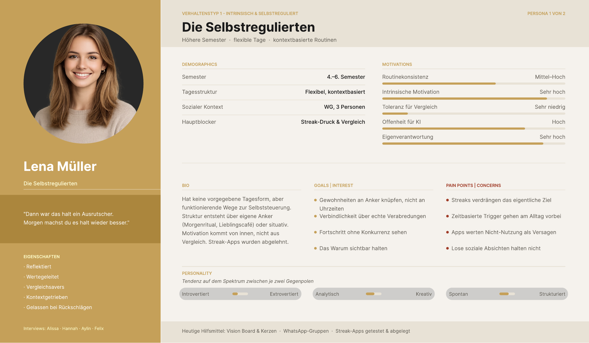

*Abb. 5.1: Das Persona-Sheet „Die Selbstregulierten", verdichtet aus vier Interviews.*

*Verdichtet aus Alissa, Hannah, Aylin und Felix. Höhere Semester, flexible Tage, bereits
funktionierende kontextbasierte Routinen.*

> „Dann war das halt ein Ausrutscher. Morgen machst du es halt wieder besser."

Dieser Typ hat keine vorgegebene Tagesform, aber funktionierende Wege zur Selbststeuerung.
Struktur entsteht über selbst gesetzte Anker oder über den Kontext. Die Motivation kommt von
innen und nicht aus dem Vergleich, Streak-Apps wurden getestet und abgelegt.

| | |
|---|---|
| **Ziele** | Gewohnheiten an Anker knüpfen statt an Uhrzeiten · Verbindlichkeit über echte Verabredungen · Fortschritt ohne Konkurrenz · das Warum sichtbar halten |
| **Frustrationen** | Streaks verdrängen das eigentliche Ziel · zeitbasierte Trigger gehen am Alltag vorbei · Apps werten Nicht-Nutzung als Versagen · lose soziale Absichten halten nicht |
| **Align-Hebel** | Wenn-Dann-Ketten an Kontexte · Habit-Buddies über konkrete Termine · Konsistenzrate statt Streak · Fehltage neutral |

### „Die Einsteiger", überfordert und inkonsistent


*Abb. 5.2: Das Persona-Sheet „Die Einsteiger", verdichtet aus zwei Interviews.*

*Verdichtet aus Danial und Ngoc Anh. Mittlere Semester, keine feste Routine, brauchen einen
klaren ersten Schritt.*

> „Ich weiß oft nicht, wo ich anfangen soll, dann werde ich überfordert und fange erst gar
> nicht an."

Dieser Typ weiß rational, was guttun würde, setzt es aber inkonsistent um. Der Tag steht und
fällt mit dem ersten Anker. Geht der Start schief, kippt der ganze Domino.

| | |
|---|---|
| **Ziele** | einen stabilen Tagesanker finden, der den Rest mitzieht · den ersten Schritt vorgegeben bekommen · sichtbare Meilensteine · auch in der Prüfungsphase eine Kernroutine halten |
| **Frustrationen** | ein schlechter Start zerlegt den Tag · Überforderung führt zum Aufschieben · Ranking motiviert kurz, bricht langfristig weg |
| **Align-Hebel** | KI-Assistent formuliert den nächsten Mikroschritt · Prüfungsmodus mit reduzierter Kernroutine · Meilensteine statt Ranking |

Anne hatte in Iteration 1 nach einem Vorher-Nachher-Vergleich anhand der Personas gefragt.
Die Spalte „Align-Hebel" ist unsere Antwort darauf. Sie stellt jeder Frustration die konkrete
Funktion gegenüber, die sie auffangen soll.

## 5.6 Feedback von Anne

Das Gespräch verlief ausgesprochen positiv, unsere Notiz im Iterationsprotokoll hält fest,
dass Anne überzeugt war. Inhaltlich kamen vier Punkte:

- **Eine offene Fachfrage.** Gibt es eine Höchstzahl an Gewohnheiten, auf die sich ein Mensch
  gleichzeitig konzentrieren kann, ohne überfordert zu werden? In den Quellen prüfen.
- **Persona-Fokus.** Auf welchen der beiden Typen zielen die Features?
- **Nicht zu früh einschränken.** Bei Mockups und Features größer denken und sich erst bei
  der technischen Umsetzung auf das Machbare beschränken. „Es muss nicht alles perfekt sein."
- **Design-System.** Farben, Typografie und Formen in einer gemeinsamen Figma-Datei
  festlegen.

Die Frage nach der Höchstzahl hat sich als der langlebigste Impuls unseres Projekts erwiesen.
Sie führte zur festen **Grenze von fünf aktiven Gewohnheiten**, deren Entwicklung in
Kapitel 7 nachgezeichnet ist. Die Frage nach dem Persona-Fokus haben wir nicht exklusiv
beantwortet, sondern über die Feature-Zuordnung. Die Einsteiger brauchen die KI-gestützte
Starthilfe, die Selbstregulierten die Situations-Anker und eine nicht bestrafende
Fortschrittsanzeige.

---

# Iteration 3 — Online-Umfrage und Priorisierung

## 5.7 Konzeption des Fragebogens

Zunächst haben wir zwei Varianten entworfen, eine lange Fassung mit zwanzig Fragen, die auch
das aktuelle Verhalten erhob, und eine Kurzfassung mit zwölf Fragen, die ausschließlich
validierte, was die Interviews offen gelassen hatten. Für die kurze Variante sprach ein
reales Risiko, denn längere Umfragen werden häufiger abgebrochen.

In einem gemeinsamen Call sind wir beide Entwürfe durchgegangen, haben schwache Fragen
markiert und überarbeitet. Jede Frage musste eine konkrete Design-Entscheidung testen, etwa
ob die Mehrheit Streaks oder Konsistenzraten bevorzugt, ob sozialer Druck motiviert und wie
lang ein Check-in sein darf. Annes Hinweis, fremde Features vor eigenen abzufragen, um Bias
zu vermeiden, haben wir in der Reihenfolge der Fragen umgesetzt.

## 5.8 Werkzeugwahl und Durchführung

Google Forms schied aus, weil Anne aus Datenschutzgründen davon abgeraten hatte. Wir haben
die Umfrage in **LimeSurvey** aufgesetzt und vor der Veröffentlichung mehrfach überarbeitet.
Wir haben sie auch für Nicht-Studierende geöffnet, die das zu Beginn angeben mussten, und um
Alter und Geschlecht ergänzt, um Muster in der Stichprobe erkennen zu können.

Verteilt haben wir sie am 14. Juni über zwei Kanäle innerhalb der Hochschule, über die
E-Commerce-Kohorte und die Erstsemester. Der Rücklauf war schnell, innerhalb von rund zwei
Stunden lagen **25 vollständige Antworten** vor. Damit war die Kapazität des eingesetzten
Umfragewerkzeugs erreicht und die Erhebung endete (siehe Abschnitt 5.11).

## 5.9 Ergebnisse

**Stichprobe.** N = 25 abgeschlossene Antworten, davon 24 eingeschrieben. 16 weiblich,
9 männlich, 19 im Alter von 21 bis 25 Jahren. Der Schwerpunkt lag im 5. bis 6. Semester (12),
gefolgt vom 1. bis 2. Semester (5).

**Wie organisieren sich Studierende heute?**

| Methode | Nennungen |
|---|---|
| Kalender oder Planer | 20 |
| Erinnerungen am Handy | 14 |
| Freunde / Lernpartner | 7 |
| Nichts Bestimmtes | 7 |
| **Habit-App** | **2** |

Nur zwei von 25 nutzen aktuell eine dedizierte Habit-App, während 20 von 25 ohnehin mit
Kalender oder Planer arbeiten. Das ist ein doppelter Befund. Bestehende Lösungen haben eine
geringe Marktdurchdringung, und eine Kalender- und Time-Blocking-Logik knüpft an vorhandenes
Verhalten an, statt neues zu verlangen.

Inhaltlich führen „Lernen und Uni" (20), „Bewegung und Sport" (18) und „Schlaf und Erholung"
(16) die Bereiche an, in denen Gewohnheiten aufgebaut werden.

**Was hält Studierende auf?** Stress und Prüfungsphase sind der mit Abstand größte
Habit-Killer (17/25). Auffällig ist die Reaktion darauf, denn 15 von 25 **reduzieren** dann,
statt ganz aufzugeben. Das spricht für einen Minimal- oder Prüfungsphasen-Modus statt einer
Pausenfunktion.

| Aussage (1 bis 5) | Ø |
|---|---|
| „Wenn ich eine Gewohnheit nicht einhalten konnte, fühle ich mich schuldig/enttäuscht." | **3,92** |
| „Ich weiß, was ich ändern will, aber es wird selten zur Routine." | 3,80 |
| „Wenn ich aus einer Routine rausgefallen bin, fällt mir der Wiedereinstieg schwer." | 3,68 |

Der hohe Schuldwert zusammen mit dem schweren Wiedereinstieg stützt die
Anti-Bestrafungs-Philosophie direkt. Eine bestrafende Mechanik würde genau die wundeste
Stelle treffen.

**Welche Funktionen werden gewünscht?**

| Funktion | Ø Nützlichkeit |
|---|---|
| Starthilfe, kleinster nächster Schritt | **4,16** |
| Erinnerung vor der Gewohnheit | 4,04 |
| Dynamische Anpassung bei Nichteinhaltung | 4,04 |
| Wenn-Dann / Situationsanker | 3,88 |
| Gemeinsamer Kalender mit Freunden | 3,04 |
| Bilder/Nachrichten *während* der Gewohnheit | **2,83** |

Bei der Frage nach der wichtigsten Einzelfunktion lag Fortschrittstracking vorn (9/25), vor
dynamischer Anpassung (7/25) und Starthilfe (6/25). Soziales nannten nur 3 von 25.

**Soziales, differenziert betrachtet.** Der schwache erste Eindruck täuscht. Die Bereitschaft
zum Teilen ist vorhanden, aber leise. 21 von 25 würden Gewohnheiten mit **engen Freunden**
teilen, mit deutlichem Abstand vor Partner:in (12) und Familie (11). Anonyme Personen nannten
nur 2. Gewünscht wird also leichtes, passives Opt-in-Teilen mit ein bis drei Vertrauten und
weder erzwungene Synchronisation noch Live-Kommunikation während der Ausführung.

## 5.10 Ein Befund, der die Interviews korrigierte

Aus den Interviews stammte die Annahme, dass Streaks schlecht sind und demotivieren. In der
Breite hielt das nicht.

| Präferenz | Stimmen |
|---|---|
| Streak | 9 |
| Konsistenzrate | 5 |
| offen für beides | 11 |

Nur 5 von 25 bevorzugen klar die Konsistenzrate, 9 tendieren zum Streak, 11 sind offen. Das
ist der einzige Punkt, an dem die quantitative Erhebung einer qualitativen Hypothese
widersprochen hat, und genau dafür war sie da.

Wir haben uns nicht für eine Seite entschieden, sondern die Spannung auseinandergenommen. Der
Streak wirkt motivierend, aber sein **Bruch** darf nicht bestrafen. In unserer fertigen
Anwendung sind deshalb beide Ansichten vorhanden, die Konsistenzrate als ruhige Kennzahl auf
der Übersicht, Serien an eigener Stelle und verpasste Tage neutral dargestellt.

## 5.11 Methodische Einordnung

Die Ergebnisse sind **richtungsweisend, nicht repräsentativ**. Drei Einschränkungen sind zu
nennen.

**Kleine und schiefe Stichprobe.** Angestrebt waren über 50 Antworten, erreicht wurden 25.
Die Stichprobe ist stark E-Commerce- und 5.-bis-6.-Semester-lastig, das
Geschlechterverhältnis mit 16 zu 9 unausgewogen. Als Priorisierungshilfe ist sie belastbar,
als Beweis nicht. Dass 25 Antworten in zwei Stunden eingingen, zeigt außerdem, dass wir eine
größere Stichprobe hätten erreichen können. Die Begrenzung lag an der Kapazität des
eingesetzten Werkzeugs und nicht an der Bereitschaft der Zielgruppe. Bei einer erneuten
Erhebung würden wir das Umfragewerkzeug deshalb früher und sorgfältiger auswählen.

**Abweichung zwischen Leitfaden und ausgelieferter Umfrage.** Unser finaler Fragebogen
enthielt neun Funktions-Skalen, darunter „gemeinsamer Kalender" und „Bilder während der
Gewohnheit schicken". Die ursprünglich geplanten Skalen zu „Habit Journey /
Fortschrittskurve" und zum Konsistenzrate-Tracking fehlen als eigene Bewertung. Vergleiche
mit unserem ursprünglichen Plan sind entsprechend einzuordnen.

**Segmentierung nicht belastbar.** Eine Auswertung nach „Anfängern" und „Fortgeschrittenen",
die unseren beiden Personas entsprochen hätte, ist bei dieser Stichprobengröße nicht
aussagekräftig.

## 5.12 Abgeleitete Produktentscheidungen

| Erkenntnis | Entscheidung |
|---|---|
| Nur 2/25 nutzen eine Habit-App, 20/25 planen mit Kalender | Time-Blocking-Logik statt eigener Tracker-Welt; niedrige Einstiegshürde |
| Stress/Prüfungsphase ist Hauptgrund fürs Aufgeben (17/25), 15/25 reduzieren statt aufzugeben | Minimal-/Prüfungsphasen-Modus mit reduzierter Kernroutine |
| Schuldgefühl nach Scheitern ø 3,92 | kein Straf- oder Bestrafungsmechanismus, Fehltage neutral |
| Starthilfe bei Überforderung ist die bestbewertete Funktion (ø 4,16) | KI-gestützter Erster-Schritt-Assistent als Kern-Anwendungsfall der Claude API |
| Fortschrittstracking meistgewählte wichtigste Funktion (9/25) | Progress Tracking als Kernfeature, nicht bestrafend gestaltet |
| Streak-Präferenz uneinheitlich (9 : 5 : 11) | beide Ansichten anbieten, Bruch vergebend gestalten |
| 21/25 teilen mit engen Freunden, nur 3/25 nennen Soziales als wichtigste Funktion | Habit-Buddies als dezente Opt-in-Ebene, keine öffentliche Rangliste |
| Gemeinsamer Kalender (3,04) und Live-Bilder (2,83) schwach bewertet | beide verworfen |

## 5.13 Eine Entscheidung gegen ein eigenes Feature

Aus der Auswertung haben wir gefolgert, die **Habit Journey** nicht weiterzuverfolgen, also
die Langzeitperspektive auf der Automatisierungskurve. Wir haben sie bewusst in die
Präsentation aufgenommen, um die Streichung anhand der Umfragedaten begründen zu können,
statt sie stillschweigend verschwinden zu lassen.

## 5.14 Feedback von Anne

Das Feedback war knapp und bestätigend. Die wichtigsten Features hätten wir aus der Umfrage
herausgearbeitet, jetzt gehe es darum, sie umzusetzen und die Erkenntnisse zu visualisieren.
Vor allem sollten wir **dem roten Faden folgen** und das Design auf der Auswertung der
Umfrage aufbauen.

Dieser Hinweis bestimmte unsere gesamte folgende Phase. Jeden Screen, der ab Juli entstand,
haben wir mit einem Bezug zu Interview-, Umfrage- oder Literaturbefund versehen,
niedergelegt in einem eigenen Begründungsdokument, das für jeden Screen festhält, worauf er
abzielt. Es war unser bewusster Versuch, nachweisen zu können, dass keine
Design-Entscheidung aus dem Bauch kam.

---

# 6. Phase 3 — Konzeption und Design

**Zeitraum:** 30. Juni bis 20. Juli 2026 · **Iteration 4**, Betreuungsgespräch am 20. Juli

Nach Annes Aufforderung, dem roten Faden zu folgen, ging es uns in dieser Phase darum, aus
den priorisierten Erkenntnissen ausgearbeitete Features und gestaltete Screens zu machen, und
zwar so, dass sich jede Entscheidung auf einen Befund zurückführen lässt. Parallel haben wir
eine verbindliche Designsprache erarbeitet, damit unsere Entwürfe zusammenpassen.

## 6.1 Von der Priorisierung zu drei Kernfeatures

Aus der Umfrage ergab sich eine klare Rangfolge. Drei Features haben wir als Kern gesetzt,
ergänzt um eine übergreifende KI-Assistenz:

| Feature | Empirischer Anker |
|---|---|
| **Time Blocking** | Wenn-Dann-Anker ø 3,88 · 20/25 planen ohnehin mit Kalender · in allen sechs Interviews bestätigt |
| **Progress Tracking** | meistgewählte wichtigste Funktion (9/25) · Schuldwert 3,92 macht „vergebend" zur Pflicht |
| **Community** | 21/25 teilen mit engen Freunden, aber nur 3/25 nennen Soziales als wichtigste Funktion |
| **KI-Assistenz** | Starthilfe bei Überforderung ø 4,16, der Bestwert aller abgefragten Funktionen |

Die **Habit Journey** haben wir an dieser Stelle gestrichen (Abschnitt 5.13).

Für alle Features galt derselbe Maßstab. Sie sollten sich ohne Erklärung bedienen lassen und
beim Benutzen so wenige Hürden wie möglich erzeugen. Eine Gewohnheit anzulegen, abzuhaken oder
zu verschieben durfte nicht selbst zu einer Aufgabe werden, die man aufschiebt. Wir haben
deshalb bei jedem Screen geprüft, welche Angabe wirklich nötig ist, und alles andere
weggelassen oder mit einem sinnvollen Vorschlag vorbelegt.

## 6.2 Time Blocking

Time Blocking ist das zentrale Strukturierungsprinzip unserer Anwendung. Statt abstrakte
Gewohnheitsziele zu setzen, betten wir Gewohnheiten nach dem Prinzip der Wenn-Dann-Planung in
konkrete Zeitfenster ein.

Der Einrichtungsflow läuft in zwei getrennten Schritten. Zuerst wird das Ziel definiert („Ich
will regelmäßig laufen gehen"), danach eine konkrete Situation als Auslöser gewählt („Wenn
ich von der Uni nach Hause komme, dann gehe ich laufen"). Das Format „Wenn X, dann Y" wird
intern gespeichert und ist Grundlage für die Planung im Tag und für Erinnerungen.

Drei Mechanismen gehören dazu:

- **Situations-Picker statt Zeitpicker.** Angeboten werden vorgefertigte Alltagssituationen
  wie „nach dem Aufstehen", „nach der Morgenvorlesung" oder „wenn ich nach Hause komme". Eine
  Situation löst Verhalten automatisch aus, während eine Uhrzeit aktiv im Kopf behalten
  werden muss.
- **Domino-Prinzip / Habit Chains.** Eine Gewohnheit wird zum Auslöser der nächsten.
  Verschiebt sich die erste, rückt die zweite mit.
- **Erinnerung vor dem Trigger**, nicht danach.

 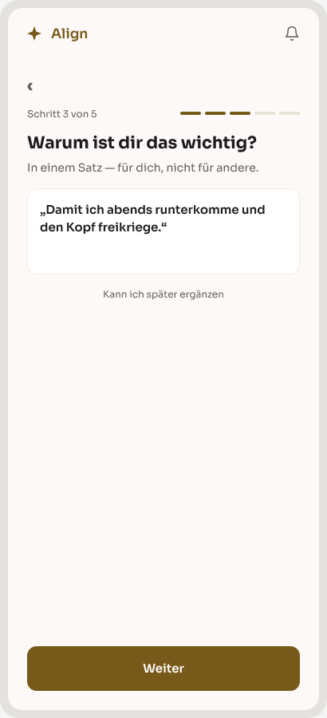

*Abb. 6.1 und 6.2: Der Einrichtungsflow im Entwurf. Links die Wahl des Ankers, rechts der
Warum-Satz in eigenen Worten.*

**Wissenschaftliche Grundlage.** Faude-Koivisto und Gollwitzer (2009) zeigen, dass das Format
„Wenn X, dann Y" Verhaltenskontrolle an die Situation statt an die Selbstdisziplin überträgt
und dass die Spezifität des Wenn-Teils für die Wirkung entscheidend ist. Becker (2024) nennt
den konkreten Auslöser als Voraussetzung jeder Gewohnheit und beschreibt das Domino-Prinzip.
Lally et al. (2010) halten fest, dass situative Cues effektiver sind als Uhrzeiten, weil sie
externe Auslösung ermöglichen.

## 6.3 Progress Tracking

Sichtbarer Fortschritt ist einer der wirksamsten Motivationsverstärker und in unserer
Zielgruppe zugleich die empfindlichste Stelle. Wir folgen bei der Gestaltung deshalb einem
einzigen Grundsatz, nämlich ehrlicher Transparenz ohne Druck.

- Es werden bis zu fünf Gewohnheiten täglich verfolgt.
- Der Verlauf erscheint als Kalenderansicht mit farblicher Abstufung, Tage ohne Eintrag
  bleiben neutral statt rot markiert.
- Ein vergessener Tag löst keine Schuldnachricht, kein Kreuz und keinen Reset aus.
- Ist eine Gewohnheit gefestigt, kann sie durch eine neue ersetzt werden.

 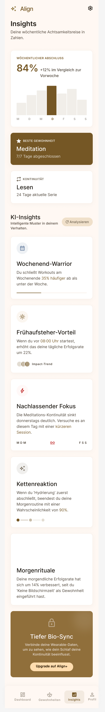

*Abb. 6.3 und 6.4: Progress Tracking im Entwurf. Die Übersicht zeigt den Stand des Tages, die
Insights-Ansicht den Verlauf über mehrere Wochen.*

**Wissenschaftliche Grundlage.** Becker (2024) beschreibt im „Tagebuch der Tugenden", dass
sichtbarer Fortschritt die zukünftige Leistung um bis zu 20 % erhöht. Lally et al. (2010)
zeigen, dass Konsistenz der wichtigste Prädiktor für den Gewohnheitsstatus ist und nicht die
absolute Anzahl der Ausführungen. Einzelne Aussetzer haben dort keine messbaren
Langzeitkosten, fehlende Tage dürfen also nie bestraft oder prominent angezeigt werden. Rund
die Hälfte der motivierten Teilnehmenden in dieser Studie erreichte keinen
Gewohnheitsstatus, weil die Konsistenz zu niedrig war. Sanfte Konsistenzhinweise sind
deshalb wichtiger als reine Streak-Zählung.

### Annes Frage nach der Höchstzahl

In Iteration 2 hatte Anne gefragt, ob es eine Obergrenze für gleichzeitig verfolgte
Gewohnheiten gibt. Die Antwort haben wir bei **Becker (2024, Kap. 14.7.2)** gefunden. Dort
werden täglich bis zu fünf Gewohnheiten bewertet, und die Liste entwickelt sich iterativ
weiter, indem gefestigte Gewohnheiten durch neue ersetzt werden.

Aus einer Betreuungsfrage wurde damit eine belegte Produktregel, die **Grenze von fünf
aktiven Gewohnheiten**. Wir haben sie in Phase 4 implementiert, wo sie mehrere Ausbaustufen
durchlief (Kapitel 7).

## 6.4 Community

Der Community-Aspekt bringt einen sozialen Layer in die Gewohnheitsbildung. Soziale
Verbindlichkeit wirkt als Verstärker, ohne Druck oder Scham zu erzeugen.

Die Umfrage hatte eine feine Unterscheidung offengelegt. Die Teilbereitschaft mit engen
Freunden ist hoch (21/25), die Priorität als eigenständige Funktion aber gering (3/25), und
aufdringliche Mechaniken werden deutlich abgelehnt (gemeinsamer Kalender ø 3,04, Live-Bilder
ø 2,83). Daraus haben wir die Positionierung als **dezente Opt-in-Ebene** abgeleitet und
nicht als Headline unserer Anwendung.

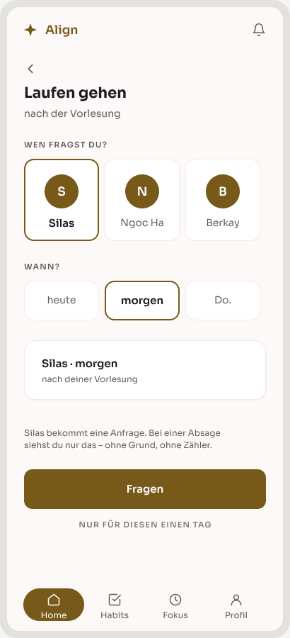

*Abb. 6.5: Eine Verabredung vorschlagen. Der Entwurf zeigt eine einzelne Gewohnheit und eine
einzelne Person, keine Gruppe und keine Liste.*

### Eine explizite Entscheidungsvorlage

Für Community haben wir zwei Wirkmechanismen gegeneinander abgewogen und als eigene
Vergleichsfolie ausgearbeitet:

| | „Community Dashboard" | „Die Verabredung" |
|---|---|---|
| Prinzip | Rangliste, Gruppenstatistiken, Feed | konkrete, terminbasierte Verbindlichkeit zwischen 1 bis 3 Personen |
| Empirie | Rangliste explizit nicht gewünscht; Rankings verlieren laut Interviews langfristig ihre Wirkung | „Wenn du eine Verabredung hast, gehst du mit einem anderen Pflichtbewusstsein ran" |

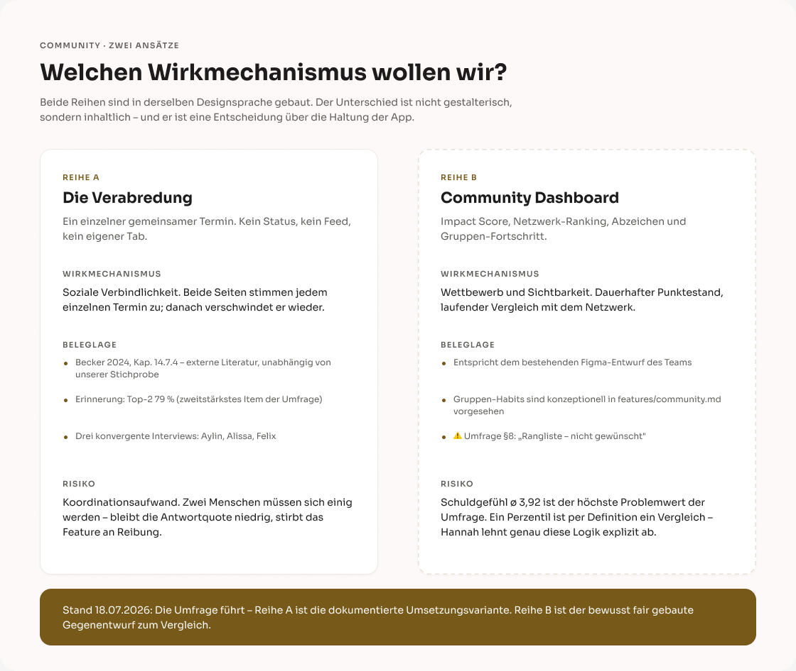

*Abb. 6.6: Die Vergleichsfolie, mit der wir die Entscheidung begründet haben.*

Wir haben uns datenbasiert für den **Verabredungsmechanismus** entschieden. Damit hatten wir
auch Annes Anregung aus Iteration 1 aufgenommen, den sozialen Aspekt im Sinne von „ich bin
nicht allein", ohne in Vergleich umzuschlagen.

**Wissenschaftliche Grundlage.** Becker (2024) beschreibt, dass das soziale Umfeld über den
Gewohnheitserfolg mitentscheidet und dass soziale Verbindlichkeit („ich verabrede mich mit
jemandem zum Sport") zu den wirksamsten Starthilfen für neue Gewohnheiten gehört.

## 6.5 KI-Assistenz

Ergänzend zu den drei Kernfeatures haben wir die über die Claude API angebundene KI als
übergreifende Ebene konzipiert. Sie formuliert bei Überforderung den kleinsten nächsten
Schritt und schlägt einen neuen Platz im Tag vor, wenn eine Gewohnheit mit einem anderen
Termin zusammenfällt.

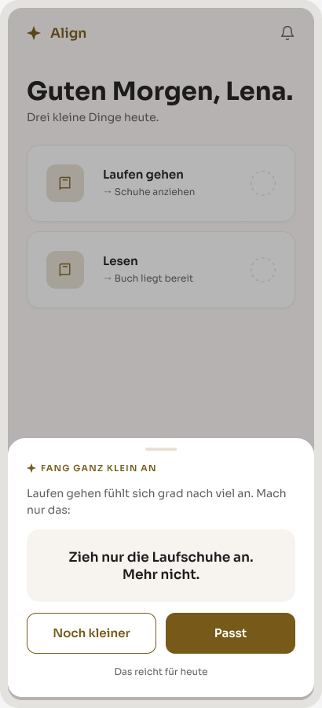

*Abb. 6.7: Der kleinste nächste Schritt im Entwurf.*

Diese Rolle ist empirisch am besten abgesichert. „Starthilfe bei Überforderung" erzielte mit
ø 4,16 die höchste Nützlichkeitsbewertung aller abgefragten Funktionen.

Für die acht Screens dieses Bereichs haben wir ein eigenes Begründungsdokument angelegt, das
für jeden Screen festhält, was zu sehen ist, warum wir es so entschieden haben und worauf es
aus Umfrage, Interviews und Literatur zielt.

## 6.6 Die Designsprache

Aus der Prototypenarbeit ist ein Dokument entstanden, das Farben, Typografie, Abstände,
Formen und Komponenten festhält. Es diente uns von hier an als visuelle Referenz für alle
Features und später als Vorlage für die Implementierung. Verbindlich blieb allerdings die
Figma-Datei, denn das Dokument war aus Screenshots abgeleitet und weicht an einzelnen Stellen
ab.

### Die Farbentscheidung

Unsere allererste Designrichtung hatte auf eine dunkle, blau akzentuierte Farbwelt gesetzt.
Im Vergleich empfanden wir sie als zu dominant und haben uns für eine ruhigere, wärmere
Sprache entschieden, mit **Gold als durchgängiger Akzentfarbe**, kombiniert mit Schwarz im
Dark Mode und Weiß im Light Mode. Beide Modi folgen derselben Designsprache. Diese Palette
hielt bis zum Projektende.

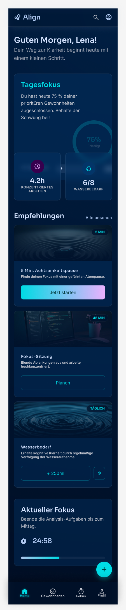  

*Abb. 6.8 bis 6.10: Dieselbe Startseite über drei Iterationen. Links die erste, dunkelblaue
Fassung mit Cyan-Akzent, in der Mitte der Zwischenstand, rechts die warme Fassung mit Gold
und Sora, die bis zum Projektende hielt.*

Als Schrift haben wir **Sora** festgelegt. Die Navigation gliedert die Anwendung im Entwurf in
vier Hauptbereiche; in der gebauten Anwendung sind daraus fünf geworden (Kapitel 8).

## 6.7 Von statischen Entwürfen zu interaktiven Prototypen

Im Verlauf dieser Phase sind wir von rein statischen Entwürfen zu interaktiven Prototypen in
HTML gewechselt. Der Grund war praktischer Natur. Ein Entwurf, der sich anklicken lässt,
zeigt Abläufe wie den mehrstufigen Einrichtungsflow einer Gewohnheit deutlich besser als eine
Abfolge einzelner Bildschirme, und Änderungen daran lassen sich gezielt vornehmen, statt
Screens neu zu zeichnen.

Verbindliche Designquelle blieb dabei durchgehend unsere Figma-Datei. Die Prototypen haben
Farben, Typografie und Abstände von dort übernommen, wo sie abwichen, galt Figma. Diese klare
Rangfolge war notwendig, weil wir parallel an mehreren Features gearbeitet haben und die
Ergebnisse zusammenpassen mussten.

Rückblickend war dieser Wechsel für uns der Übergang von der Gestaltung zur Umsetzung. Die
interaktiven Prototypen dieser Phase sind unmittelbar in unsere spätere Implementierung
eingegangen.

## 6.8 Prototypen

Bis zum Betreuungsgespräch lagen Entwürfe für alle drei Kernfeatures vor. Jede und jeder von
uns hat einen Bereich verantwortet, sodass die Gestaltungsarbeit gleichmäßig verteilt war:

- **Time Blocking und KI-Assistent** als Wireframe-Sequenz von neun Screens, vom Ziel über
  die Wahl des Ankers und den persönlichen Warum-Satz bis zur Kollisionsmeldung, wenn ein
  neuer Slot mit einem bestehenden Termin zusammenfällt
- **Progress Tracking** als Low-Fidelity-Wireframes und finale High-Fidelity-Screens mit
  Übersicht, Wachstum und Konsistenz, Insights, Hindernissen und Meilensteinen
- **Community** mit Habit-Erstellung, Community-Screens und der Vergleichsfolie zur
  Mechanismus-Entscheidung

## 6.9 Feedback von Anne

Das Feedback fiel kurz aus. Wir hätten drei Features herausgesucht und im Design umgesetzt.
Anne wurde im Anschluss in die Figma-Datei eingeladen, um die Entwürfe direkt einsehen zu
können.

## 6.10 Was daraus folgte

Wenige Stunden nach dem Gespräch haben wir die Entscheidung getroffen, die den Rest unseres
Projekts bestimmte. Wir haben mit der technischen Umsetzung begonnen.

Wir hatten zu diesem Zeitpunkt eine empirisch abgesicherte Feature-Auswahl, zwei Personas,
eine Designsprache und gestaltete Screens für drei Kernfeatures. Nichts davon haben wir
verworfen, Prototypen und Designsprache sind unmittelbar in die Implementierung eingegangen.

---

# 7. Phase 4 — Technische Umsetzung

**Zeitraum:** 21. Juli bis 7. September 2026 · **Iterationen 5 und 6**, Betreuungsgespräche
am 10. August und 7. September

Nach der Konzeptphase stand fest, welche Features wir bauen wollten. In dieser Phase haben
wir sie in lauffähige Software übersetzt. Zuerst haben wir die technische Grundlage gebaut,
danach daraus eine Anwendung gemacht, die sich benutzen lässt.

## 7.1 Die Entscheidung für den Tech-Stack

Wir haben Align als Mobile-First-Web-App mit Laravel gebaut. Warum wir diese
Entwicklungsentscheidung getroffen haben, erklären wir im Folgenden.

**Web-App statt nativer App.** In der Konzeptphase sind wir von einer nativen App ausgegangen.
Eine Web-App läuft dagegen im Browser, auf dem Smartphone genauso wie am Laptop. Sie muss
nicht getrennt für iOS und Android gebaut und nicht über einen App-Store veröffentlicht werden.
Dadurch war jede Änderung sofort sichtbar, und wir konnten jeden Zwischenstand direkt
ausprobieren.

**Mobile First.** Align ist für das Smartphone gedacht. Deshalb haben wir jede Ansicht zuerst
für die Breite eines Smartphones gestaltet und erst danach für größere Bildschirme angepasst.
Entwickelt haben wir am Laptop. Im Browser lässt sich die Bildschirmbreite umstellen, sodass
wir die Mobilansicht laufend prüfen konnten, ohne Simulator und ohne eigenes Testgerät.

**Laravel.** Laravel ist ein PHP-Framework, in dem viele Grundfunktionen einer Webanwendung
schon enthalten sind, zum Beispiel die Anmeldung, der Zugriff auf die Datenbank und die
Prüfung von Eingaben. Diese Teile mussten wir nicht selbst programmieren. So kamen wir
schneller zu einer lauffähigen Anwendung und konnten uns auf die eigentlichen Funktionen von
Align konzentrieren. Die Oberfläche haben wir mit React gebaut, weil sich die Bildschirme damit
aus wiederverwendbaren Bausteinen zusammensetzen lassen. Welche weiteren Werkzeuge wir
verwendet haben und wofür, zeigt Abschnitt 7.2.

Die Web-App ist eine Entscheidung für die Entwicklung und keine für das spätere Produkt. Align
ist ein MVP aus einem Studienprojekt und kein marktfähiges Produkt. Unsere langfristige
Produktidee bleibt eine native App (Abschnitt 9.10).

Beim Programmieren haben wir KI-gestützte Werkzeuge eingesetzt. Was die App können soll,
welche Daten sie speichert und wie sie sich in welcher Situation verhält, haben wir selbst
entschieden. Unsere Gründe dafür beschreiben wir in den folgenden Abschnitten.

## 7.2 Der Stack im Überblick

| Schicht | Technologie | Begründung |
|---|---|---|
| Sprache / Runtime | PHP 8.4, Node 25 | kommen beide von Herd, keine separate Einrichtung |
| Backend | **Laravel 13** | Routing, Validierung, Anmeldung und Datenbankzugriff sind bereits enthalten |
| Bridge | **Inertia.js 3** | verbindet Controller direkt mit React-Seiten, SPA-Gefühl ohne eigene API-Schicht |
| Frontend | **React 19** + TypeScript 5.7 | Komponenten mit Typprüfung über die gesamte Oberfläche |
| UI | **shadcn/ui** (Radix), **Tailwind CSS 4** | Komponenten liegen als Quelltext im Projekt und sind frei an die Designsprache anpassbar |
| Build | Vite 8 | Hot Reload im Betrieb, gebündelte Assets für die Auslieferung |
| Routen im Frontend | `laravel/wayfinder` | erzeugt TypeScript-Funktionen aus den Laravel-Routen, Tippfehler fallen beim Kompilieren auf |
| Auth | `laravel/fortify` mit Passkeys und 2FA | geprüfter Baustein statt Eigenbau |
| Datenbank | **SQLite** | eine Datei, kein Server; Cache, Queue und Session laufen ebenfalls darüber |
| KI | `laravel/ai` über die **OpenRouter-API** | siehe 7.4 |
| Qualität | Pest 5, Larastan, Pint, ESLint, Prettier | siehe 7.5 |
| Umgebung | Laravel Herd, `https://align.test` | HTTPS lokal, ohne eigene Serverkonfiguration |

## 7.3 Architektur

Ein Aufruf nimmt immer denselben Weg:

```
Browser → Route (routes/web.php) → Controller → Inertia::render() → React-Seite
```

Der Controller lädt die Daten und benennt die React-Seite, die sie darstellen soll. Eine
separate REST-API brauchen wir nicht, weil Inertia die Props direkt übergibt. Jede Entität
besteht aus einem Eloquent-Model und einer Migration, die die Tabelle beschreibt. Eingaben
prüfen Form Requests, Zugriffsrechte regeln Policies, feste Wertebereiche liegen als Enums
vor.

Die Oberfläche baut auf shadcn/ui-Komponenten, die die Design-Tokens aus der zentralen
Stylesheet-Datei tragen. Dort liegen Schrift (Sora) und Farben aus Figma als CSS-Variablen,
darunter `primary` mit `#775A19`. Unsere Designsprache aus Phase 3 ist damit nicht
nachgebaut, sondern als Quelle im Code verankert.

## 7.4 Die KI-Anbindung

Die KI-Funktionen sprechen nicht direkt mit einem Anbieter, sondern über das Laravel-AI-SDK
mit der OpenRouter-API. Anbieter und Modell stehen in der Umgebungskonfiguration und lassen
sich ohne Codeänderung austauschen.

Jede Funktion ist eine eigene Agent-Klasse mit festem Prompt, Zeitlimit und einem
JSON-Schema für die Antwort, etwa der Agent für den kleinsten nächsten Schritt. Die
zugehörigen Routen sind gedrosselt, weil hinter ihnen ein kostenpflichtiger Dienst steht.

Die Agenten kennen dabei den Kontext, in dem sie gefragt werden, also die Gewohnheiten der
Person, ihren Schlafrahmen und ihren Stundenplan. Ein Vorschlag für einen neuen Platz im Tag
entsteht damit nicht im luftleeren Raum, sondern für genau diesen Tag.

Eine Entscheidung ist uns dabei wichtig. Fällt ein Aufruf aus, antwortet die Anwendung mit
einer **ehrlichen Absage** und nicht mit einem regelbasierten Ersatzvorschlag. Ein Vorschlag
soll nur dann als KI-Vorschlag erscheinen, wenn er auch von der KI stammt. Ein Fallback, der
KI nur simuliert, wäre gegenüber dem Nutzer eine Täuschung und im Rahmen dieser Arbeit auch
gegenüber unserer Leitfrage, in der kontextsensitive KI ausdrücklich vorkommt.

## 7.5 Qualitätssicherung

Feature-Tests mit **Pest** decken die zentralen Abläufe ab: Onboarding, Gewohnheiten,
Erinnerungen, KI-Vorschläge, Verabredungen. **Larastan** prüft die Typen im Backend, der
TypeScript-Compiler die im Frontend, **Pint** und **ESLint/Prettier** den Stil. Ein einzelner
Befehl führt alles in einem Durchlauf aus.

---

# Iteration 5 — Aufbau der Anwendung

Unser Ziel war ein lauffähiger Stand, der die drei Kernfeatures erkennbar abbildet. Er
musste nicht vollständig sein, aber weit genug, um ihn vorführen zu können.

## 7.6 Was entstand

**Grundgerüst und Designsprache.** Am Anfang stand ein Dashboard, das noch mit Beispieldaten
arbeitete. Den Rest prägte der nächste Schritt: Wir haben die Designsprache aus Phase 3 in die
Anwendung übernommen, und das Platzhalter-Widget wich echten Gewohnheitsdaten. Danach kamen
Onboarding, das Abhaken von Gewohnheiten und die drei Feature-Bereiche dazu.

**Kernfunktionen.** Darauf aufbauend entstanden feste Uhrzeiten und Erinnerungen zehn Minuten
vor dem Termin, die KI-Anbindung mit dem Vorschlag des kleinsten nächsten Schritts und der
Tageskalender, in dem die KI einen Block verschieben kann. Dazu kamen der Freundschafts-Layer
mit gemeinsam übernommenen Gewohnheiten, die Umschaltung zwischen Light und Dark Mode und eine
Serienzählung, die ein Wochenende und einen verpassten Tag übersteht. Außerdem entstand eine
Ansicht, die zeigt, was mit wem verabredet ist, und die Möglichkeit, eine Verabredung
abzusagen, ohne dass eine Lücke zurückbleibt.

**Die Fünf-Gewohnheiten-Grenze.** Aus der in Phase 3 belegten Regel wurde eine Funktion.
Gewohnheiten lassen sich beenden, statt bei fünf festzustecken, und die Grenze wird dort
erklärt, wo sie tatsächlich greift, nicht als abstrakte Regel im Onboarding.

Parallel ist ein eigenes Logo entstanden, das wir in einer hellen und einer dunklen Variante
eingebunden haben.

Für diesen Bericht haben wir den Code-Stand vom 10. August noch einmal gestartet und zwei
Bildschirme nachträglich aufgenommen. Datum und Beispieldaten stammen deshalb aus der Aufnahme,
Aufbau und Funktionen aus dem damaligen Stand.

 

*Abb. 7.1 und 7.2: Die Anwendung im Code-Stand vom 10. August. Links die Übersicht mit
Prozentwert und großer Serien-Karte, „Ich komm nicht rein" war der damalige Name der
Starthilfe. Rechts der Kalender, der den Tag noch als Liste nach Situationen ordnete, darunter
„nach dem Mittagessen" und „wenn ich nach Hause komme".*

## 7.7 Feedback von Anne

Anne nannte drei Punkte. Die Dokumentation parallel weiterführen, das Design fertigstellen
und dabei priorisieren, die technische Umsetzung weitertreiben.

---

# Iteration 6 — Ausbau und Härtung

Für diese Iteration hatten wir uns zwei Ziele gesetzt. Die App sollte intuitiver werden, damit
sie nicht selbst zum Hindernis wird, und das Bestehende sollte so robust werden, dass es in
unterschiedlichen Kontexten zuverlässig funktioniert. Diese beiden Ziele zu vereinbaren, fiel
uns schwer. Damit sich die App intuitiv bedienen lässt, muss sie in jeder Situation
verlässlich reagieren. Jede Gewohnheit muss dabei aber anders behandelt werden, je nachdem, ob
sie zum Beispiel am Aufstehen, an einer Vorlesung oder an einer festen Uhrzeit hängt. Außerdem
ist der Kontext oft ein anderer, etwa an einem Tag mit Vorlesungen oder am Wochenende. Alles so
umzusetzen, dass es trotzdem immer zuverlässig funktioniert, war deshalb nicht einfach.

Der Stand aus Iteration 5 hatte viele Funktionen, aber sie griffen noch nicht ineinander.
Abbildung 7.2 zeigt das deutlich. Der Kalender ordnete den Tag nach Situationen, weil die
Gewohnheiten keine Dauer hatten und sich deshalb keiner Uhrzeit zuordnen ließen. Er wusste
nicht, wann der Tag beginnt und endet, und er wusste nichts von Vorlesungen. Jede der folgenden
Änderungen schließt eine dieser Lücken. Wir stellen sie in der Reihenfolge vor, in der sie
aufeinander aufbauen, und beschreiben jeweils, wie es vorher war, was beim Benutzen auffiel und
was wir geändert haben.

| Abschnitt | Vorher | Nachher |
|---|---|---|
| **7.8 Katalog** | freie Eingabe, Gewohnheiten ohne Dauer | fester Katalog, jede Gewohnheit mit Dauer |
| **7.9 Schlafplan** | der Tag hatte keinen Anfang und kein Ende | Aufstehen und Schlafengehen spannen den Tag auf |
| **7.10 Zeitraster** | der Tag als Liste nach Situationen | der Tag als Zeitraster mit verschiebbaren Blöcken, nur noch Situationen mit berechenbarer Uhrzeit |
| **7.11 Stundenplan** | Semesterplan als eigener Bereich | Kurse liegen direkt im Kalender und haben Vorrang vor Gewohnheiten |
| **7.12 Navigation** | Seitenleiste mit sechs Einträgen | fünf Tabs am unteren Rand |
| **7.13 Gewohnheiten** | Karten mit Schaltern, Fortschritt in Prozent | Wochenblatt, Tage statt Prozent |

## 7.8 Gewohnheiten bekommen eine Dauer: der Katalog

**Vorher.** Anfangs wählte man im zweiten Schritt des Assistenten aus Vorschlägen oder tippte
über „Etwas anderes" eine eigene Gewohnheit in ein Textfeld. Unter den Vorschlägen standen auch
Gewohnheiten wie „Treppe statt Aufzug" oder „Eine Station früher aussteigen", die keine Dauer
haben und keinen Platz im Tag belegen (Abb. 7.3).

**Was beim Benutzen auffiel.** Eine Gewohnheit ohne Dauer lässt sich nicht in einen Tag
einplanen. Man weiß nicht, wie viel Platz sie braucht, und eine angehängte Gewohnheit weiß
nicht, wann die vorige fertig ist. Solange der Kalender eine Liste war, fiel das kaum auf.
Sobald wir den Tag als Zeitraster zeigen wollten, wurde es zum Hindernis.

**Nachher.** Wir haben uns entschieden, zunächst nur mit fest vorgegebenen Gewohnheiten zu
arbeiten, damit die Anwendung jede Gewohnheit zuverlässig planen kann. Das Textfeld ist
entfallen, und Gewohnheiten kommen aus einem festen Katalog. Aufgenommen wird nur, was drei
Bedingungen erfüllt: planbar sein, eine Dauer haben, am Stück stattfinden. Der Katalog ist in
vier Bereiche des Studienalltags sortiert, und jeder Eintrag zeigt seine Dauer, die sich beim
Anlegen anpassen lässt (Abb. 7.4).

 

*Abb. 7.3 und 7.4: Derselbe Schritt im selben Bereich vorher und nachher. Links der Code-Stand
vom 31. August mit Vorschlägen, von denen zwei keine Dauer haben, und dem Feld
„Etwas anderes" für eine eigene Gewohnheit. Rechts der Katalog, in dem jeder Eintrag seine
Dauer trägt.*

**Warum das die wichtigste Änderung war.** Aus einem Tracker wurde damit ein
Planungswerkzeug. Erst die Dauer macht aus einer Gewohnheit einen Block, der eine echte Spanne
im Tag belegt, und auf ihr bauen alle folgenden Abschnitte auf. Zugleich ist der Katalog unsere
größte bewusste Einschränkung, denn eigene Gewohnheiten lassen sich derzeit nicht eintragen.
Wie sich die Anwendung an dieser Stelle erweitern ließe, beschreibt Abschnitt 9.7.

## 7.9 Der Tag bekommt einen Rahmen: der Schlafplan

**Vorher.** Der Tag hatte keinen Anfang und kein Ende. Gewohnheiten, die „nach dem Aufstehen"
oder „vor dem Schlafengehen" stattfinden sollten, hingen an Momenten, deren Uhrzeit die
Anwendung nicht kannte.

**Was beim Benutzen auffiel.** Ohne Rahmen konnte die Anwendung weder sagen, wie viel Platz ein
Tag überhaupt bietet, noch Gewohnheiten an seinen Rändern sinnvoll einordnen. Auch ein
Vorschlag für einen neuen Platz hätte in der Nacht landen können.

**Nachher.** Aufsteh- und Schlafenszeit spannen den Tag auf, in dem alles andere stattfindet.
Beide legt man im Schlafplan fest, und zwar für jeden Wochentag einzeln, weil ein Samstag
anders aussieht als ein Dienstag (Abb. 7.5). Damit kennt die Anwendung die Uhrzeit von
„nach dem Aufstehen" und „vor dem Schlafengehen". Verschiebt sich der Rahmen, verschieben sich
die Gewohnheiten an seinen Rändern mit. Wie der Kalender den Rahmen darstellt, zeigt
Abschnitt 7.10.

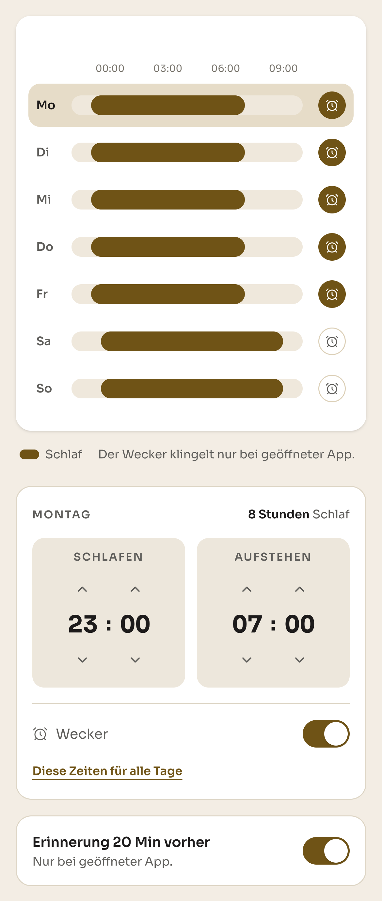

*Abb. 7.5: Der Schlafplan mit einem Balken je Wochentag. Darunter lassen sich Schlafens- und
Aufstehzeit des gewählten Tages einstellen, dazu der Wecker und die Erinnerung vor der
Schlafenszeit.*

**Zwei Aufgaben auf einmal.** In der Anwendung ist der Rahmen bewusst **keine Gewohnheit**. Er
wird nicht abgehakt, hat weder Serie noch Quote und belegt keinen der fünf Plätze. Er
beantwortet die Frage, die vor jeder Planung steht, nämlich wie lang der Tag überhaupt ist. Ein
regelmäßiger Schlafrhythmus ist aber selbst eine gute Gewohnheit. Wer im Schlafplan feste
Zeiten einträgt, nimmt sich damit schon vor, zu diesen Zeiten schlafen zu gehen und
aufzustehen. Damit das im Alltag klappt, erinnert die Anwendung auf Wunsch 20 Minuten vor der
Schlafenszeit daran, und zur Aufstehzeit kann ein Wecker klingeln, beides, solange die
Anwendung geöffnet ist. Der Schlafplan gibt der Planung also einen Rahmen und hilft zugleich,
einen festen Schlafrhythmus als Gewohnheit aufzubauen.

## 7.10 Aus der Liste wird ein Zeitraster

**Vorher.** Der Kalender zeigte einen Tag als Liste, gegliedert nach den Situationen, an denen
die Gewohnheiten hingen (Abb. 7.2). Man sah, was nach dem Aufstehen oder nach dem Mittagessen
anstand, aber nicht, wann genau, wie lange es dauert und ob zwei Dinge zeitlich zusammenpassen.

**Nachher.** Mit Dauer und Rahmen ließ sich der Tag als Zeitraster zeigen, das beim Aufstehen
beginnt und beim Schlafengehen endet (Abb. 7.6 und 7.7). Jede Gewohnheit ist ein Block mit
Anfang und Ende. Über der Tagesansicht liegt eine Monatsansicht, aus der man in jeden Tag
springt. Blöcke lassen sich per Langdruck greifen und verschieben. Hängt eine Gewohnheit an
einer anderen, rückt sie mit, und bevor die Änderung gilt, fragt die Anwendung, ob sie nur an
diesem Tag oder immer gelten soll. Wie das in der fertigen Anwendung aussieht, zeigt
Abschnitt 8.4.

 

*Abb. 7.6 und 7.7: Derselbe Tag am Anfang und am Ende. Er beginnt mit der Aufstehzeit um 07:00
und endet mit der Schlafenszeit um 23:00. „Frühstücken" hängt an „nach dem Aufstehen" und liegt
deshalb am Anfang des Tages, „Meditieren" hängt an „vor dem Schlafengehen" und liegt an seinem
Ende.*

**Nur Situationen, deren Uhrzeit sich berechnen lässt.** Im Zeitraster braucht jede Gewohnheit
eine Uhrzeit, auch wenn sie an einer Situation hängt. Anfangs gab es neben „nach dem Aufstehen",
„nach der Vorlesung" und „vor dem Schlafengehen" noch „nach dem Frühstück", „nach dem Mittagessen"
und „wenn ich nach Hause komme" (Abb. 7.2). Für diese drei Momente kannte die Anwendung keine
Uhrzeit und musste sie schätzen, zum Beispiel das Mittagessen um 13 Uhr. Das passt aber für kaum
jemanden, weil jede Person zu anderen Zeiten frühstückt, zu Mittag isst oder nach Hause kommt.
Noch weniger ließ sich mit einer selbst eingetippten Situation anfangen.
„Wenn ich aus der Bib komme" konnte die Anwendung nirgends einordnen, also landete die
Gewohnheit bei allen mittags. Im Kalender hätte eine Gewohnheit damit zu einer Uhrzeit
gestanden, die nicht stimmt. Wir haben diese Situationen und das Feld für eigene Situationen
deshalb herausgenommen. Angeboten werden nur noch die drei Situationen, deren Uhrzeit die Anwendung und
die KI aus den eigenen Angaben berechnen können: „nach dem Aufstehen" und
„vor dem Schlafengehen" aus dem Schlafplan und „nach der Vorlesung" aus dem Stundenplan, sofern
einer eingetragen ist (Abschnitt 7.11). Wer eine Gewohnheit nach dem Frühstück machen möchte,
hängt sie stattdessen an die Gewohnheit „Frühstücken", deren Platz im Tag feststeht. Wie sich
weitere Situationen zurückholen ließen, beschreibt Abschnitt 9.7.

**Luft zwischen zwei Blöcken.** Zwischen zwei Blöcken hält Align Luft, nämlich eine
Viertelstunde zwischen zwei Gewohnheiten und vor und nach einer Vorlesung, zum Hinkommen und
Umschalten, und fünf Minuten innerhalb einer Kette. Ohne diese Regel hätte das Raster Tage
erlaubt, die auf dem Bildschirm aufgehen, im Alltag aber nicht.

**„Immer" nur, wenn an allen Tagen Platz ist.** Beim Verschieben entscheidet man, ob der neue
Platz nur an diesem Tag oder immer gelten soll. „Immer" legt die Gewohnheit an jedem Wochentag,
an dem sie vorgesehen ist, auf die neue Uhrzeit. Deshalb prüft die Anwendung vorher jeden
dieser Wochentage, und zwar jeweils den nächsten Termin und, falls ein Semester bevorsteht,
auch den ersten Termin im Semester. Liegt an einem dieser Tage schon eine andere Gewohnheit auf
dem neuen Platz, lehnt die Anwendung „Immer" ab. Sie nennt die Gewohnheit, die im Weg liegt,
und die freien Zeiten davor und danach. Außerdem schlägt sie vor, die Gewohnheit als „danach"
an die andere zu hängen, und bietet an, direkt zu dem betroffenen Tag zu springen (Abb. 7.8).
Nur für den gewählten Tag lässt sich die Gewohnheit trotzdem verschieben, wenn dort Platz ist.

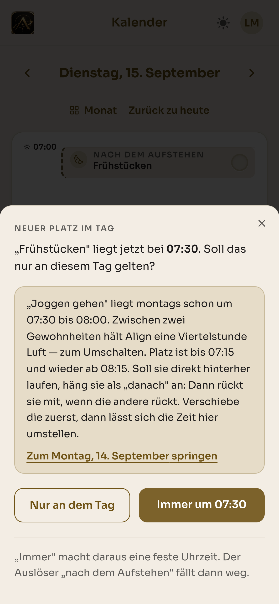

*Abb. 7.8: „Frühstücken" soll an einem Dienstag auf 07:30 rücken. An diesem Tag ist dort Platz,
für „Immer" aber nicht, weil montags um 07:30 schon „Joggen gehen" liegt.*

## 7.11 Der Stundenplan zieht in den Kalender

**Vorher.** Aus der Competitor-Analyse stammte der Befund, dass keine der untersuchten
Anwendungen in Semestern und Vorlesungsrhythmus denkt (Abschnitt 4.2). Dafür haben wir den
Semesterplan gebaut. Zunächst bekam er einen eigenen Bereich in der Navigation, in dem sich ein
Semester und seine Kurse als Karten je Wochentag eintragen ließen (Abb. 7.9).

**Was beim Benutzen auffiel.** Ein eigener Bereich trennt, was zusammengehört. Ein Stundenplan
ist keine eigene Aufgabe, sondern gibt vor, wo im Tag überhaupt Platz für Gewohnheiten ist. Wer
seinen Tag plant, will die Vorlesung dort sehen, wo auch die Gewohnheiten liegen.

**Nachher.** Der Semesterplan ist in den Kalender gewandert. Kurse liegen als Blöcke direkt im
Tag und blockieren ihn, damit weder man selbst noch die KI eine Gewohnheit in eine Vorlesung
legt (Abb. 8.15). Ein Kurs in einem kommenden Semester beansprucht seinen Platz erst ab
Semesterbeginn, und die Monatsansicht kündigt Konflikte an, bevor sie eintreten (Abb. 8.14).


*Abb. 7.9: Der Semesterplan im Code-Stand vom 3. September, noch als eigener Bereich mit einer
Liste von Kursen.*

**Vorlesungen haben Vorrang.** Eine Vorlesung gibt die Hochschule vor, sie lässt sich nicht
verschieben. Eine Gewohnheit dagegen schon. Treffen beide aufeinander, gibt deshalb immer die
Gewohnheit nach. Zieht man eine Gewohnheit in eine Vorlesung, lässt die Anwendung das nicht zu,
erklärt den Grund und nennt die freien Zeiten davor und danach (Abb. 7.10). Hängt eine
Gewohnheit an einer Situation, weicht sie innerhalb eines Zeitfensters von selbst auf die
nächste freie Stelle aus.

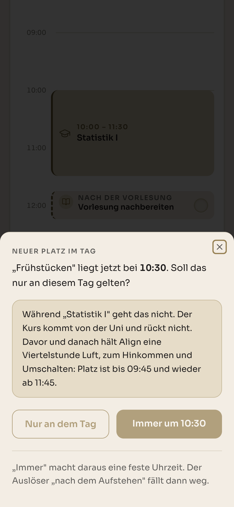

*Abb. 7.10: „Frühstücken" soll an einem Mittwoch im Semester auf 10:30 rücken, mitten in
„Statistik I". Die Anwendung lässt das nicht zu, weil der Kurs nicht rückt, und nennt die
freien Zeiten bis 09:45 und ab 11:45.*

**Eine Verfeinerung.** Zunächst wurde ein Kurs abgewiesen, wenn an seiner Stelle schon eine
Gewohnheit lag. Das war im Einzelfall korrekt, aber nicht hilfreich. Wer zu Beginn eines
Semesters seinen Stundenplan einträgt, hätte vorher jede Gewohnheit, die im Weg liegt, von Hand
wegräumen müssen, obwohl sich nur die Gewohnheit verschieben lässt und nicht die Vorlesung.
Jetzt wird der Kurs eingetragen, und die Gewohnheit an seiner Stelle wird geparkt. Sie wird
nicht gelöscht, verliert aber ab Semesterbeginn ihren Platz im Tag. Im Kalender steht sie dann
unter dem Tag im Bereich „Ohne festen Platz", zusammen mit der Uhrzeit, zu der sie bisher lief
(Abb. 7.11). Von dort lässt sie sich ins Raster ziehen. Tippt man sie an, kann man sich über
„Anderer Zeitpunkt?" von der KI einen neuen Platz vorschlagen lassen (Abb. 7.12).

 

*Abb. 7.11 und 7.12: Ab Semesterbeginn liegt montags „Analysis I" auf der Zeit von
„Joggen gehen". Die Gewohnheit steht deshalb unter dem Tag im Bereich „Ohne festen Platz".
Tippt man sie an, kann die KI einen anderen Zeitpunkt vorschlagen.*

## 7.12 Die Navigation wandert nach unten

**Vorher.** Auf dem Handy lag die Navigation in einer Seitenleiste mit sechs Einträgen, darunter
Semester und Schlaf als eigene Bereiche (Abb. 7.13). Um den Bereich zu wechseln, musste man die
Seitenleiste erst öffnen.

**Nachher.** Die Navigation steht als Leiste mit fünf Tabs am unteren Bildschirmrand, in
Reichweite des Daumens und auf jeder Seite sichtbar: Übersicht, Gewohnheiten, Kalender,
Schlafplan und Community. Der Semesterplan braucht keinen eigenen Tab mehr, weil er im Kalender
liegt, und die Mobilansicht bekam eine eigene Kopfzeile. Für eine Anwendung, die mehrmals am Tag
kurz geöffnet wird, ist das der direkteste Weg zu jedem Bereich.

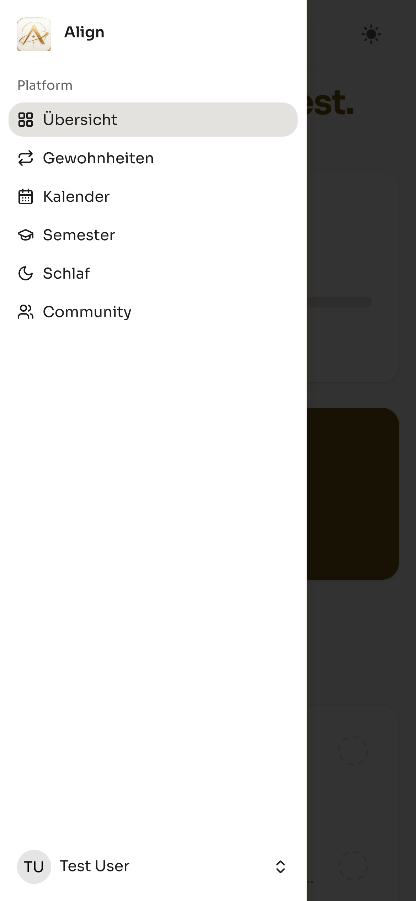

*Abb. 7.13: Die Navigation im Code-Stand vom 3. September als Seitenleiste mit sechs Einträgen.
In der fertigen Anwendung steht sie als Tab-Leiste am unteren Rand, zu sehen etwa in Abb. 8.2.*

## 7.13 Gewohnheiten im Wochenblick: Tage statt Prozent

**Vorher.** Die Gewohnheiten-Seite hat drei Stufen durchlaufen. Zuerst bestand sie aus Karten
mit einem Schalter je Gewohnheit, und auf dem Handy wurden Titel und Auslöser abgeschnitten
(Abb. 7.14). Danach haben wir die Karten nach dem nächsten Termin sortiert und in
„Steht heute an" und „Steht später an" geteilt (Abb. 7.15). Der Fortschritt stand als
Prozentwert auf der Übersicht, daneben eine große Karte mit der längsten Serie (Abb. 7.1).

**Was beim Benutzen auffiel.** Die Seite zeigte, welche Gewohnheiten es gibt, aber nicht, wie
es mit ihnen läuft. Und ein Prozentwert sagt nicht, worauf er sich bezieht. Zählen alle Tage
mit, erscheint eine Gewohnheit, die nur montags, mittwochs und freitags läuft, schwächer, als
sie ist.

**Nachher.** Die Seite legt alle Gewohnheiten auf ein Blatt und zeigt für jede die letzten
sieben Tage als Haken, gefüllt, wenn erledigt, hohl, wenn offen, und gestrichelt, wenn nicht
vorgesehen. Ein Tag lässt sich antippen und nachtragen. Der Fortschritt zählt **Tage statt
Prozente** und nur die Tage, an denen die Gewohnheit tatsächlich anstand, etwa „8 von 13 Tagen"
(Abb. 8.16). Damit ist auch der Streak-Befund aus der Umfrage umgesetzt (Abschnitt 5.10). Die
Konsistenz steht als ruhige Kennzahl im Vordergrund, Serien haben einen eigenen, kleineren
Platz, und ein verpasster Tag ist kein rotes Kreuz.

 

*Abb. 7.14 und 7.15: Die Gewohnheiten-Seite im Code-Stand vom 10. August mit Schaltern und
abgeschnittenen Titeln und im Code-Stand vom 3. September mit der Einteilung nach heute und
später. Den heutigen Stand zeigt Abb. 8.16.*

## 7.14 Verabredungen zu Ende gedacht

Parallel dazu haben wir die Verabredungen vervollständigt. Eine abgesagte Verabredung endete
anfangs im Nichts, nach der Absage blieb nur ein Satz stehen. Jetzt bietet sie einen Weg an.
Wer die Gewohnheit führt, macht allein weiter, und wer eingeladen war, kann sie als eigene
übernehmen. Fremde Gewohnheiten lassen sich außerdem direkt übernehmen. Dabei entsteht eine
eigene Gewohnheit, die gegen die eigenen fünf Plätze zählt und bei Tag eins beginnt. Den
Warum-Satz und den ersten Schritt übernimmt man nicht mit, weil sie zu einer Person gehören und
nicht zu einer Gewohnheit.

## 7.15 Wie sich das Datenmodell entwickelte

Die Reihenfolge unserer Datenbank-Migrationen zeichnet den Weg der Anwendung genau nach. Sie
zeigt, dass wir nicht nach einem fertigen Modell gebaut, sondern schrittweise erweitert
haben. Jede Tabelle entstand, als die zugehörige Frage auftrat.

| Schritt | Was hinzukam | Wofür |
|---|---|---|
| 1 | `habits`, `habit_completions`, Onboarding-Marker, Motivation | Grundgerüst für Gewohnheiten und ihr Abhaken |
| 2 | feste Zeitpläne, Erinnerungen, kleinster Schritt | Time Blocking und KI-Assistenz |
| 3 | `friendships`, `appointments`, `appointment_notices` | Community und Verabredungen |
| 4 | `ai_suggestions`, Zielgröße, Ketten | KI-Gedächtnis und Habit Chains |
| 5 | `template_key`, Entfernung punktueller Gewohnheiten, `sleep_schedules` | Katalog und Tagesrahmen |
| 6 | `semesters`, `courses`, `course_exceptions` | Semesterplan |
| 7 | `sleep_day_overrides`, Zeitpläne je Wochentag | tageweise Anpassung des Rahmens |

Auffällig sind die Migrationen, die etwas **entfernen**: punktuelle Gewohnheiten, geratene
Situationen, eine Kursart, die sich als überflüssig erwies. Sie belegen, dass wir Konzepte
auch wieder zurückgenommen haben, wenn der tatsächliche Gebrauch dagegen sprach.

## 7.16 Das Abschlussgespräch

Im Abschlussgespräch haben wir Anne die fertige Anwendung vorgeführt. Dabei sind wir beim
Verschieben von Gewohnheiten noch auf kleinere Fehler gestoßen, die wir anschließend behoben
haben.

---

# 8. Die fertige App

Dieses Kapitel führt durch die lauffähige Anwendung, in der Reihenfolge, in der man sie beim
ersten Benutzen kennenlernt. Die Bildschirmaufnahmen zeigen den Stand vom 12. und 13. September
2026 in einer Mobilansicht mit 390 Pixeln Breite, also in der Ansicht, für die wir Align
gestaltet haben. Als Beispiel dient ein Demokonto, das nach unserer ersten Persona Lena heißt.

Die Anwendung gliedert sich über eine Navigationsleiste am unteren Rand in fünf Bereiche,
**Übersicht**, **Gewohnheiten**, **Kalender**, **Schlafplan** und **Community**. Für jeden
Bildschirm galt derselbe Maßstab wie für die Konzeption (Abschnitt 1.6). Er sollte sich ohne
Erklärung bedienen lassen und so wenige Schritte wie möglich verlangen.

---

## 8.1 Der Auftakt


*Abb. 8.1: Der Auftakt erklärt die Anwendung, bevor die erste Frage gestellt wird.*

Vor dem Onboarding steht ein kurzer Auftakt über sechs Bildschirme. Er benennt eine typische
Situation aus dem Studienalltag, statt Funktionen aufzuzählen, und stellt erst danach die
erste Frage.

## 8.2 Die Übersicht

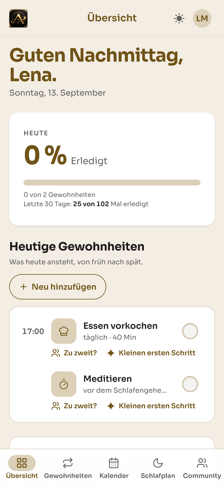

*Abb. 8.2: Die Übersicht zeigt nur, was heute ansteht.*

Die Startseite beantwortet eine einzige Frage, nämlich was heute ansteht. Sie zeigt oben den
Tagesfortschritt, darunter die heutigen Gewohnheiten von früh nach spät und unten den
Tagesrahmen.

Drei Entscheidungen aus der Nutzerforschung sind hier unmittelbar sichtbar.

**Die Fortschrittskarte nennt zwei Zahlen.** „0 von 2 Gewohnheiten" für heute und „25 von 102
Mal erledigt" für die letzten 30 Tage. Die zweite Zahl ordnet einen Tag, an dem noch nichts
erledigt ist, in einen Verlauf ein, statt ihn für sich zu bewerten (Abschnitt 5.10).

**Offene und erledigte Gewohnheiten unterscheiden sich nur durch den Haken.** Offene tragen einen
hohlen Kreis, erledigte einen gefüllten Haken. Ein rotes Kreuz oder eine Mahnung gibt es nicht,
das ist der bewusste Verzicht auf Bestrafung (Schuldwert ø 3,92 in der Umfrage).

**Zwei Angebote unter jeder offenen Gewohnheit.** „Zu zweit?" führt in den
Verabredungsmechanismus, „Kleinen ersten Schritt" ruft die KI-Assistenz auf. Beide stehen
nebeneinander direkt unter der Gewohnheit, also dort, wo man sie braucht, und nicht in einem
eigenen Menü.

## 8.3 Eine Gewohnheit anlegen

Am Anlegen einer Gewohnheit zeigt sich unser Anspruch an eine einfache Bedienung am
deutlichsten. Der Assistent stellt fünf Fragen, jede auf einem eigenen Bildschirm, und bietet
bei jeder eine Auswahl an, statt ein leeres Feld zu zeigen. Im Beispiel legt Lena „Aufräumen"
an, direkt im Anschluss an „Essen vorkochen".

 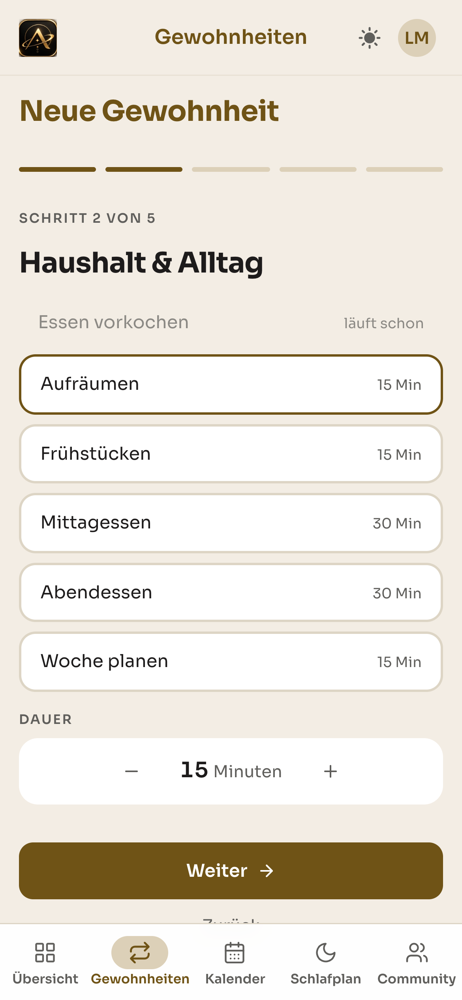

*Abb. 8.3 und 8.4: Schritt 1 fragt nach dem Bereich, Schritt 2 zeigt die Einträge des Katalogs
mit ihrer Dauer.*

**Schritt 1 und 2 fragen, was man sich vornimmt.** Zuerst wählt man einen der vier Bereiche des
Studienalltags, danach einen Eintrag aus dem Katalog. Jeder Eintrag trägt eine Dauer, die sich
darunter anpassen lässt. „Essen vorkochen" ist ausgegraut und als „läuft schon" markiert, damit
dieselbe Gewohnheit nicht zweimal entsteht. Warum es kein freies Eingabefeld gibt, erklärt
Abschnitt 7.8.

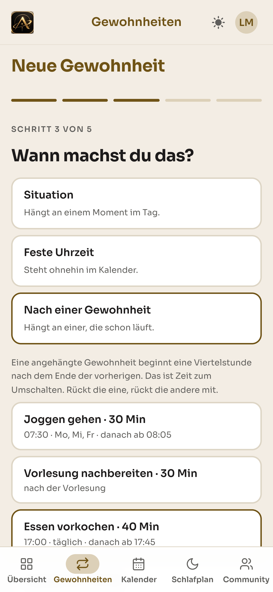 

*Abb. 8.5 und 8.6: Schritt 3 verankert die Gewohnheit im Tag, Schritt 4 schlägt einen ersten
Handgriff vor.*

**Schritt 3 fragt, wann.** Hier liegt der Kern des Time-Blocking-Konzepts. Der Assistent bietet
drei Wege an, eine Gewohnheit im Tag zu verankern:

| Anker | Beschreibung in der App |
|---|---|
| **Situation** | „Hängt an einem Moment im Tag." |
| **Feste Uhrzeit** | „Steht ohnehin im Kalender." |
| **Nach einer Gewohnheit** | „Hängt an einer, die schon läuft." |

Die Situation steht oben, weil situative Anker laut Lally et al. (2010) zuverlässiger auslösen
als Uhrzeiten. Der dritte Weg bildet das Domino-Prinzip ab. Für jede Gewohnheit, an die sich die
neue hängen lässt, steht gleich dabei, ab wann sie liefe, bei „Essen vorkochen" etwa „danach ab
17:45". Rückt die eine, rückt die andere mit.

**Schritt 4 fragt, womit es anfängt.** Beim Betreten dieses Schritts fragt die KI im Hintergrund
nach und schlägt drei Handgriffe vor, die in einer Minute getan sind und zur gewählten
Gewohnheit passen. Für „Aufräumen" war einer davon „Falte eine Decke oder ein Kissen, das gerade
nicht da liegt, wo es hingehört, und leg es an seinen Platz". Man übernimmt einen Vorschlag,
formuliert einen eigenen oder geht ohne weiter. Diese Starthilfe erhielt in der Umfrage mit
ø 4,16 die höchste Nützlichkeitsbewertung aller abgefragten Funktionen.

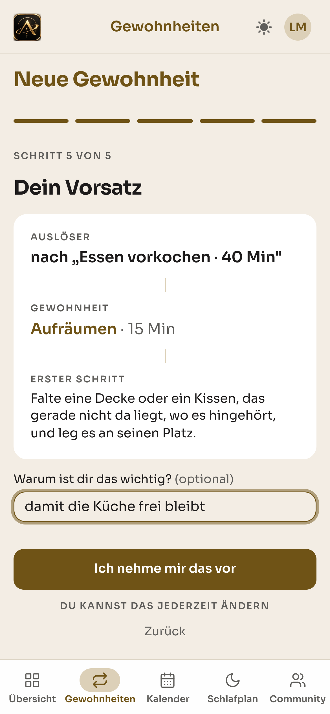 

*Abb. 8.7 und 8.8: Schritt 5 fasst den Vorsatz zusammen, danach bietet die Anwendung an, die
Gewohnheit zu zweit anzugehen.*

**Schritt 5 fasst den Vorsatz zusammen.** Auslöser, Gewohnheit und erster Schritt stehen
untereinander. Darunter folgt die einzige offene Frage des ganzen Ablaufs, „Warum ist dir das
wichtig?", und sie ist ausdrücklich optional. Der Knopf heißt nicht „Speichern", sondern „Ich
nehme mir das vor". Er ist die bewusste Zusage, die Faude-Koivisto und Gollwitzer (2009) als
Voraussetzung wirksamer Wenn-Dann-Pläne beschreiben.

**Danach ist die Gewohnheit angelegt**, und die Anwendung fragt einmal, ob man sie mit jemandem
aus dem eigenen Kreis angehen möchte, für einen einzelnen Tag. „Später" steht gleichwertig
daneben, niemand wird zu einer Verabredung gedrängt.

## 8.4 Verschieben, und die Kette rückt mit

Im Kalender ist ein Tag ein Zeitraster, und jede Gewohnheit ist ein Block darin. Blöcke lassen
sich verschieben. Man hält einen Block kurz gedrückt, bis er sich löst, und zieht ihn an eine
andere Stelle. Was dabei passiert, zeigt sich am besten an zwei Gewohnheiten, die aneinander
hängen.

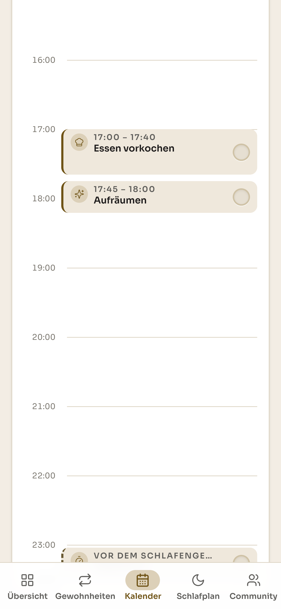  

*Abb. 8.9 bis 8.11: Vor dem Ziehen, beim Ziehen und nach dem Loslassen.*

Vorher liegt „Essen vorkochen" von 17:00 bis 17:40 und „Aufräumen" direkt dahinter von 17:45 bis
18:00 (Abb. 8.9). Beim Ziehen zeigt eine Marke die Uhrzeit, an der der Block landen würde, hier
18:30, und „Aufräumen" wandert schon während der Bewegung mit (Abb. 8.10). Nach dem Loslassen
fragt die Anwendung nach und nennt dabei, was sich außerdem ändert, nämlich dass „Aufräumen" mit
auf 19:15 rutscht (Abb. 8.11). Erst dann entscheidet man, ob die Änderung **nur heute** oder
**immer** gelten soll.

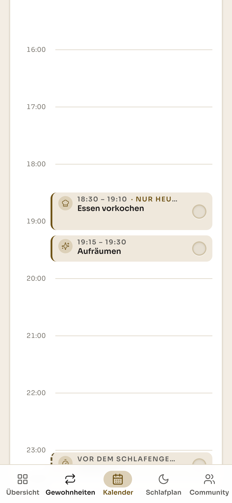 

*Abb. 8.12 und 8.13: Nach der Entscheidung „Nur heute", im Kalender und auf der Übersicht.*

Nach „Nur heute" liegen beide Blöcke an ihrer neuen Stelle, und „Essen vorkochen" trägt den
Hinweis „nur heute" (Abb. 8.12). Auch die Übersicht ordnet sich neu. „Essen vorkochen" steht dort
um 18:30 mit dem Vermerk „nur an diesem Tag", und „Aufräumen" folgt mit dem vorbereiteten ersten
Schritt (Abb. 8.13). Morgen gilt wieder der gewohnte Plan.

In diesem kleinen Ablauf steckt, was Align von einem Gewohnheitstracker unterscheidet. Eine
Gewohnheit ist kein Eintrag in einer Liste, sondern ein Platz in einem echten Tag. Ändert sich
der Tag, ändert sich der Plan mit, und die Anwendung sagt vorher, was dabei passiert.

## 8.5 Der Stundenplan im Kalender

 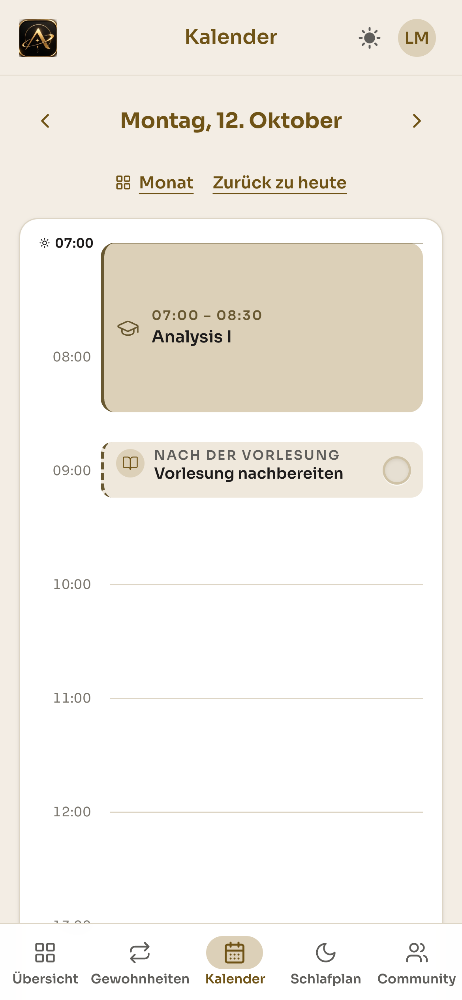

*Abb. 8.14 und 8.15: Die Monatsansicht kündigt einen Konflikt mit dem Stundenplan an, die
Tagesansicht zeigt den ersten Vorlesungstag.*

Der Kalender hat zwei Ebenen. Die **Monatsansicht** zeigt für jeden Tag Punkte, einen je
vorgesehener Gewohnheit, und markiert die laufende Woche. Oben steht ein Hinweis, der die
Semesterlogik sichtbar macht:

> „Eine Gewohnheit verliert ab dem 12. Oktober durch deinen Stundenplan ihren Platz. Bis
> dahin läuft alles wie bisher. Ein neuer Platz lässt sich schon jetzt finden."

Die Anwendung weiß, dass zum Semesterbeginn eine Vorlesung in einen bereits belegten Platz
fällt, und sagt es, bevor der Konflikt eintritt. Der Weg aus dem Konflikt wird direkt
angeboten. Man springt zum betroffenen Tag oder lässt sich neue Zeiten von der KI vorschlagen.

Die **Tagesansicht** zeigt Montag, den 12. Oktober, den ersten Tag des Wintersemesters, und
darin das Zusammenspiel von Stundenplan und Gewohnheiten:

- **„Analysis I", 07:00 bis 08:30,** ist ein Block aus dem Stundenplan. Er ist gefüllt
  dargestellt, weil er sich nicht verschieben lässt.
- **„Nach der Vorlesung · Vorlesung nachbereiten"** hängt unmittelbar daran. Der gestrichelte
  Rand kennzeichnet einen situativen Anker, die Gewohnheit hat also keine feste Uhrzeit, sondern
  folgt einem Ereignis.
- Die Gewohnheit, die zuvor um 07:30 lag, erscheint an diesem Tag nicht mehr im Raster, weil die
  Vorlesung sie verdrängt hat. Sie steht unter dem Tag im Bereich „Ohne festen Platz"
  (Abb. 7.11). Genau darauf hatte die Monatsansicht hingewiesen.

## 8.6 Gewohnheiten im Wochenblick

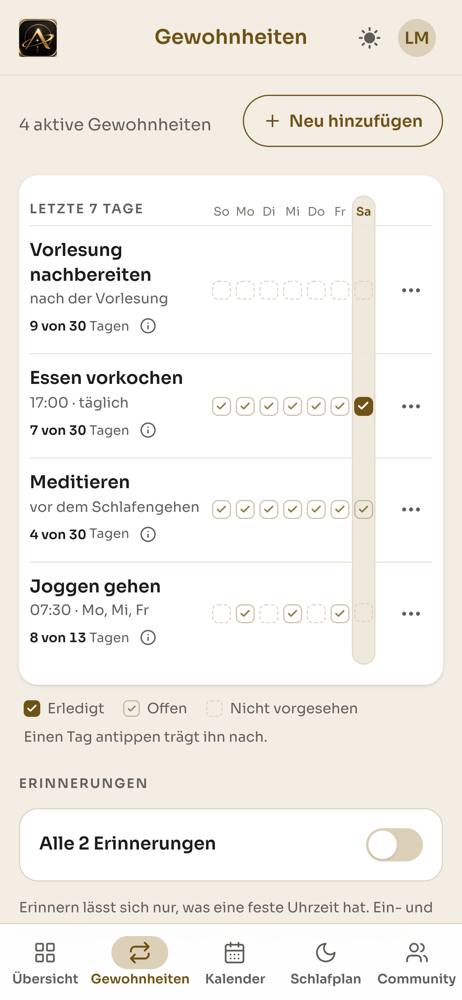

*Abb. 8.16: Alle Gewohnheiten mit den letzten sieben Tagen.*

Die Gewohnheiten-Seite legt alle aktiven Gewohnheiten auf ein Blatt und zeigt für jede die
letzten sieben Tage. Das Raster kennt drei Zustände, die unten erklärt werden: **erledigt**
(gefüllt), **offen** (hohl) und **nicht vorgesehen** (gestrichelt). Ein Tag lässt sich antippen
und damit nachtragen.

Die Zahl unter jedem Titel ist die entscheidende Gestaltungsentscheidung. „8 von 13 Tagen" steht
bei einer Gewohnheit, die nur montags, mittwochs und freitags läuft, denn gezählt werden
ausschließlich Tage, an denen die Gewohnheit tatsächlich anstand. Eine Gewohnheit wird nicht
dafür abgewertet, dass sie dienstags nicht vorgesehen war.

## 8.7 Schlafplan


*Abb. 8.17: Der Tagesrahmen, für jeden Wochentag einzeln einstellbar.*

Der Schlafplan spannt den Rahmen auf, in dem geplant werden kann. Er ist bewusst **keine
Gewohnheit**, er wird nicht abgehakt und hat weder Serie noch Quote.

Die Wochenansicht zeigt für jeden Tag einen Balken. Werktags liegen acht Stunden Schlaf von
23:00 bis 07:00, am Wochenende verschiebt sich das Fenster nach hinten, in der App steht dazu
„8 Stunden bis 9,5 Stunden Schlaf, je nach Tag". Darunter lässt sich jeder Tag einzeln anpassen.
Der Wecker ist werktags aktiv, am Wochenende nicht. Auf Wunsch erinnert die Anwendung außerdem
20 Minuten vor der Schlafenszeit daran, schlafen zu gehen (Abschnitt 7.9).

Bewegt sich dieser Rahmen, bewegen sich die Gewohnheiten an seinen Rändern mit.

## 8.8 Community

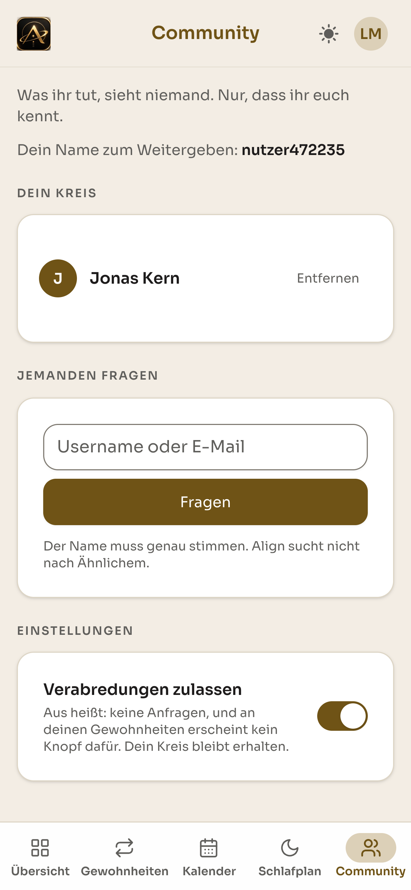

*Abb. 8.18: Der Community-Bereich beginnt mit der Zusage, was nicht geteilt wird.*

Der Community-Bereich setzt die Entscheidung aus Abschnitt 6.4 um, also Verabredung statt
Rangliste. Wichtig ist der erste Satz der Seite:

> „Was ihr tut, sieht niemand. Nur, dass ihr euch kennt."

Die Seite beginnt mit dem, was **nicht** geteilt wird. Das ist die direkte Antwort auf den
Interviewbefund, dass Vergleich als Kontrolle empfunden wird, und auf die Umfrage, in der eine
Rangliste explizit nicht gewünscht war.

Verbindungen entstehen nur über einen exakt eingegebenen Namen, die Anwendung schlägt keine
Personen vor und sucht nicht nach Ähnlichem. Verabredungen lassen sich vollständig abschalten,
ohne den bestehenden Kreis zu verlieren.

## 8.9 Dark Mode

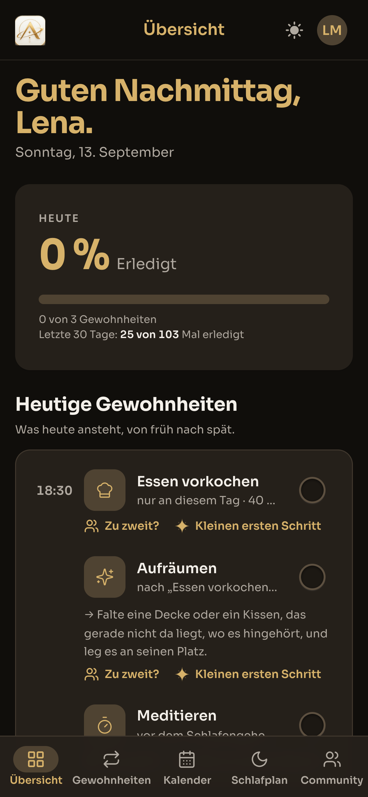

*Abb. 8.19: Die Übersicht im Dark Mode.*

Alle Bereiche liegen in einem hellen und einem dunklen Modus vor, die derselben Designsprache
folgen. Gold bleibt in beiden Modi die Akzentfarbe, im Dark Mode trägt es zusätzlich die
Überschriften, weil ein reines Weiß auf dunklem Grund zu hart wirkt.

 

*Abb. 8.20 und 8.21: Gewohnheiten und Kalender im Dark Mode. Das Sieben-Tage-Raster und die
Monatsansicht behalten ihre Struktur, nur die Flächen kehren sich um.*

## 8.10 Funktionsumfang im Überblick

| Bereich | Umgesetzt |
|---|---|
| **Gewohnheiten** | Anlegen in fünf Schritten aus dem Katalog (vier Bereiche) · Anker über Situation, feste Uhrzeit oder Kette · Wochentage und Uhrzeiten je Tag · Bearbeiten und Beenden · Grenze von fünf aktiven Gewohnheiten |
| **Tracking** | Abhaken per Tippen oder Wischen · Sieben-Tage-Raster mit Nachtragen · Konsistenz über 30 Tage, die nur vorgesehene Tage zählt · Serien ohne Bestrafung bei Unterbrechung |
| **Kalender** | Monatsansicht mit Tagespunkten · Tagesansicht als Zeitraster · Verschieben per Ziehen, nur heute oder immer · verkettete Gewohnheiten rücken mit · Semesterplan mit Kursen, Kollisionsprüfung und Parken verdrängter Gewohnheiten |
| **Tagesrahmen** | Schlaf- und Aufstehzeit je Wochentag · tageweise Ausnahmen · Wecker und Erinnerung vor der Schlafenszeit innerhalb der Anwendung |
| **KI-Assistenz** | kleinster erster Schritt · neue Zeiten vorschlagen · Tag neu ordnen · Kontextwissen über Gewohnheiten, Rahmen und Stundenplan |
| **Community** | Kontakte über exakten Namen · Verabredungen zu zweit für einen einzelnen Tag · Absagen mit Weiterführung · Übernehmen fremder Gewohnheiten |
| **Sonstiges** | Auftakt vor dem Onboarding · Light und Dark Mode · Registrierung mit Passkeys und Zwei-Faktor-Authentifizierung |

Was wir bewusst nicht umgesetzt haben und wie sich Align weiterentwickeln ließe, beschreiben die
Abschnitte 9.7 bis 9.10.

---

# 9. Reflexion und Ausblick

Dieses Kapitel blickt auf vier Monate Projektarbeit zurück. Es beschreibt, welche
Entscheidungen getragen haben, an welchen Stellen wir umgekehrt sind, welche Rolle
KI-Werkzeuge dabei gespielt haben und wo die Grenzen unseres Vorgehens liegen. Wir halten
uns dabei an dieselbe Regel wie im übrigen Bericht. Wir berichten, was entschieden wurde und
warum, nicht, was wir uns im Nachhinein gewünscht hätten. Der zweite Teil des
Kapitels blickt nach vorn, auf das, was wir bewusst weggelassen haben, und darauf, wie sich
Align weiterentwickeln ließe.

---

## 9.1 Was getragen hat

**Die Reihenfolge der Nutzerforschung war die wichtigste Weichenstellung.** Im ersten
Betreuungsgespräch riet uns Anne, zuerst qualitative Interviews zu führen und erst daraus
den Fragebogen zu entwickeln. Wir haben diesen Hinweis in Abschnitt 4.5 als „die
folgenreichste Rückmeldung unseres gesamten Projekts" bezeichnet, und die Rückschau
bestätigt das. Hätten wir die Umfrage zuerst entworfen, wären ihre Fragen aus unseren
eigenen Annahmen entstanden. So testete jede Frage etwas, das vorher jemand tatsächlich
gesagt hatte. Jede spätere Feature-Entscheidung ruht auf dieser Grundlage.

**Das Iterationsformat hat abstrakte Diskussionen verhindert.** Alle drei Wochen brauchten
wir ein vorzeigbares Ergebnis. Diese Terminstruktur hat mehr bewirkt als Planbarkeit. Weil
jede Iteration etwas Sichtbares abliefern musste, blieben Konzeptfragen nie lange
theoretisch. Die Ausgestaltung der Fortschrittsanzeige und der Wechsel der Farbwelt sind
beides Korrekturen, die früh kamen und deshalb wenig gekostet haben.

**Die Dokumentation lief mit, statt am Ende rekonstruiert zu werden.** Von Anfang an haben
wir Iterationsnotizen, Feedback und Entscheidungen festgehalten, zunächst in Notion, ab
Phase 4 als Markdown im Projektverzeichnis. Ohne diese Gewohnheit wäre dieser Bericht
deutlich lückenhafter ausgefallen, besonders bei der Nachzeichnung, warum eine Entscheidung
zu einem bestimmten Zeitpunkt fiel.

**Zwischen Konzeption und Umsetzung gab es keinen Bruch.** Am Ende von Phase 3 hatten wir
eine empirisch abgesicherte Feature-Auswahl, zwei Personas, eine Designsprache und gestaltete
Screens für drei Kernfeatures. Nichts davon haben wir verworfen. Die Designsprache ist in der
Implementierung nicht nachgebaut, sondern als Quelle im Code verankert. Farben, Abstände und
Bewegungsregeln stehen an einer Stelle und gelten für die gesamte Anwendung. Dass ein
Studienprojekt die Lücke zwischen Prototyp und lauffähigem Produkt ohne Konzeptverlust
überbrückt, hat uns in der letzten Phase selbst überrascht.

## 9.2 Wo wir umgekehrt sind

Drei Stellen im Projekt haben wir revidiert, nachdem wir sie bereits entschieden hatten.

**Die Umfrage hat eine unserer Interviewhypothesen widerlegt.** Aus den Interviews stammte
die Annahme, Streaks seien schädlich und demotivierend. In der Breite hielt das nicht. Nur 5
von 25 Befragten bevorzugten klar die Konsistenzrate, 9 tendierten zum Streak, 11 waren für
beides offen. Das ist der einzige Punkt, an dem die quantitative Erhebung einer qualitativen
Hypothese widersprochen hat, und genau dafür war sie da. Statt uns für eine Seite zu
entscheiden, haben wir die Spannung auseinandergenommen. Der Streak motiviert, aber sein
Bruch darf nicht bestrafen (Abschnitt 5.10). Beide Ansichten sind in der fertigen Anwendung
vorhanden.

**Die freie Eingabe von Gewohnheiten mussten wir zurücknehmen.** Anfangs konnte jede
Gewohnheit frei formuliert werden. Beim wirklichen Benutzen zeigte sich, dass das nicht
trägt. Einer frei formulierten Gewohnheit fehlt die Dauer, und ohne Dauer lässt sich nichts
zuverlässig in einen Tag einplanen. Wir haben daraufhin auf einen Katalog mit festen
Dauerangaben umgestellt. Diese Änderung ist der Wendepunkt unserer Umsetzung, weil aus einem
Tracker ein Planungswerkzeug wurde, und zugleich unsere größte bewusste Einschränkung des
Funktionsumfangs (Abschnitt 7.8).

**Auch das Datenmodell ist gewachsen, nicht entworfen worden.** Die Reihenfolge unserer
Migrationen zeichnet den Weg der Anwendung nach; bemerkenswert sind dabei jene, die etwas
entfernen. Punktuelle Gewohnheiten, geratene Situationen und eine überflüssige Kursart sind
nach dem tatsächlichen Gebrauch wieder verschwunden (Abschnitt 7.15).

Die letzte Iteration hat uns die Grenzen dieses Vorgehens gezeigt. Wir wollten die Anwendung
intuitiver machen und gleichzeitig das Bestehende härten. Beides zu vereinbaren war schwierig,
weil jede Gewohnheit anders behandelt werden muss und der Kontext oft ein anderer ist. Nach
Iteration 5 hatten wir viele Funktionen, aber sie griffen noch nicht ineinander. Wer in kurzen Zyklen
Funktionen ergänzt, erzeugt Verbindungsarbeit, die selbst Zeit kostet.

## 9.3 Der Wechsel der Plattform

Geplant hatten wir eine native App, gebaut haben wir eine Mobile-First-Web-App mit Laravel. Die
Gründe stehen in Abschnitt 7.1. Eine Web-App muss nicht getrennt für iOS und Android gebaut und
über einen App-Store veröffentlicht werden, und in Laravel sind viele Grundfunktionen einer
Webanwendung bereits enthalten.

Rückblickend war das für ein Projekt mit sechs dreiwöchigen Iterationen die richtige
Entscheidung. Sie passt auch zu unserer eigenen Marktanalyse, die als zweite Lücke notiert
hatte, dass Planen am Laptop stattfindet und fast alle spezialisierten Anwendungen das
ignorieren (Abschnitt 2.3). In der Vergleichsmatrix stand Align von Anfang an
mit voller Bewertung in der Spalte Web.

Offen bleiben muss allerdings, dass unsere Leitfrage weiterhin von „einer mobilen
Applikation" spricht. Der Wechsel ist eine Entwicklungsentscheidung, keine
Produktentscheidung; die langfristige Produktidee bleibt die mobile Anwendung, und Abschnitt 9.10
kommt darauf zurück. Die Folgen zeigen sich vor allem an einer Stelle. Erinnerungen erscheinen
nur, solange die Anwendung geöffnet ist, während das Konzept eine Benachrichtigung vor dem
Auslöser vorsah.

## 9.4 KI als Werkzeug, und wo sie aufhört

KI kommt in diesem Projekt zweimal vor, und die beiden Fälle sind auseinanderzuhalten.

**In der Anwendung** ist sie eine eigene Ebene über den drei Kernfeatures. Sie formuliert den
kleinsten nächsten Schritt, schlägt neue Zeiten vor und ordnet den Tag neu. Diese Rolle ist
empirisch am besten abgesichert: „Starthilfe bei Überforderung" erzielte mit ø 4,16 die
höchste Nützlichkeitsbewertung aller abgefragten Funktionen. Technisch ist jede Funktion eine
eigene Agent-Klasse mit festem Prompt, Zeitlimit und einem Schema für die Antwort. Die
wichtigste Entscheidung dabei war eine Verzichtsentscheidung. Fällt ein Aufruf aus, antwortet
Align mit einer ehrlichen Absage statt mit einem regelbasierten Ersatzvorschlag. Was wie ein
KI-Vorschlag aussieht, muss auch einer sein (Abschnitt 7.4). Anzumerken ist, dass unser
Konzept in Phase 3 von der Claude API ausging, während die Umsetzung über `laravel/ai` an die
OpenRouter-API spricht; Anbieter und Modell stehen in der Umgebungskonfiguration und lassen
sich ohne Codeänderung austauschen.

**Bei der Entwicklung** haben wir KI-gestützte Entwicklungswerkzeuge eingesetzt. Sie haben uns
geholfen, den Funktionsumfang in der verfügbaren Zeit umzusetzen. Die Konfiguration dieser
Werkzeuge liegt offen im Repository und ist als Teil des Arbeitsprozesses gekennzeichnet.

Die Grenze verlief bei den Entscheidungen darüber, was die Anwendung tun soll und wie, und das
lässt sich im Projektverlauf belegen. Die Umstellung auf den Katalog kam daher, dass wir die Anwendung
selbst benutzt und dabei gemerkt haben, dass eine Gewohnheit ohne Dauer nicht planbar ist.
Die Grenze von fünf aktiven Gewohnheiten geht auf Annes Frage nach einer Höchstzahl zurück
und wurde mit Umfragedaten begründet. Der Verzicht auf einen simulierten KI-Fallback ist eine
Haltungsentscheidung gegenüber dem Nutzer. Keine dieser drei Entscheidungen stammt aus einem
Werkzeug. Ein Werkzeug kann eine Regel umsetzen, aber nicht bestimmen, welche Regel richtig
ist; diese Arbeit bleibt vollständig bei uns, und sie ist der eigentliche Inhalt der Kapitel
5 bis 7.

## 9.5 Grenzen unseres Vorgehens

Unsere empirische Grundlage ist richtungsweisend, nicht repräsentativ. Drei Einschränkungen
haben wir bereits in Abschnitt 5.11 benannt und wiederholen sie hier, weil sie die Reichweite
aller Aussagen dieses Berichts begrenzen.

**Die Stichprobe ist klein und schief.** Angestrebt waren über 50 Antworten, erreicht wurden
25. Sie ist stark E-Commerce- und 5.-bis-6.-Semester-lastig, das Geschlechterverhältnis mit
16 zu 9 unausgewogen. Als Priorisierungshilfe ist sie belastbar, als Beweis nicht. Dass die
25 Antworten in rund zwei Stunden eingingen, zeigt zugleich, dass die Begrenzung an der
Kapazität des Umfragewerkzeugs lag und nicht an der Bereitschaft der Zielgruppe.

**Der ausgelieferte Fragebogen wich vom Leitfaden ab.** Die ursprünglich geplanten Skalen zur
Habit Journey und zum Konsistenzrate-Tracking fehlen als eigene Bewertung. Über zwei
Konzepte, die wir anschließend verworfen beziehungsweise umgebaut haben, liegen damit keine
direkten Daten vor.

**Eine Auswertung nach Personas ist nicht belastbar.** Eine Trennung nach Einsteigern und
Selbstregulierten, die unseren beiden Personas entsprochen hätte, ist bei dieser
Stichprobengröße nicht aussagekräftig.

Dazu kommt eine Grenze, die im Bericht bisher nur durch ihre Abwesenheit sichtbar wird.
**Die fertige Anwendung ist nie mit Nutzern getestet worden.** Nach Abschluss der Nutzerforschung
im Juni war die einzige Rückkopplung von außen das Betreuungsgespräch. Geprüft haben wir
technisch, mit Tests, statischer Analyse und einer Pipeline, die bei jedem Push läuft. Ob die
Anwendung ihren eigenen Anspruch erfüllt, nämlich nicht selbst zum Hindernis zu werden, ist
damit begründet, aber nicht gemessen. Das ist die deutlichste Lücke unseres Vorgehens und der
erste Punkt, den Abschnitt 9.9 aufgreift.

## 9.6 Was wir mitnehmen

**Eine begründete Entscheidung ist mehr wert als eine gute Idee.** Der Hinweis, dem roten
Faden zu folgen, kam im dritten Betreuungsgespräch und hat unsere gesamte Konzeptionsphase
bestimmt. Jeden Screen, der ab Juli entstand, haben wir mit einem Bezug zu einem Interview-,
Umfrage- oder Literaturbefund versehen. Der Nutzen zeigte sich nicht beim Gestalten, sondern
beim Streichen. Die Habit Journey ließ sich mit Daten aus der Diskussion nehmen, statt
stillschweigend zu verschwinden.

**Feedback wirkt nur, wenn es eine Adresse bekommt.** Alle sechs Betreuungsgespräche lassen
sich im Bericht bis zu einer konkreten Umsetzung verfolgen. Aus der Anregung zum sozialen
Aspekt wurde das Community-Feature, aus der Frage nach einer Höchstzahl die Grenze von fünf
aktiven Gewohnheiten, aus dem Hinweis auf Datenschutz die Entscheidung für LimeSurvey. Dass
das durchgängig gelang, liegt an einer kleinen Gewohnheit. Wir haben die Folgerungen aus
einem Gespräch festgehalten, solange es noch frisch war. Die erste Notion-Seite mit Feedback
und weiterem Vorgehen entstand direkt im Anschluss an das erste Gespräch, und die
Entscheidung, mit der technischen Umsetzung zu beginnen, fiel wenige Stunden nach dem
vierten.

**Für eine Dreiergruppe genügt wenig Organisation, solange die Termine stehen.** Wir haben
mit einem Gruppenchat für den Alltag und festen Terminen für inhaltliche Abstimmungen
gearbeitet. Ein eigenes Projektmanagement-Werkzeug haben wir nie gebraucht. Getragen hat
stattdessen die Regel, Aufgaben vor jeder Iteration ausdrücklich zu verteilen und zu jedem
Gespräch eine kurze Präsentation zu erstellen. Beides zusammen hat dem Projekt eine Form
gegeben, die im Nachhinein nachvollziehbar ist.

**Umsetzbarkeit darf nicht am Anfang stehen.** Anne hat uns zweimal geraten, gute Konzepte
nicht aufzugeben, nur weil ihre technische Umsetzung aufwendig erscheint. Genau das ist
eingetreten. Die Stundenplan-Integration war im Mai eine unbelegte Annahme aus der
Marktanalyse und wirkte technisch am teuersten. Sie ist als Semesterplan der Gedanke, der
unseren gesamten Projektverlauf überdauert hat, und zugleich das Merkmal, das Align von einem
Gewohnheitstracker unterscheidet.

---

# Ausblick

Ein Ausblick lässt sich als Wunschliste schreiben oder aus dem heraus, was bereits belegt
ist. Wir wählen den zweiten Weg. Unsere Migrationen zeigen, dass wir Konzepte nicht nur
ergänzt, sondern nach dem tatsächlichen Gebrauch auch zurückgenommen haben (Abschnitt 7.15).
Jede dieser Rücknahmen trägt einen Grund, und jeder dieser Gründe beschreibt zugleich, was
nötig wäre, um sie aufzuheben. Wir beginnen mit den Funktionen, die wir bei der
Umsetzung bewusst weggelassen haben, ordnen danach die verworfenen Konzeptideen ein und
benennen, was als Nächstes käme.

---

## 9.7 Was wir bewusst weggelassen haben, und der Weg zurück

Vier Funktionen fehlen in der fertigen Anwendung bewusst. Wir haben sie weggelassen, damit der
Umfang beherrschbar bleibt und die übrigen Funktionen zuverlässig laufen. Drei davon passen
nicht zu dem, was unser Planungsmodell voraussetzt, nämlich eine bekannte Dauer oder Uhrzeit.
Für die vierte reichte die Zeit der Umsetzung nicht mehr.

| Weggelassen | Warum | Was es bräuchte |
|---|---|---|
| **Punktuelle Gewohnheiten** wie „Treppe statt Aufzug" | haben keine Dauer und belegen kein Zeitfenster | ein zweiter Gewohnheitstyp, der ohne Platz im Tag auskommt und nur gezählt wird |
| **Situative Anker ohne planbare Uhrzeit** wie „nach dem Frühstück" | jede Person frühstückt oder isst zu einer anderen Zeit, die Anwendung müsste die Uhrzeit raten (Abschnitt 7.10) | eine Möglichkeit, die Uhrzeit eines solchen Moments je Wochentag einmal selbst festzulegen |
| **Eigene Gewohnheiten eintragen** | frei formulierte Gewohnheiten tragen keine Dauer, deshalb haben wir zunächst mit einem festen Katalog gearbeitet (Abschnitt 7.8) | ein eigener Eintrag, den die KI auswertet und dem sie Dauer, Bereich und eine passende Tageszeit zuordnet |
| **Blocker** als eigene Kategorie für feste Termine | im Rahmen dieser Umsetzung nicht mehr erreicht | ein dritter Blocktyp neben Kurs und Gewohnheit, der den Tag belegt, ohne abgehakt zu werden |

Der dritte Punkt ist der wichtigste, weil er die spürbarste Einschränkung der fertigen
Anwendung ist. Wer eine Gewohnheit vorhat, die im Katalog fehlt, kann sie derzeit nicht
anlegen. Mit dem festen Katalog haben wir bewusst begonnen, damit die Planung zuverlässig
funktioniert. Darauf lässt sich aufbauen. Nutzer könnten wieder eigene Gewohnheiten eintragen,
und die KI könnte einen solchen Eintrag auswerten und ihm eine Dauer, einen Bereich und eine
passende Tageszeit zuordnen. Die Anwendung könnte die Gewohnheit dann genauso planen wie einen
Eintrag aus dem Katalog. Das wäre kein Rückschritt zum alten Zustand, denn die freie Eingabe
scheiterte nicht an der Freiheit, sondern an den fehlenden Angaben.

## 9.8 Verworfenes, das wiederkommen könnte

**Die Habit Journey.** Wir haben sie nach der Umfrage gestrichen und die Streichung bewusst
in die Zwischenpräsentation aufgenommen, statt sie stillschweigend verschwinden zu lassen
(Abschnitt 5.13). Die methodische Einordnung in Abschnitt 5.11 zwingt uns hier zu einer
Einschränkung. Der ausgelieferte Fragebogen enthielt keine eigene Skala zur Habit Journey.
Wir haben also ein Konzept gestrichen, ohne es je erhoben zu haben. Das Konzept selbst liegt
vollständig ausgearbeitet vor und beruht unmittelbar auf Lally et al. (2010). Vorgesehen
waren eine Automatisierungskurve pro Gewohnheit mit gemessenem und geschätztem Verlauf, eine
Phasenanzeige von Aufbau über Festigung bis Gewohnheit und Erfolgsmarken nach 30, 66 und 100
Tagen. Die Zahl 66 ist dabei kein Spielelement, sondern der in der Studie gemessene
Durchschnitt. Für eine Anwendung, die Gewohnheitsbildung als Prozess über Wochen versteht,
schließt das eine Lücke, die unsere Fortschrittsanzeige heute offen lässt. Sie zeigt die
letzten 30 Tage, aber nicht den Weg.

**Das Freiwerden eines Platzes.** Eng damit verbunden ist ein Mechanismus, den wir konzipiert
und nicht gebaut haben. Läuft eine Gewohnheit über Wochen zuverlässig, könnte die Anwendung
anbieten, sie als gefestigt zu markieren und damit einen der fünf aktiven Plätze freizugeben.
Heute gibt es nur „Beenden", und das liest sich wie ein Abbruch. Die Grenze von fünf
Gewohnheiten ist unsere am besten begründete Produktregel; sie hat aber keinen vorgesehenen
Ausgang nach oben.

**Zurückhaltende Erweiterungen der Community.** Gebaut ist die Verabredung für einen
einzelnen Tag. Ausgearbeitet, aber nicht umgesetzt sind drei kleinere Bausteine. Der erste
ist ein Signal, dass jemand heute aktiv ist, ohne zu zeigen, woran. Der zweite ist eine
einzelne Reaktion auf eine erledigte Gewohnheit. Der dritte ist eine gemeinsame Gewohnheit
für eine kleine Gruppe, etwa eine WG oder eine Lerngruppe. Alle drei folgen derselben Regel
wie der bestehende Bereich, nach der Aussetzer für andere unsichtbar bleiben.

**Was verworfen bleibt.** Die Rangliste und das Community Dashboard nehmen wir nicht wieder
auf. In den Interviews wurde Vergleich als Kontrolle beschrieben, in der Umfrage war eine
Rangliste ausdrücklich nicht gewünscht, und beide Mechaniken widersprechen der Zusage, mit
der der Community-Bereich beginnt. Ebenso bleiben der gemeinsame Kalender (ø 3,04) und
Live-Bilder während einer Gewohnheit (ø 2,83) gestrichen. Sie waren die beiden schwächsten
Bewertungen der gesamten Umfrage.

## 9.9 Was als Nächstes käme

**Ein Modus für die Prüfungsphase.** Das ist der stärkste Befund unserer Nutzerforschung, den
die fertige Anwendung nicht bedient. Stress und Prüfungsphase sind mit 17 von 25 Nennungen
der mit Abstand größte Grund, Gewohnheiten aufzugeben. Wichtiger noch ist die Reaktion
darauf. 15 von 25 reduzieren in dieser Zeit, statt ganz aufzuhören (Abschnitt 5.9). Align kennt
heute den Stundenplan, aber keine Prüfungsphase; es kann einen Tag umsortieren, aber nicht
kleiner machen. Ein solcher Modus würde den Tag auf eine Kernroutine zusammenziehen und die
übrigen Gewohnheiten sichtbar beiseitestellen, statt sie zu löschen, mit demselben Weg
zurück. Reduzieren statt pausieren, als Funktion statt als Vorsatz. Von allen offenen Punkten
hat dieser die beste Datengrundlage.

**Erinnerungen, die die Anwendung verlassen.** Unser Konzept sah eine Erinnerung vor dem
Auslöser vor, nicht danach. Umgesetzt sind Erinnerungen und ein Wecker innerhalb der
Anwendung, die nur wirken, solange sie geöffnet ist. Das ist eine direkte Folge der Plattformentscheidung aus Abschnitt
7.1 und einer der Punkte, an denen sich ihr Preis zeigt.

**Eine Erprobung mit Nutzern.** Nach Abschnitt 9.5 ist dies die deutlichste Lücke unseres
Vorgehens. Sinnvoll wäre beides. Ein Usability-Test des Einrichtungsflows und der
Tagesansicht mit Studierenden, die das Projekt nicht kennen, würde zeigen, ob die Anwendung
ihren ersten Anspruch einlöst. Eine Folgebefragung mit mindestens 50 Teilnehmenden über die
eigene Fachrichtung hinaus würde die Befunde absichern, die wir bisher als richtungsweisend
bezeichnen müssen, und zugleich die beiden Skalen nachholen, die im ausgelieferten Fragebogen
fehlten. Besonders offen ist dabei die Frage, ob der Koordinationsaufwand einer Verabredung
im Alltag tragbar ist. Das lässt sich nur mit echten Paaren prüfen, nicht mit
Einzelpersonen.

## 9.10 Die langfristige Richtung

Gemessen an den vier Marktlücken, die unsere Analyse im Mai gefunden hat, fällt die Bilanz
gemischt aus, aber nachvollziehbar.

| Marktlücke | Stand |
|---|---|
| **Lebensrealität Studierender als Produktlogik** | halb geschlossen, der Semesterplan kennt Kurse und Kollisionen, aber keine Prüfungsphasen |
| **Planen findet am Laptop statt** | erfüllt, aber als Nebenwirkung der Entwicklungsentscheidung, nicht als Produktentscheidung |
| **KI als Begleiter statt Content-Bibliothek** | geschlossen, die KI kennt Gewohnheiten, Schlafrahmen und Stundenplan und macht Vorschläge für den tatsächlichen Tag |
| **Subtile statt aggressiver Gamifizierung** | geschlossen durch Konsistenzrate, neutrale Fehltage und fehlenden Verlustdruck |

Von den sechs Ansprüchen aus Abschnitt 1.6 haben wir fünf erreicht und können sie belegen:
klare Struktur, Verzicht auf Bestrafung, Konsistenz über Light und Dark Mode, kontextsensitive
Personalisierung über Situations-Anker und eine Gestaltung, deren Entscheidungen auf Literatur
zurückführbar sind. Beim ersten Anspruch, dass die Anwendung nicht selbst zum Hindernis werden
darf, haben wir gute Gründe, aber keinen Beleg. Ihn zu erbringen, ist die eigentliche Aufgabe
der nächsten Phase.

Die langfristige Produktidee bleibt die native mobile Anwendung. Sie löst einen der offenen
Punkte unmittelbar, denn Erinnerungen erreichen den Nutzer dann auch außerhalb der Anwendung. Die Positionierung aus Abschnitt 2.4
bleibt dabei unverändert das Ziel, nämlich eine Anwendung zum Gewohnheitsaufbau, die die
Lebensrealität Studierender versteht und ohne Druck zur Konsistenz führt. Align ist heute ein
MVP aus einem Studienprojekt und kein marktfähiges Produkt. Es zeigt etwas anderes, das für
den Zweck dieser Arbeit genauer passt. Eine solche Anwendung lässt sich aus Interviews, einer
Umfrage und drei wissenschaftlichen Quellen begründen und in lauffähige Form bringen, ohne
dass zwischen der Begründung und dem Gebauten eine Lücke entsteht.
